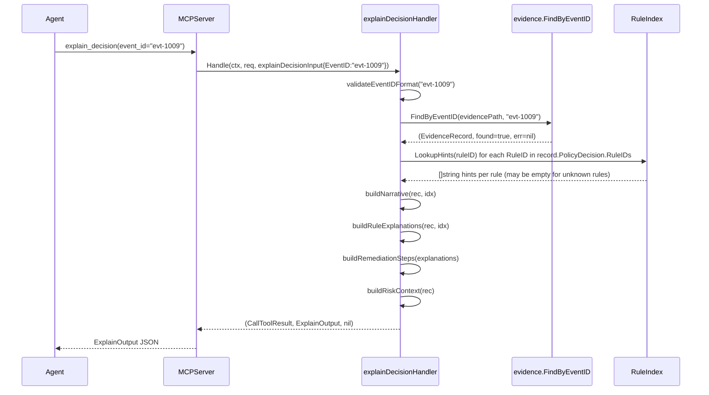

# MCP Tool Design: explain_decision

**Status:** Draft — 2026-02-25
**Author:** AI-generated design document
**Module:** `samebits.com/evidra`
**Target package:** `pkg/mcpserver`

---

## 1. Purpose

### Why agents need structured explanations post-denial

When the `validate` tool returns `allow: false`, the calling agent receives a `ValidateOutput` that contains `rule_ids`, `hints` (flat string list), and `reasons` (flat string list). These fields are designed for fast pass/fail signaling, not for agent comprehension. An agent that receives a denial must understand:

- Which specific rule fired and what threshold was exceeded
- Whether the denial was an absolute block or a soft deny that risk_tags could bypass
- The exact risk_tags or operational changes that would produce a different outcome
- What `risk_level: "high"` means in the context of this specific action and environment

The `validate` response intentionally omits this reasoning depth to keep the hot path lean. `explain_decision` fills that gap as a separate, read-only, on-demand lookup.

### How it differs from get_event

`get_event` returns the raw `EvidenceRecord` as stored — it is a fidelity-preserving mirror of the JSONL record. The full `Params` map is included, which may contain sensitive invocation data. There is no synthesis: the caller receives every field and must interpret the structure themselves.

`explain_decision` is an interpretation layer. It:

- Reads the same `EvidenceRecord` via `evidence.FindByEventID`
- Cross-references `PolicyDecision.RuleIDs` against the bundle's `rule_hints/data.json` and `params/data.json`
- Constructs a `narrative` string using a deterministic template (no LLM call, no randomness)
- Produces per-rule structured explanations with agent-actionable remediation steps
- Deliberately omits `EvidenceRecord.Params` from the response to avoid leaking invocation data through the explain path

### The "agent context injection" use case

The primary consumer of `explain_decision` is an AI agent that has just received a denial from `validate`. The agent injects the `explain_decision` response directly into its context window before deciding how to proceed. The `narrative` field is specifically designed for this: it is a single coherent English paragraph that an agent can include verbatim in a chain-of-thought or pass to a user as an explanation. The `rule_explanations` array provides machine-parseable structure for agents that want to programmatically decide whether to retry with different risk_tags.

---

## 2. Functional Specification

### Inputs

| Field | Type | Required | Validation |
|---|---|---|---|
| `event_id` | `string` | Yes | Must match `^evt-[0-9]+$`; rejected otherwise with `ErrCodeInvalidInput` |

### Outputs

`ExplainOutput` — a structured explanation of the policy decision recorded under `event_id`. Fields are described in Section 3. The response is:

- **Read-only:** no writes to the evidence store, no OPA evaluation, no side effects of any kind.
- **Deterministic:** given the same `EvidenceRecord` content and the same loaded bundle data, `explain_decision` always produces byte-identical output. Narrative construction uses only template substitution and sorted iteration; no randomness.
- **Idempotent:** calling `explain_decision` with the same `event_id` any number of times always returns the same response (the underlying evidence record is append-only and immutable once written).

### Non-goals

- `explain_decision` does NOT re-evaluate policy. It reads the decision that was already recorded.
- `explain_decision` does NOT suggest alternative input structures beyond what the rule hints file specifies. Novel advice is never synthesised.
- `explain_decision` does NOT expose `EvidenceRecord.Params`, `EvidenceRecord.Actor`, or `EvidenceRecord.Hash` fields. These are available via `get_event` for callers with a legitimate need for the raw record.

---

## 3. MCP Contract

### Tool registration metadata

```
Name:            explain_decision
Title:           Explain Policy Decision
Description:     Return a structured explanation of the policy decision recorded under
                 event_id. Designed for injection into an agent context window after
                 a validate denial. Read-only; no side effects.
ReadOnlyHint:    true
IdempotentHint:  true
DestructiveHint: false
OpenWorldHint:   false
```

### JSON request schema

```json
{
  "type": "object",
  "required": ["event_id"],
  "properties": {
    "event_id": {
      "type": "string",
      "description": "Evidence event identifier returned by validate. Must match evt-[0-9]+.",
      "pattern": "^evt-[0-9]+$"
    }
  },
  "additionalProperties": false
}
```

### JSON response schema

```json
{
  "type": "object",
  "required": ["ok", "event_id", "allow", "risk_level", "narrative", "rule_explanations", "remediation_steps", "risk_context", "recorded_at"],
  "properties": {
    "ok": {
      "type": "boolean",
      "description": "True when the record was found and explanation was constructed."
    },
    "event_id": {
      "type": "string",
      "description": "Echo of the requested event_id."
    },
    "allow": {
      "type": "boolean",
      "description": "The allow value from the recorded PolicyDecision."
    },
    "risk_level": {
      "type": "string",
      "enum": ["low", "medium", "high"],
      "description": "Risk level from the recorded PolicyDecision."
    },
    "narrative": {
      "type": "string",
      "description": "Plain-English explanation suitable for direct injection into an LLM context window. Deterministic template output — not AI-generated."
    },
    "rule_explanations": {
      "type": "array",
      "items": {
        "type": "object",
        "required": ["rule_id", "decision_type", "message"],
        "properties": {
          "rule_id": {
            "type": "string",
            "description": "Canonical rule ID in dotted format, e.g. ops.mass_delete."
          },
          "decision_type": {
            "type": "string",
            "enum": ["deny", "warn"],
            "description": "Whether this rule fired as a deny or a warn."
          },
          "message": {
            "type": "string",
            "description": "The reason message emitted by the policy rule."
          },
          "hints_for_agent": {
            "type": "array",
            "items": {"type": "string"},
            "description": "Ordered list of actionable hints from rule_hints/data.json for this rule. May be empty if the rule has no registered hints or if the bundle was rotated since the record was written."
          }
        }
      }
    },
    "remediation_steps": {
      "type": "array",
      "items": {"type": "string"},
      "description": "Ordered, deduplicated list of all actionable steps across all fired rules. This is the union of hints_for_agent across all rule_explanations, deduplicated while preserving first-occurrence order."
    },
    "risk_context": {
      "type": "object",
      "required": ["level", "meaning", "advisory"],
      "properties": {
        "level": {
          "type": "string",
          "enum": ["low", "medium", "high"]
        },
        "meaning": {
          "type": "string",
          "description": "Plain-English interpretation of this risk level for this specific decision."
        },
        "advisory": {
          "type": "boolean",
          "description": "Whether the decision was recorded as advisory (observe mode). If true, the action was not blocked even if allow=false."
        }
      }
    },
    "recorded_at": {
      "type": "string",
      "format": "date-time",
      "description": "ISO 8601 timestamp from the EvidenceRecord."
    },
    "error": {
      "type": "object",
      "properties": {
        "code": {"type": "string"},
        "message": {"type": "string"}
      },
      "description": "Present only when ok=false."
    }
  }
}
```

### Concrete JSON examples

#### Example A — denied decision (ops.mass_delete fired)

Request:
```json
{"event_id": "evt-1009"}
```

Response:
```json
{
  "ok": true,
  "event_id": "evt-1009",
  "allow": false,
  "risk_level": "high",
  "narrative": "Action denied. Rule ops.mass_delete fired because the mass-deletion threshold was exceeded for environment 'dev'. The configured maximum is 5 deletions; the action requested 12. To resolve: include 'breakglass' in risk_tags, or reduce the resource_count to 5 or fewer. This decision was recorded at 2026-02-25T14:03:11Z under policy ref ops-v0.1/r3.",
  "rule_explanations": [
    {
      "rule_id": "ops.mass_delete",
      "decision_type": "deny",
      "message": "Mass delete actions exceed threshold",
      "hints_for_agent": [
        "Reduce deletion scope",
        "Or add risk_tag: breakglass"
      ]
    }
  ],
  "remediation_steps": [
    "Reduce deletion scope",
    "Or add risk_tag: breakglass"
  ],
  "risk_context": {
    "level": "high",
    "meaning": "One or more deny rules fired. The action was blocked. risk_level high indicates a hard policy violation that requires either a risk_tag bypass (breakglass or equivalent) or a change to the operation parameters.",
    "advisory": false
  },
  "recorded_at": "2026-02-25T14:03:11Z"
}
```

#### Example B — allowed decision with warn (ops.breakglass_used fired as warn)

Request:
```json
{"event_id": "evt-1042"}
```

Response:
```json
{
  "ok": true,
  "event_id": "evt-1042",
  "allow": true,
  "risk_level": "medium",
  "narrative": "Action allowed with warnings. Rule ops.breakglass_used fired as a warning because the 'breakglass' risk_tag was present in the invocation. The action was permitted, but this event has been recorded for audit. To reduce risk: use breakglass only for emergencies, prefer change-approved tags for non-emergency production changes. This decision was recorded at 2026-02-25T15:22:07Z under policy ref ops-v0.1/r3.",
  "rule_explanations": [
    {
      "rule_id": "ops.breakglass_used",
      "decision_type": "warn",
      "message": "Breakglass tag used; action permitted but flagged for audit",
      "hints_for_agent": [
        "Use breakglass only for emergencies.",
        "Prefer change-approved tags for non-emergency production changes."
      ]
    }
  ],
  "remediation_steps": [
    "Use breakglass only for emergencies.",
    "Prefer change-approved tags for non-emergency production changes."
  ],
  "risk_context": {
    "level": "medium",
    "meaning": "No deny rules fired, but the 'breakglass' risk_tag was present. The action was allowed but carries elevated audit risk. This event will be reviewed during compliance audits.",
    "advisory": false
  },
  "recorded_at": "2026-02-25T15:22:07Z"
}
```

#### Example C — clean allowed decision (no rules fired)

Request:
```json
{"event_id": "evt-1001"}
```

Response:
```json
{
  "ok": true,
  "event_id": "evt-1001",
  "allow": true,
  "risk_level": "low",
  "narrative": "Action allowed. No policy rules fired. The invocation passed all checks under policy ref ops-v0.1/r3. This decision was recorded at 2026-02-25T09:10:44Z.",
  "rule_explanations": [],
  "remediation_steps": [],
  "risk_context": {
    "level": "low",
    "meaning": "No deny or warn rules fired. The action is within normal operational parameters.",
    "advisory": false
  },
  "recorded_at": "2026-02-25T09:10:44Z"
}
```

#### Example D — event not found

Response:
```json
{
  "ok": false,
  "error": {
    "code": "not_found",
    "message": "event_id not found"
  }
}
```

---

## 4. Internal Architecture

### Component relationships

`explainDecisionHandler` is a new handler type in `pkg/mcpserver`, parallel to `getEventHandler`. It holds a reference to `*ValidateService` (same as `getEventHandler`) and additionally receives a `*RuleIndex` populated at server startup.

`RuleIndex` is a value type built once in `NewServer` by loading the bundle's `rule_hints/data.json` and `params/data.json`. It is read-only after construction and safe for concurrent access without locking (immutable after init). This is the same `RuleIndex` that will be used by the forthcoming `list_rules` tool; `explain_decision` depends on it being built first (see Section 13).

The data loading path for `RuleIndex` bypasses the OPA engine entirely. It reads the JSON files from the bundle directory directly, the same way `BundleSource.LoadData` does. No OPA evaluation occurs during `explain_decision`.

### Sequence diagram



### Narrative construction algorithm

`buildNarrative` is a pure function. It never calls any external service. The algorithm is:

1. Determine the opening clause from `PolicyDecision.Allow` and the count of fired rules:
   - `allow=false, len(RuleIDs) > 0` → `"Action denied."`
   - `allow=true, len(RuleIDs) > 0` → `"Action allowed with warnings."`
   - `allow=true, len(RuleIDs) == 0` → `"Action allowed. No policy rules fired."`

2. For each rule ID in `PolicyDecision.RuleIDs` (sorted for determinism), append a rule clause:
   - Template: `"Rule {rule_id} fired because {reason}."`
   - `reason` is taken from `PolicyDecision.Reasons` at the matching index if available; otherwise the raw `PolicyDecision.Reason` field is used; otherwise `"the rule conditions were met"` is used as a fallback.

3. If any hints exist (union of hints across all fired rules), append:
   - `"To resolve: {hint_1}; {hint_2}."` (semicolon-joined, period-terminated)

4. Always append the provenance tail:
   - `"This decision was recorded at {Timestamp.UTC().Format(time.RFC3339)} under policy ref {PolicyRef}."`
   - If `PolicyRef` is empty, omit the `under policy ref` clause.

The result is a single string with no embedded newlines. All dynamic values are inserted using `fmt.Sprintf`; no `text/template` engine is needed.

---

## 5. Data Structures (Go)

```go
// Generated by AI | 2026-02-25 | explain_decision tool design | TOOL_DESIGN_explain_decision.md

package mcpserver

import (
    "context"
    "fmt"
    "regexp"
    "sort"
    "strings"
    "time"

    "github.com/modelcontextprotocol/go-sdk/mcp"

    "samebits.com/evidra/pkg/evidence"
)

// RuleIndex is an immutable lookup table built at server startup from the
// bundle's rule_hints/data.json. It is safe for concurrent reads after
// construction. It is shared between the explain_decision and list_rules
// (future) handlers.
type RuleIndex struct {
    // hints maps canonical rule_id to its ordered hint strings.
    hints map[string][]string
}

// NewRuleIndex constructs a RuleIndex from a parsed rule_hints data.json map.
// The input map is the Go representation of the JSON object keyed by rule_id.
func NewRuleIndex(rawHints map[string][]string) RuleIndex {
    h := make(map[string][]string, len(rawHints))
    for k, v := range rawHints {
        cp := make([]string, len(v))
        copy(cp, v)
        h[k] = cp
    }
    return RuleIndex{hints: h}
}

// LookupHints returns the hints for the given rule_id. Returns nil (not an
// error) if the rule_id is not present in the index — this is a valid state
// when the bundle has been rotated and the record predates a rule rename.
func (idx RuleIndex) LookupHints(ruleID string) []string {
    return idx.hints[ruleID]
}

// RuleExplanation is the per-rule component of ExplainOutput.
type RuleExplanation struct {
    RuleID       string   `json:"rule_id"`
    DecisionType string   `json:"decision_type"` // "deny" or "warn"
    Message      string   `json:"message"`
    HintsForAgent []string `json:"hints_for_agent"`
}

// RiskContext describes what the risk_level means for this specific decision.
type RiskContext struct {
    Level    string `json:"level"`
    Meaning  string `json:"meaning"`
    Advisory bool   `json:"advisory"`
}

// ExplainOutput is the structured response returned by the explain_decision
// tool. It is serialised to JSON and returned as the tool result payload.
// The Params field from the underlying EvidenceRecord is intentionally absent.
type ExplainOutput struct {
    OK               bool              `json:"ok"`
    EventID          string            `json:"event_id,omitempty"`
    Allow            bool              `json:"allow"`
    RiskLevel        string            `json:"risk_level"`
    Narrative        string            `json:"narrative"`
    RuleExplanations []RuleExplanation `json:"rule_explanations"`
    RemediationSteps []string          `json:"remediation_steps"`
    RiskContext      RiskContext       `json:"risk_context"`
    RecordedAt       time.Time         `json:"recorded_at"`
    Error            *ErrorSummary     `json:"error,omitempty"`
}

// explainDecisionInput is the parsed tool input for explain_decision.
type explainDecisionInput struct {
    EventID string `json:"event_id"`
}

// explainDecisionHandler handles explain_decision tool invocations.
// It is constructed once per server instance and is goroutine-safe.
type explainDecisionHandler struct {
    service  *ValidateService
    ruleIdx  RuleIndex
}

// Handle implements the mcp.ToolHandler interface for explain_decision.
func (h *explainDecisionHandler) Handle(
    ctx context.Context,
    _ *mcp.CallToolRequest,
    input explainDecisionInput,
) (*mcp.CallToolResult, ExplainOutput, error) {
    output := h.service.ExplainDecision(ctx, input.EventID, h.ruleIdx)
    return &mcp.CallToolResult{}, output, nil
}
```

### Narrative generation function signature

```go
// buildNarrative constructs the plain-English narrative string for ExplainOutput.
// It is a pure function: given the same inputs it always returns the same string.
// No external calls are made. Hint lookup uses idx; missing rule IDs produce no
// hint clause for that rule but do not cause an error.
func buildNarrative(rec evidence.EvidenceRecord, idx RuleIndex) string
```

Full signature context: `buildNarrative` is an unexported package-level function in `pkg/mcpserver`. It accepts the full `EvidenceRecord` (not a subset) so the narrative can incorporate `PolicyRef`, `Timestamp`, `EnvironmentLabel`, and `BundleRevision` without the caller having to pre-extract them. It is called only from `(*ValidateService).ExplainDecision`.

### ExplainDecision service method signature

```go
// ExplainDecision reads the EvidenceRecord for eventID and constructs an
// ExplainOutput. It never writes to the evidence store. idx must be fully
// initialised before this method is called.
func (s *ValidateService) ExplainDecision(
    ctx context.Context,
    eventID string,
    idx RuleIndex,
) ExplainOutput
```

### Helper function signatures

```go
// buildRuleExplanations constructs the per-rule explanation slice from the
// recorded PolicyDecision and the RuleIndex. Rules with no hint entry in the
// index get an empty HintsForAgent slice (graceful degradation).
func buildRuleExplanations(dec evidence.PolicyDecision, idx RuleIndex) []RuleExplanation

// buildRemediationSteps returns the deduplicated, first-occurrence-ordered
// union of all HintsForAgent strings across all RuleExplanations.
func buildRemediationSteps(explanations []RuleExplanation) []string

// buildRiskContext produces the RiskContext from the PolicyDecision fields.
func buildRiskContext(dec evidence.PolicyDecision) RiskContext

// riskLevelMeaning returns the fixed meaning string for a given risk_level and
// whether any deny rules were present. The text is templated, not generated.
func riskLevelMeaning(level string, hasDenies bool, advisory bool) string

// validateEventIDFormat returns an error if eventID does not match ^evt-[0-9]+$.
var eventIDPattern = regexp.MustCompile(`^evt-[0-9]+$`)
func validateEventIDFormat(eventID string) error
```

---

## 6. Concurrency and Safety Model

### Read-only evidence access

`explain_decision` calls `evidence.FindByEventID(path, eventID)`, which acquires the store's file lock via `withStoreLock`, validates the chain, scans records, and releases the lock. This is identical to the path taken by `get_event`. Multiple concurrent `explain_decision` calls will serialize at the file lock boundary. This is acceptable: `explain_decision` is not on the hot path.

### RuleIndex concurrent access

`RuleIndex` is constructed once in `NewServer` before any handler is registered. After `NewServer` returns, `RuleIndex` is never mutated. All handler goroutines receive a copy of the `RuleIndex` value (it is passed by value to `explainDecisionHandler` at construction). The `hints` map inside `RuleIndex` is read-only after `NewRuleIndex` returns. No mutex is required for `RuleIndex` reads.

### No writes

`explain_decision` makes no writes of any kind: no evidence appends, no manifest updates, no file creation. It does not call OPA. It does not modify any `ValidateService` fields. The handler is safe to call concurrently from any number of goroutines.

### Context cancellation

`evidence.FindByEventID` does not currently accept a `context.Context`. If the client disconnects before the store lock is acquired, the call will complete or fail based on the lock timeout (`EVIDRA_EVIDENCE_LOCK_TIMEOUT_MS`, default 2000ms). This is consistent with how `get_event` behaves and does not require special handling.

---

## 7. Security Model

### Input validation

`event_id` is validated against `^evt-[0-9]+$` before any file I/O. This prevents:

- Directory traversal via `event_id` values containing `/`, `..`, or null bytes
- Unbounded scan triggered by maliciously long `event_id` strings (the regex anchors on a numeric suffix, capping realistic values)

If the pattern does not match, the handler returns `ErrCodeInvalidInput` immediately without touching the evidence store.

### Params exclusion

`EvidenceRecord.Params` is intentionally excluded from `ExplainOutput`. The Params map may contain sensitive operational data (e.g. Kubernetes payloads, Terraform plan details, internal resource identifiers). Callers that need the raw record should use `get_event`. The `explain_decision` response surface is limited to:

- Fields from `PolicyDecision` (allow, risk_level, reason, reasons, rule_ids, hints, advisory)
- Timestamp, PolicyRef, BundleRevision, EnvironmentLabel from the record header
- Hint text from `rule_hints/data.json` (bundle-controlled, not caller-controlled)

### Information disclosure through rule explanations

The hints returned by `explain_decision` are the same hints already returned by the `validate` tool in its `hints` field. There is no new information disclosed relative to an agent that called `validate` and received a denial. The risk profile is identical to `list_rules` (future tool): a caller learns which rules exist and what bypasses are registered for them. This is accepted as necessary for the agent-explanation use case.

### Advisory flag

`EvidenceRecord.PolicyDecision.Advisory` is propagated to `RiskContext.Advisory`. When `advisory=true`, the agent is informed that the action was not blocked even if `allow=false`. This prevents an agent from incorrectly concluding it was stopped when running in observe mode.

---

## 8. Observability

### Structured logging

Every invocation of `ExplainDecision` logs at `slog.Info` level on success and `slog.Warn`/`slog.Error` level on failure:

```go
slog.InfoContext(ctx, "explain_decision",
    "event_id",   eventID,
    "allow",      rec.PolicyDecision.Allow,
    "risk_level", rec.PolicyDecision.RiskLevel,
    "rule_count", len(rec.PolicyDecision.RuleIDs),
)
```

On not-found:
```go
slog.WarnContext(ctx, "explain_decision: event not found", "event_id", eventID)
```

On chain invalid:
```go
slog.ErrorContext(ctx, "explain_decision: chain invalid", "event_id", eventID, "err", err)
```

### Prometheus metrics

Counter registered in `NewServer` (or lazily on first call via `sync.Once`):

```
evidra_explain_decision_total{allow="true|false", risk_level="low|medium|high"}
```

On error paths the counter is not incremented; instead a separate error counter fires:

```
evidra_explain_decision_errors_total{code="not_found|chain_invalid|internal_error"}
```

Both counters use the `prometheus/client_golang` package already present in the module (confirm with `go.mod`). If the package is not present, these metrics are a placeholder until the dependency is added (see AI_DECISIONS.md requirement).

### OpenTelemetry span

```go
ctx, span := otel.Tracer("evidra/mcpserver").Start(ctx, "explain_decision")
defer span.End()
span.SetAttributes(
    attribute.String("event_id", eventID),
    attribute.Bool("allow", rec.PolicyDecision.Allow),
    attribute.String("risk_level", rec.PolicyDecision.RiskLevel),
    attribute.Int("rule_count", len(rec.PolicyDecision.RuleIDs)),
)
```

OTel is a placeholder if `go.opentelemetry.io/otel` is not yet in `go.mod`. The span must be added as part of the implementation ticket, not deferred.

---

## 9. Performance Considerations

### FindByEventID complexity

`evidence.FindByEventID` is O(n) where n is the total number of records in the evidence store. It acquires the file lock, validates the entire chain (hash-by-hash from first record), then scans sequentially until the target EventID is found. For a store with 10,000 records, this is a full sequential scan of up to 10,000 JSONL lines.

This is acceptable for `explain_decision` because:
- It is an on-demand lookup, not called in a hot loop
- The same O(n) cost applies to `get_event`, which is already shipped
- Chain validation is a safety requirement; it cannot be skipped

### Narrative construction complexity

`buildNarrative` is O(k) where k is the number of fired rule IDs. In practice k is bounded by the number of rules in the bundle (currently 6). The operation is CPU-bound string concatenation with no I/O.

### Caching opportunity

Because `EvidenceRecord` is immutable once written (append-only store, hash-linked chain), and because `RuleIndex` is immutable after server startup, the output of `explain_decision` for a given `event_id` is also immutable. A map-based in-memory cache keyed by `event_id` would make repeated calls for the same event O(1) after the first call.

Recommended implementation: an `explainCache` field of type `sync.Map` on `explainDecisionHandler`, mapping `string` (event_id) to `ExplainOutput`. The cache is populated on first lookup and never invalidated during the server's lifetime. Cache entries must not be added when the result is an error (not_found, chain_invalid, internal_error) since those conditions may be transient.

Cache invalidation concern: if the bundle is replaced at runtime (hot-reload), `RuleIndex` changes and cached `ExplainOutput` values with stale hint text would be served. Since bundle hot-reload is not currently implemented (the server loads the bundle once at startup), this is not a concern for v1. A future hot-reload implementation must invalidate the explain cache.

---

## 10. Failure Modes

### Event not found

`evidence.FindByEventID` returns `found=false` after scanning all records. Handler returns:

```json
{"ok": false, "error": {"code": "not_found", "message": "event_id not found"}}
```

This is not retryable. The agent should not retry with the same `event_id`.

### Chain invalid

`evidence.FindByEventID` wraps `ErrChainInvalid` when the hash-linked chain fails validation. This indicates evidence store corruption or tampering. Handler returns:

```json
{"ok": false, "error": {"code": "evidence_chain_invalid", "message": "evidence chain validation failed"}}
```

This is a hard error. The operator must investigate the store. The agent should surface this to a human and stop retrying.

### RuleIndex not built

If `NewServer` fails to load `rule_hints/data.json` (e.g. bundle path is misconfigured), `RuleIndex` will have an empty `hints` map. All `LookupHints` calls return nil. `explain_decision` still returns a valid `ExplainOutput` with empty `HintsForAgent` slices and a `narrative` that omits the "To resolve" clause. No error is returned; degraded output is preferable to a failure that prevents the agent from understanding the denial at all.

### Partial explanation: rule ID has no hint entry

When the bundle is rotated and a rule is renamed (e.g. `ops.mass_delete` becomes `ops.bulk_delete`), records written before the rotation will contain the old rule ID. `LookupHints("ops.mass_delete")` returns nil on the new bundle. The rule is still included in `rule_explanations` with its recorded `message` but `hints_for_agent` is an empty array. The narrative omits hints for that rule. This is graceful degradation; the agent still receives the rule_id and message.

### Internal evidence read error

Any non-chain-invalid error from `evidence.FindByEventID` returns:

```json
{"ok": false, "error": {"code": "internal_error", "message": "failed to read evidence"}}
```

This covers OS errors, JSON parse failures of individual JSONL lines, and store lock timeout (when `EVIDRA_EVIDENCE_LOCK_TIMEOUT_MS` is exceeded).

---

## 11. Backward Compatibility

### narrative is opaque to machines

The `narrative` field is a human-readable string. It must not be parsed programmatically by any consumer. Its structure may change between releases (e.g. new template clauses added, phrasing changed). Agents must treat it as a display string for human or LLM consumption only.

### rule_explanations fields are additive

New fields may be added to `RuleExplanation` in future versions. Consumers must use `additionalProperties: true` when validating the response schema, or ignore unknown fields. The `rule_id`, `decision_type`, and `message` fields are stable and will not be removed.

### hints_for_agent vs hints in validate response

`ValidateOutput.Hints` (returned by `validate`) is the flat union of all hint strings from all fired rules. It is the same data as the union of `hints_for_agent` across all `rule_explanations` in `ExplainOutput`. The two fields are semantically equivalent but structurally different: `Hints` is a flat deduplicated list; `hints_for_agent` is per-rule. There is no version conflict; agents may use either depending on whether they need per-rule attribution.

### recorded_at vs timestamp field naming

`EvidenceRecord.Timestamp` is exposed as `recorded_at` in `ExplainOutput` (not `timestamp`). This naming distinguishes the explain response from the raw record format and avoids confusion with the MCP tool invocation timestamp. The name `recorded_at` is stable.

---

## 12. Testing Strategy

### Golden output tests

For each concrete example in Section 3, a fixture `EvidenceRecord` is written to a temp evidence store, then `ExplainDecision` is called, and the full JSON output is compared byte-for-byte to a golden file. Golden files live in `pkg/mcpserver/testdata/explain_decision/`:

```
testdata/explain_decision/
  fixture_denied_mass_delete.jsonl       # evidence store seed
  fixture_denied_mass_delete.golden.json # expected ExplainOutput
  fixture_allowed_warned_breakglass.jsonl
  fixture_allowed_warned_breakglass.golden.json
  fixture_allowed_clean.jsonl
  fixture_allowed_clean.golden.json
```

Golden files must be committed to the repository. The test uses `testutil.UpdateGolden` flag convention (`-update` flag rewrites golden files) so that intentional template changes can be applied without manually editing JSON.

### Rule ID with no hint entry (graceful degradation)

```go
func TestExplainDecision_MissingHintEntry(t *testing.T) {
    // Construct a record whose PolicyDecision.RuleIDs contains "ops.unknown_rule_v2"
    // (a rule ID not present in the RuleIndex).
    // Assert:
    //   - ok=true (no error)
    //   - rule_explanations has one entry with rule_id="ops.unknown_rule_v2"
    //   - hints_for_agent is empty ([]string{})
    //   - remediation_steps is empty
    //   - narrative does NOT contain "To resolve"
}
```

### Narrative content assertions

Rather than exact string matching for narrative tests (which would be brittle), narrative unit tests assert that specific substrings are present or absent:

```go
func TestBuildNarrative_DeniedContainsRuleID(t *testing.T)
func TestBuildNarrative_AllowedContainsNoRulesFired(t *testing.T)
func TestBuildNarrative_WarnedContainsAllowedWithWarnings(t *testing.T)
func TestBuildNarrative_HintsJoinedWithSemicolon(t *testing.T)
func TestBuildNarrative_EmptyPolicyRefOmitsClause(t *testing.T)
func TestBuildNarrative_TimestampIsRFC3339UTC(t *testing.T)
```

### Corrupted chain test

```go
func TestExplainDecision_CorruptedChain(t *testing.T) {
    // Write two valid records, then manually corrupt the Hash field of record 1
    // in the JSONL file to simulate tampering.
    // Assert:
    //   - ok=false
    //   - error.code == "evidence_chain_invalid"
}
```

### Concurrency test

```go
func TestExplainDecision_ConcurrentReads(t *testing.T) {
    // Launch 20 goroutines, each calling ExplainDecision with the same event_id.
    // Assert no data races (run with -race) and all goroutines receive ok=true.
}
```

### Input validation test

```go
func TestExplainDecision_InvalidEventIDFormat(t *testing.T) {
    // Test cases: "", "evt-", "evt-abc", "../etc/passwd", "EVT-123"
    // All must return ok=false, code="invalid_input" without touching the store.
}
```

---

## 13. Implementation Plan

The following tasks must be completed in order. Tasks 1-3 have no dependency on `list_rules` beyond sharing the `RuleIndex` type; `list_rules` must define `RuleIndex` before `explain_decision` is merged if they land in the same PR.

### Task 1 — Define ExplainOutput types in pkg/mcpserver

Add to `pkg/mcpserver/` (new file `explain.go`):
- `RuleIndex` struct and `NewRuleIndex`, `LookupHints` methods
- `RuleExplanation`, `RiskContext`, `ExplainOutput` structs
- `explainDecisionInput`, `explainDecisionHandler` structs

No business logic in this task. This task can be reviewed independently.

**Dependency:** None.

### Task 2 — Implement buildNarrative and helper functions

Implement in `pkg/mcpserver/explain.go`:
- `buildNarrative(rec evidence.EvidenceRecord, idx RuleIndex) string`
- `buildRuleExplanations(dec evidence.PolicyDecision, idx RuleIndex) []RuleExplanation`
- `buildRemediationSteps(explanations []RuleExplanation) []string`
- `buildRiskContext(dec evidence.PolicyDecision) RiskContext`
- `riskLevelMeaning(level string, hasDenies bool, advisory bool) string`
- `validateEventIDFormat(eventID string) error`

Write unit tests for each function in `pkg/mcpserver/explain_test.go`. No golden files needed at this stage; substring assertions are sufficient.

**Dependency:** Task 1.

### Task 3 — Implement explainDecisionHandler using evidence.FindByEventID and RuleIndex lookup

Implement `(*ValidateService).ExplainDecision(ctx, eventID, idx RuleIndex) ExplainOutput` in `pkg/mcpserver/server.go` (or `explain.go`). Implement `(*explainDecisionHandler).Handle`. Add slog logging calls. Add Prometheus counter increments (gated on whether `prometheus/client_golang` is in go.mod).

**Dependency:** Tasks 1 and 2.

### Task 4 — Load RuleIndex in NewServer and register the tool

In `NewServer` (`pkg/mcpserver/server.go`):

1. After `svc := newValidateService(opts)`, load `rule_hints/data.json` from the bundle path:

```go
idx, err := loadRuleIndex(opts.BundlePath)
if err != nil {
    // Log warning; continue with empty RuleIndex (graceful degradation)
    idx = RuleIndex{}
}
```

2. Construct `explainDecisionHandler`:

```go
explainTool := &explainDecisionHandler{service: svc, ruleIdx: idx}
```

3. Register with `mcp.AddTool`:

```go
mcp.AddTool(server, &mcp.Tool{
    Name:        "explain_decision",
    Title:       "Explain Policy Decision",
    Description: "Return a structured explanation of the policy decision recorded under event_id. Designed for injection into an agent context window after a validate denial. Read-only; no side effects.",
    Annotations: &mcp.ToolAnnotations{
        Title:           "Explain Policy Decision",
        ReadOnlyHint:    true,
        IdempotentHint:  true,
        DestructiveHint: boolPtr(false),
        OpenWorldHint:   boolPtr(false),
    },
    InputSchema: map[string]any{
        "type":     "object",
        "required": []any{"event_id"},
        "properties": map[string]any{
            "event_id": map[string]any{
                "type":        "string",
                "description": "Evidence event identifier returned by validate. Must match evt-[0-9]+.",
                "pattern":     "^evt-[0-9]+$",
            },
        },
        "additionalProperties": false,
    },
}, explainTool.Handle)
```

Implement `loadRuleIndex(bundlePath string) (RuleIndex, error)` which reads `<bundlePath>/evidra/data/rule_hints/data.json`, unmarshals to `map[string][]string`, and calls `NewRuleIndex`.

**Dependency:** Tasks 1, 2, 3.

### Task 5 — Integration tests and golden file generation

Write integration tests in `pkg/mcpserver/explain_integration_test.go`:
- Seed a temp evidence store with fixture records
- Call `ExplainDecision` via the handler
- Compare output to golden files
- Include the concurrency test and the corrupted-chain test

Generate golden files by running tests with `-update` flag.

Add `TestServerRegistersExplainDecisionTool` to `server_test.go`:

```go
func TestServerRegistersExplainDecisionTool(t *testing.T) {
    server := newTestServer(t)
    tools := listToolNamesFromServer(t, server)
    if !containsTool(tools, "explain_decision") {
        t.Fatalf("expected explain_decision tool in %v", tools)
    }
}
```

**Dependency:** Tasks 1-4.

### Notes on dependency ordering

`list_rules` and `explain_decision` share the `RuleIndex` type. If `list_rules` is implemented first, `RuleIndex` is already defined in `pkg/mcpserver`. If `explain_decision` lands first, it defines `RuleIndex` and `list_rules` reuses it. They must not both define `RuleIndex` independently — coordinate the merge order to avoid a duplicate type declaration. The `RuleIndex` type itself is not tool-specific and may be extracted to a separate unexported file (e.g. `rule_index.go`) to make the ownership explicit.
