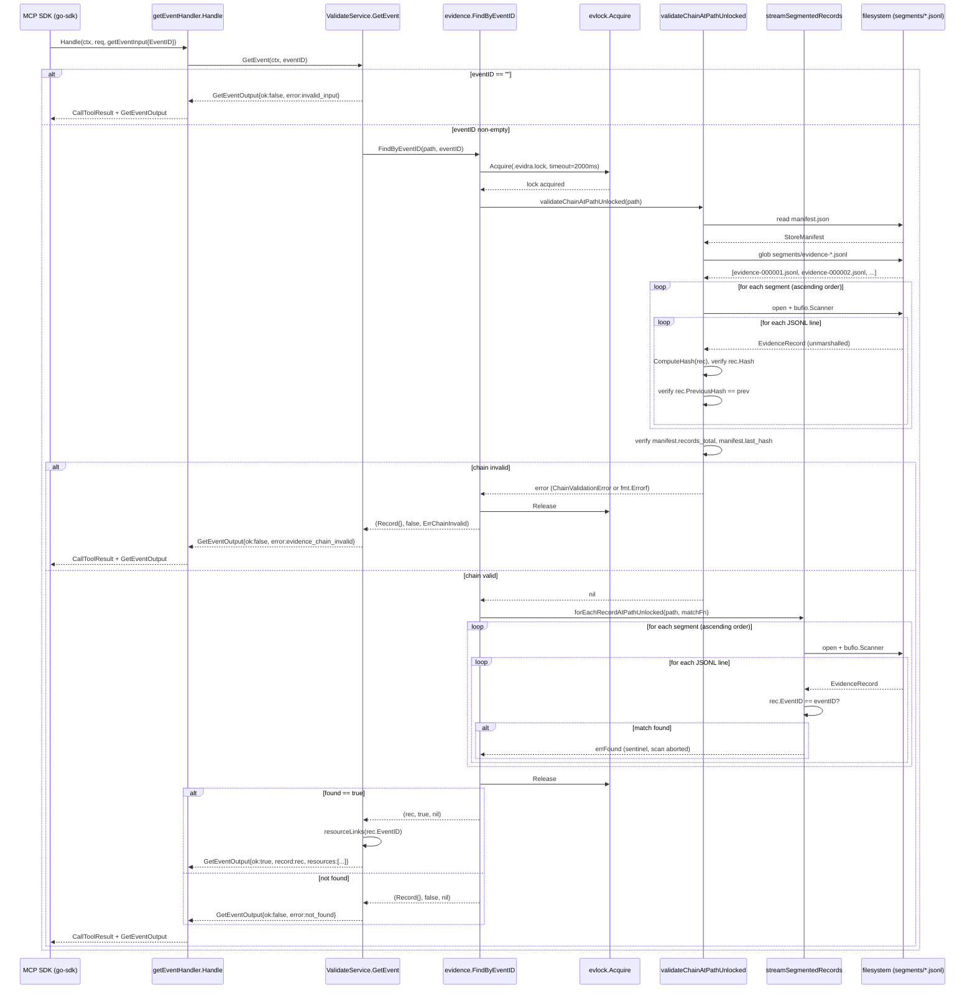

# MCP Tool Design: get_event

**Document date:** 2026-02-25
**Status:** Implementation-ready internal design
**Author:** AI-generated design document
**Module:** `samebits.com/evidra`
**Go version:** 1.22+

---

## Table of Contents

1. [Purpose](#1-purpose)
2. [Functional Specification](#2-functional-specification)
3. [MCP Contract](#3-mcp-contract)
4. [Internal Architecture](#4-internal-architecture)
5. [Data Structures (Go)](#5-data-structures-go)
6. [Concurrency and Safety Model](#6-concurrency-and-safety-model)
7. [Security Model](#7-security-model)
8. [Observability](#8-observability)
9. [Performance Considerations](#9-performance-considerations)
10. [Failure Modes](#10-failure-modes)
11. [Backward Compatibility](#11-backward-compatibility)
12. [Testing Strategy](#12-testing-strategy)
13. [Implementation Plan](#13-implementation-plan)

---

## 1. Purpose

### Why agents need evidence retrieval by ID

The `get_event` tool provides agents with deterministic, point-in-time access to a single immutable evidence record identified by its `event_id`. The evidence record represents the complete audit trail for a single tool invocation that was validated by the `validate` tool: the actor identity, the tool and operation called, all input parameters, the policy decision (including rule IDs and hints), and the cryptographic hash linking that record into the chain.

This retrieval capability serves three distinct agent workflows:

**Post-validate audit (most common)**: After a `validate` call returns an `event_id`, a downstream agent or orchestrator layer calls `get_event` to confirm the exact record that was committed before proceeding with execution. This closes the gap between policy decision and confirmed persistence: the `validate` tool returns `ok: true`, but the agent cannot assume the evidence store is consistent until it independently retrieves the record and verifies its presence.

**Supervisor agent verification**: A supervisor agent monitoring an autonomous pipeline calls `get_event` at checkpoints to verify that previously validated actions match the decision context it expected. For example, a supervisor checking that a `terraform apply` was validated with `risk_level: low` rather than `medium` before it was executed. The full `EvidenceRecord` including `PolicyDecision.RuleIDs`, `PolicyDecision.Hints`, and `InputHash` are available to the supervisor for this structural comparison.

**Compliance check**: An external compliance process or reporting agent needs to reconstruct the full audit context for a known `event_id`. The `get_event` tool provides the complete record including the `BundleRevision`, `EnvironmentLabel`, `ProfileName`, `PolicyRef`, and the hash-chain fields `PreviousHash` and `Hash`. These fields together prove that the record is unmodified and properly chained into the evidence store.

All three use cases require the chain validation to succeed before the record is returned. The `get_event` tool never returns a record from a store whose chain integrity cannot be verified. This means `get_event` is an integrity assertion as much as it is a data retrieval operation.

---

## 2. Functional Specification

### Inputs

| Field | Type | Required | Validation |
|---|---|---|---|
| `event_id` | `string` | Yes | Non-empty string; no format constraint enforced by the tool (UUID, opaque string, etc.) |

The `event_id` is validated only for non-emptiness. No UUID format validation, no length constraint, and no path-character sanitization is performed in `ValidateService.GetEvent` beyond the empty-string check. The raw value is passed directly to `evidence.FindByEventID`.

### Outputs

On success (`ok: true`):
- The complete `EvidenceRecord` struct is returned in the `record` field.
- `Resources` contains `ResourceLink` entries for `evidra://event/{event_id}`, and, for segmented stores, `evidra://evidence/manifest` and `evidra://evidence/segments`.

On failure (`ok: false`):
- The `record` field is absent (`omitempty`).
- The `error` field contains an `ErrorSummary` with a machine-readable `code` and a human-readable `message`.
- `Resources` is absent.

### Side effects

None. `get_event` is a read-only operation. It does not modify the evidence store, does not update the manifest, does not move any segment file, and does not write any log entry.

### Determinism

Given a fixed evidence store snapshot, repeated calls with the same `event_id` return identical `EvidenceRecord` values. The tool is fully deterministic: the same input produces the same output. The only source of non-determinism would be a concurrent `validate` call that appends a new record while `get_event` is scanning; however, this cannot change the outcome for a previously committed `event_id` because the store is append-only and segments are never modified after being written.

There is one subtle non-determinism in the failure path: if the store was last written by a concurrent `validate` and the lock timeout is hit, `get_event` returns `evidence_store_busy` rather than the record. This is a liveness failure, not a correctness failure.

### Idempotency

Fully idempotent. Calling `get_event` with the same `event_id` any number of times in any order produces the same result given the same underlying store state. The MCP tool annotations reflect this: `IdempotentHint: true`, `ReadOnlyHint: true`, `DestructiveHint: false`.

### Chain validation behavior

`FindByEventID` calls `validateChainAtPathUnlocked` before scanning for the record. This means:

1. The full chain is validated from the first record of the first segment to the last record of the last segment, computing and verifying the SHA-256 hash of every record.
2. If chain validation fails (hash mismatch, `previous_hash` mismatch, manifest counters mismatched, sealed segment missing, etc.), `get_event` returns `ErrCodeChainInvalid` immediately without returning any record — even if the target `event_id` exists in the store.
3. Chain validation does not short-circuit when the target record is found; it completes the full traversal and then performs the match scan as a second pass. This is a deliberate design choice: partial chain integrity is not meaningful.

The implication is that `get_event` latency is at minimum the time to validate the full chain, not just the time to locate the record.

---

## 3. MCP Contract

### Tool registration metadata

```
Name:        "get_event"
Title:       "Get Evidence Event"
Description: "Fetch one immutable evidence record by event_id."
Annotations:
  ReadOnlyHint:    true
  IdempotentHint:  true
  DestructiveHint: false
  OpenWorldHint:   false
```

### JSON request schema

```json
{
  "type": "object",
  "required": ["event_id"],
  "properties": {
    "event_id": {
      "type": "string",
      "description": "Evidence event identifier."
    }
  }
}
```

### JSON response schema (GetEventOutput)

The MCP SDK serializes the Go `GetEventOutput` struct directly as the tool result. The full schema:

```json
{
  "type": "object",
  "required": ["ok"],
  "properties": {
    "ok": {
      "type": "boolean",
      "description": "True if the event was found and the chain is valid."
    },
    "record": {
      "description": "The complete evidence record. Present only when ok is true.",
      "$ref": "#/definitions/EvidenceRecord"
    },
    "resources": {
      "type": "array",
      "description": "MCP resource links. Present only when ok is true.",
      "items": { "$ref": "#/definitions/ResourceLink" }
    },
    "error": {
      "description": "Error detail. Present only when ok is false.",
      "$ref": "#/definitions/ErrorSummary"
    }
  },
  "definitions": {
    "EvidenceRecord": {
      "type": "object",
      "required": ["event_id", "timestamp", "policy_ref", "actor", "tool", "operation", "params", "policy_decision", "execution_result", "previous_hash", "hash"],
      "properties": {
        "event_id":          { "type": "string" },
        "timestamp":         { "type": "string", "format": "date-time" },
        "policy_ref":        { "type": "string" },
        "bundle_revision":   { "type": "string", "description": "omitempty" },
        "profile_name":      { "type": "string", "description": "omitempty" },
        "environment_label": { "type": "string", "description": "omitempty" },
        "input_hash":        { "type": "string", "description": "omitempty; SHA-256 hex of canonical input" },
        "actor": {
          "type": "object",
          "required": ["type", "id", "origin"],
          "properties": {
            "type":   { "type": "string", "description": "human|agent|system" },
            "id":     { "type": "string" },
            "origin": { "type": "string", "description": "mcp|cli|api" }
          }
        },
        "tool":      { "type": "string" },
        "operation": { "type": "string" },
        "params": {
          "type": "object",
          "description": "Arbitrary key-value map of operation parameters including risk_tags, target, payload, scenario_id."
        },
        "policy_decision": {
          "type": "object",
          "required": ["allow", "risk_level", "reason", "advisory"],
          "properties": {
            "allow":      { "type": "boolean" },
            "risk_level": { "type": "string", "enum": ["low", "medium", "high"] },
            "reason":     { "type": "string" },
            "reasons":    { "type": "array", "items": { "type": "string" }, "description": "omitempty" },
            "hints":      { "type": "array", "items": { "type": "string" }, "description": "omitempty" },
            "rule_ids":   { "type": "array", "items": { "type": "string" }, "description": "omitempty; canonical dotted rule IDs e.g. k8s.protected_namespace" },
            "advisory":   { "type": "boolean", "description": "True when decision was in observe mode" }
          }
        },
        "execution_result": {
          "type": "object",
          "required": ["status"],
          "properties": {
            "status":           { "type": "string" },
            "exit_code":        { "type": ["integer", "null"] },
            "stdout":           { "type": "string", "description": "omitempty" },
            "stderr":           { "type": "string", "description": "omitempty" },
            "stdout_truncated": { "type": "boolean", "description": "omitempty" },
            "stderr_truncated": { "type": "boolean", "description": "omitempty" }
          }
        },
        "previous_hash": { "type": "string", "description": "SHA-256 hex of previous record; empty string for chain head" },
        "hash":          { "type": "string", "description": "SHA-256 hex of this record (excluding hash field itself)" }
      }
    },
    "ResourceLink": {
      "type": "object",
      "properties": {
        "URI":      { "type": "string" },
        "Name":     { "type": "string" },
        "MIMEType": { "type": "string" }
      }
    },
    "ErrorSummary": {
      "type": "object",
      "required": ["code", "message"],
      "properties": {
        "code":       { "type": "string", "enum": ["invalid_input", "evidence_chain_invalid", "not_found", "internal_error"] },
        "message":    { "type": "string" },
        "risk_level": { "type": "string", "description": "omitempty" },
        "reason":     { "type": "string", "description": "omitempty" }
      }
    }
  }
}
```

### Error codes produced by get_event

| Code | Condition | Chain scan performed |
|---|---|---|
| `invalid_input` | `event_id` is empty string | No — returns immediately |
| `evidence_chain_invalid` | `validateChainAtPathUnlocked` returned `ErrChainInvalid` | Yes — full chain scan attempted, aborted on first failure |
| `not_found` | Chain valid but no record matches the given `event_id` | Yes — full chain + full record scan |
| `internal_error` | `os.Open` failed on segment, JSONL parse error, manifest read failure, lock acquisition error other than busy | Yes, up to point of failure |

Note: `evidence_store_busy` (`StoreError.Code`) from the `evlock` layer is mapped to `internal_error` at the `mcpserver` layer. The current error-mapping code in `ValidateService.GetEvent` does not distinguish `StoreError` from other errors; both fall through to `ErrCodeInternalError`.

### Concrete JSON examples

**Request — found case:**

```json
{
  "event_id": "01HTABCDE1234567890ABCDEF"
}
```

**Response — found case:**

```json
{
  "ok": true,
  "record": {
    "event_id": "01HTABCDE1234567890ABCDEF",
    "timestamp": "2026-02-25T14:30:00Z",
    "policy_ref": "sha256:a1b2c3d4e5f6",
    "bundle_revision": "ops-v0.1-r42",
    "profile_name": "ops",
    "environment_label": "staging",
    "input_hash": "e3b0c44298fc1c149afbf4c8996fb92427ae41e4649b934ca495991b7852b855",
    "actor": {
      "type": "agent",
      "id": "claude-agent-001",
      "origin": "mcp"
    },
    "tool": "terraform",
    "operation": "apply",
    "params": {
      "target": { "workspace": "infra-staging" },
      "risk_tags": ["breakglass"]
    },
    "policy_decision": {
      "allow": true,
      "risk_level": "medium",
      "reason": "breakglass tagged: ops.unapproved_change waived",
      "reasons": ["ops.unapproved_change suppressed by breakglass tag"],
      "hints": ["Ensure change window is approved before execution."],
      "rule_ids": ["ops.unapproved_change"],
      "advisory": false
    },
    "execution_result": {
      "status": "pending",
      "exit_code": null
    },
    "previous_hash": "7f83b1657ff1fc53b92dc18148a1d65dfc2d4b1fa3d677284addd200126d9069",
    "hash": "9f86d081884c7d659a2feaa0c55ad015a3bf4f1b2b0b822cd15d6c15b0f00a08"
  },
  "resources": [
    {
      "URI": "evidra://event/01HTABCDE1234567890ABCDEF",
      "Name": "Evidence record",
      "MIMEType": "application/json"
    },
    {
      "URI": "evidra://evidence/manifest",
      "Name": "Evidence manifest",
      "MIMEType": "application/json"
    },
    {
      "URI": "evidra://evidence/segments",
      "Name": "Evidence segments",
      "MIMEType": "application/json"
    }
  ]
}
```

**Request — not-found case:**

```json
{
  "event_id": "nonexistent-event-id"
}
```

**Response — not-found case:**

```json
{
  "ok": false,
  "error": {
    "code": "not_found",
    "message": "event_id not found"
  }
}
```

**Response — chain invalid case:**

```json
{
  "ok": false,
  "error": {
    "code": "evidence_chain_invalid",
    "message": "evidence chain validation failed"
  }
}
```

**Response — empty event_id:**

```json
{
  "ok": false,
  "error": {
    "code": "invalid_input",
    "message": "event_id is required"
  }
}
```

---

## 4. Internal Architecture

### Packages involved

| Package | Role in get_event |
|---|---|
| `pkg/mcpserver` | MCP tool registration and dispatch; `getEventHandler.Handle` decodes `getEventInput`, delegates to `ValidateService.GetEvent`, wraps result in `mcp.CallToolResult` |
| `pkg/evidence` | All storage logic: `FindByEventID` (public entry point), `validateChainAtPathUnlocked`, `forEachRecordAtPathUnlocked`, `streamSegmentedRecords`, `streamFileRecords`, `withStoreLock` |
| `pkg/config` | `ResolveEvidencePath` — resolves `--evidence-dir` flag or `EVIDRA_EVIDENCE_DIR` / `EVIDRA_HOME` env vars to the store root directory |
| `pkg/evlock` | File locking primitive used by `withStoreLock`; `evlock.Acquire` with configurable timeout |

### Call flow (prose)

1. The MCP SDK receives a `tools/call` JSON-RPC message with `name: "get_event"` and decodes the `params` object into a `getEventInput` struct via the generic handler type parameter.
2. `getEventHandler.Handle` is called with the decoded `getEventInput`. It immediately calls `h.service.GetEvent(ctx, input.EventID)`.
3. `ValidateService.GetEvent` performs the empty-string guard. On empty, returns immediately with `ErrCodeInvalidInput`.
4. `evidence.FindByEventID(s.evidencePath, eventID)` is called. This acquires the file lock (`evlock.Acquire`) on `.evidra.lock` in the store root with a default timeout of 2000 ms (overridable via `EVIDRA_EVIDENCE_LOCK_TIMEOUT_MS`).
5. Inside the lock, `validateChainAtPathUnlocked` is called. For the segmented store, this calls `validateSegmentedChain`, which:
   a. Loads the manifest from `manifest.json`.
   b. Calls `orderedSegmentNames` to discover all `evidence-NNNNNN.jsonl` files in `segments/` in ascending index order, verifying contiguous sequence (no gaps).
   c. Streams every record from every segment in order via `streamFileRecords` (buffered `bufio.Scanner`).
   d. For each record, recomputes `ComputeHash` (SHA-256 of `canonicalEvidenceRecord` — all fields except `hash`) and verifies `rec.Hash` matches.
   e. Verifies `rec.PreviousHash` equals the previous record's `Hash` (empty for the chain head).
   f. After all segments, verifies manifest `records_total` and `last_hash` match the observed values.
6. If chain validation fails, `FindByEventID` returns `(Record{}, false, ErrChainInvalid)`. The lock is released.
7. If chain validation succeeds, `forEachRecordAtPathUnlocked` is called again (second full scan). For each record, `rec.EventID == eventID` is tested. On match, the record is captured in `out` and the scan is short-circuited by returning a sentinel `errFound` error.
8. The lock is released.
9. `ValidateService.GetEvent` receives `(rec, found, nil)` and builds `GetEventOutput`. If `found`, populates `Record` and calls `s.resourceLinks(rec.EventID)` to build the `ResourceLink` slice.
10. `getEventHandler.Handle` passes the output to the MCP SDK, which serializes it to JSON and sends the `tools/call` response.

### Mermaid sequence diagram



### Note on double traversal

A critical architectural characteristic: `FindByEventID` traverses the entire store twice under the same lock acquisition. The first pass is chain validation (full traversal, no early exit). The second pass is the record search (early exit on match, but worst case is full traversal if the record is in the last segment or not present). Both passes open and read every segment file independently via `streamFileRecords`; there is no shared file descriptor or in-memory buffer between the two passes.

This means for a store with N records distributed across K segments:
- Chain validation: O(N) record reads, K file open/close operations
- Record search: O(N) worst case record reads, K file open/close operations (early exit possible)
- Total: O(2N) record reads in the worst case (record not found or record is the last in the last segment)

---

## 5. Data Structures (Go)

### getEventInput

Defined in `pkg/mcpserver/server.go`. Used as the generic type parameter for the MCP tool handler, enabling automatic JSON deserialization by the go-sdk.

```go
// pkg/mcpserver/server.go
type getEventInput struct {
    EventID string `json:"event_id"`
}
```

### GetEventOutput

Defined in `pkg/mcpserver/server.go`. Serialized directly to JSON as the tool result.

```go
// pkg/mcpserver/server.go
type GetEventOutput struct {
    OK        bool                    `json:"ok"`
    Record    *evidence.Record        `json:"record,omitempty"`
    Resources []evidence.ResourceLink `json:"resources,omitempty"`
    Error     *ErrorSummary           `json:"error,omitempty"`
}
```

The `Record` field is a pointer so that `omitempty` suppresses the field entirely when `ok` is false. `evidence.Record` is a type alias (not a distinct type): `type Record = EvidenceRecord`. This means `*evidence.Record` and `*evidence.EvidenceRecord` are identical at the type system level and are serialized identically.

### EvidenceRecord (full definition)

Defined in `pkg/evidence/types.go`. This is the canonical on-disk and in-memory representation.

```go
// pkg/evidence/types.go
type EvidenceRecord struct {
    EventID          string                 `json:"event_id"`
    Timestamp        time.Time              `json:"timestamp"`
    PolicyRef        string                 `json:"policy_ref"`
    BundleRevision   string                 `json:"bundle_revision,omitempty"`
    ProfileName      string                 `json:"profile_name,omitempty"`
    EnvironmentLabel string                 `json:"environment_label,omitempty"`
    InputHash        string                 `json:"input_hash,omitempty"`
    Actor            invocation.Actor       `json:"actor"`
    Tool             string                 `json:"tool"`
    Operation        string                 `json:"operation"`
    Params           map[string]interface{} `json:"params"`
    PolicyDecision   PolicyDecision         `json:"policy_decision"`
    ExecutionResult  ExecutionResult        `json:"execution_result"`
    PreviousHash     string                 `json:"previous_hash"`
    Hash             string                 `json:"hash"`
}

// Record is a type alias for EvidenceRecord. Not a distinct type.
// type Record = EvidenceRecord  (defined in types.go)
```

**Important:** The `Hash` field covers all fields except itself. `ComputeHash` constructs a `canonicalEvidenceRecord` (identical field set, but without the `Hash` field), marshals it, and computes SHA-256. Adding new fields to `EvidenceRecord` without adding them to `canonicalEvidenceRecord` will cause those fields to be silently excluded from the hash computation, which is a correctness concern for backward compatibility (see Section 11).

### PolicyDecision

```go
// pkg/evidence/types.go
type PolicyDecision struct {
    Allow     bool     `json:"allow"`
    RiskLevel string   `json:"risk_level"`
    Reason    string   `json:"reason"`
    Reasons   []string `json:"reasons,omitempty"`
    Hints     []string `json:"hints,omitempty"`
    RuleIDs   []string `json:"rule_ids,omitempty"`
    Advisory  bool     `json:"advisory"`
}
```

`Advisory` is `true` when the MCP server was in `observe` mode at the time of validation. In observe mode, `PolicyDecision.Allow` may be `false` (policy would deny), but the `validate` tool returns `ok: true` to the caller. The `get_event` tool returns the stored `PolicyDecision` verbatim, preserving the distinction between the policy decision and the enforcement decision.

### ExecutionResult

```go
// pkg/evidence/types.go
type ExecutionResult struct {
    Status          string `json:"status"`
    ExitCode        *int   `json:"exit_code"`
    Stdout          string `json:"stdout,omitempty"`
    Stderr          string `json:"stderr,omitempty"`
    StdoutTruncated bool   `json:"stdout_truncated,omitempty"`
    StderrTruncated bool   `json:"stderr_truncated,omitempty"`
}
```

`ExitCode` is a pointer to distinguish "not yet executed" (nil, JSON `null`) from exit code 0. The `validate` tool records a `pending` status with `ExitCode: nil` because validation does not execute the tool; it only evaluates policy.

### ResourceLink

```go
// pkg/evidence/resource_links.go
type ResourceLink struct {
    URI      string
    Name     string
    MIMEType string
}
```

Note: `ResourceLink` fields have no JSON struct tags. They are serialized in `GetEventOutput.Resources` as `{"URI": "...", "Name": "...", "MIMEType": "..."}` with capitalized keys. This is intentional: the struct is used internally and in the MCP content layer where it is converted to `*mcp.ResourceLink`. The capitalized JSON keys in the tool output are a consequence of Go's default JSON marshaling for exported fields without tags.

### canonicalEvidenceRecord (internal, unexported)

```go
// pkg/evidence/types.go (unexported)
type canonicalEvidenceRecord struct {
    EventID          string                 `json:"event_id"`
    Timestamp        time.Time              `json:"timestamp"`
    PolicyRef        string                 `json:"policy_ref"`
    BundleRevision   string                 `json:"bundle_revision,omitempty"`
    ProfileName      string                 `json:"profile_name,omitempty"`
    EnvironmentLabel string                 `json:"environment_label,omitempty"`
    InputHash        string                 `json:"input_hash,omitempty"`
    Actor            invocation.Actor       `json:"actor"`
    Tool             string                 `json:"tool"`
    Operation        string                 `json:"operation"`
    Params           map[string]interface{} `json:"params"`
    PolicyDecision   PolicyDecision         `json:"policy_decision"`
    ExecutionResult  ExecutionResult        `json:"execution_result"`
    PreviousHash     string                 `json:"previous_hash"`
    // Hash field intentionally absent
}
```

This struct exists solely to exclude the `Hash` field from hash computation. It mirrors `EvidenceRecord` exactly except for the missing `Hash` field. Any future field addition to `EvidenceRecord` must also be added to `canonicalEvidenceRecord` if it should be included in the integrity hash.

### invocation.Actor

```go
// pkg/invocation/invocation.go
type Actor struct {
    Type   string `json:"type"`
    ID     string `json:"id"`
    Origin string `json:"origin"`
}
```

---

## 6. Concurrency and Safety Model

### Read-only tool

`get_event` performs no writes. It does not call `appendAtPath`, does not modify the manifest, and does not rotate segments. The only state mutation it performs is acquiring and releasing the file lock.

### Concurrent reads vs concurrent append writes

The evidence store uses a filesystem-level advisory lock (`evlock`, which wraps `syscall.Flock` on POSIX systems). The lock is exclusive: both readers (`get_event`, `ForEachRecordAtPath`) and writers (`validate` → `appendAtPath`) must acquire the same lock before operating.

This design means:
- **Concurrent `get_event` calls are serialized** at the lock level. Two simultaneous `get_event` calls for different `event_id` values cannot run concurrently; one will wait up to 2000 ms for the other to release the lock.
- **A `validate` call blocks `get_event`** and vice versa. The MCP server exposes both tools, and an agent pipeline that issues `validate` and `get_event` in tight succession may hit the lock timeout if the `validate` call is slow (e.g., OPA policy evaluation is running).
- **Multiple MCP server processes** sharing the same `evidence-dir` (e.g., two concurrent evidra-mcp instances started with the same `--evidence-dir`) are safely serialized by the file lock. The lock file is `{evidence-dir}/.evidra.lock`.

There is a subtle race in the lock implementation that is worth noting for a segmented store: `detectStoreMode` (called inside `lockRootForPath`) reads the filesystem to determine whether the path is a file or directory. This call occurs before the lock is acquired. If the store directory is created concurrently between the stat and the lock acquisition, the behavior is safe (the directory will be detected on the second attempt). This is not a correctness issue for `get_event` because `get_event` never creates the store.

### Segment sealing during scan

If a `validate` call causes a segment to be sealed (rotated) while a concurrent `get_event` is waiting for the lock, the `get_event` call will see the updated manifest and the new segment list when it acquires the lock. This is safe because:
1. Sealed segments are append-only and never modified after sealing.
2. The lock ensures `get_event` cannot start reading while `validate` is writing.
3. `orderedSegmentNames` re-reads the filesystem state at the time the lock is held, so it will see any newly created segments.

### Store.mu vs evlock

`Store.Append` and `Store.ValidateChain` (defined in `pkg/evidence/store.go`) hold a `sync.Mutex` (`s.mu`) in addition to the file lock. The `Get_event` call path via `ValidateService.GetEvent` does not go through `Store`; it calls `evidence.FindByEventID` directly, which goes through `withStoreLock` (file lock only, no `sync.Mutex`). This means:
- Concurrent `get_event` calls on the same `ValidateService` instance do not contend on a Go mutex; they contend only on the filesystem lock.
- The `Store.mu` layer and the `evlock` layer are parallel safety mechanisms for different call paths (CLI vs MCP server), not nested locks.

---

## 7. Security Model

### event_id injection risks (path traversal)

The `event_id` value is passed directly to `evidence.FindByEventID`, which passes it directly to the comparison `rec.EventID == eventID` during the scan. The `event_id` is never used to construct a filesystem path. Segment filenames are derived only from the sequential integer index (`evidence-%06d.jsonl`), not from any user-provided value. Therefore, path traversal via `event_id` is not possible.

The MCP resource endpoint `evidra://event/{event_id}` in `readResourceEvent` does use `event_id` as a URI template parameter, and the implementation extracts it with `strings.TrimPrefix(req.Params.URI, "evidra://event/")`. This extraction does not construct a filesystem path either; the extracted value is passed to `evidence.FindByEventID` for the same scan-based lookup. Path traversal is not possible through the resource endpoint either.

**Risk: None. No mitigations required for path traversal.**

### DoS via repeated lookups (O(n) scan per call)

Each `get_event` call performs an O(n) chain validation pass followed by an O(n) record search pass, where n is the total number of records in the store. An unauthenticated MCP client (if the transport is HTTP SSE without authentication) could issue `get_event` requests at high frequency to keep the evidence store lock held continuously, blocking all `validate` calls from committing evidence.

The default lock timeout of 2000 ms provides a ceiling: each `get_event` call holds the lock for at most the duration of 2N record reads. For a store with 100,000 records (see Section 9), this is estimated at 2-4 seconds. A single concurrent `get_event` flooding attack could effectively deny the `validate` tool for the duration of the attack.

**Mitigations not currently implemented:**
- No rate limiting on `get_event` calls.
- No per-client throttle.
- No authentication on the MCP transport layer (authentication is transport-level, outside evidra's scope).
- No read lock / write lock distinction (reads and writes share the same exclusive lock).

**Current mitigations:**
- The lock timeout (2000 ms) ensures that a `validate` call will not wait indefinitely; it will fail with `evidence_store_busy` rather than deadlock.
- The MCP server is typically invoked with stdio transport (one process per agent session), not HTTP, which limits the blast radius.

### Chain validation as integrity check

Returning any record from a chain with invalid integrity would allow an attacker who can modify JSONL files on disk to inject false evidence. The mandatory pre-scan chain validation in `FindByEventID` prevents this: a tampered store returns `ErrChainInvalid` rather than the (potentially tampered) record.

This is the most important security property of `get_event`. Do not weaken this invariant in future implementations (e.g., do not add a `--skip-chain-validation` flag).

### Data exposure (full record returned including params)

`GetEventOutput.Record` is the complete `EvidenceRecord` including `Params`, which may contain sensitive values (Terraform workspace names, Kubernetes namespace targets, risk tags, payload data). The MCP tool does not filter or redact any fields. Any client with access to the MCP server and a valid `event_id` can retrieve the full params of any validated invocation.

**Implication:** `event_id` values must be treated as read-restricted identifiers. If the MCP server is exposed on an HTTP transport, access control should be enforced at the transport layer (mTLS, JWT bearer token) rather than within evidra.

The `InputHash` field provides a proof-of-input-integrity for the params without exposing the params themselves; however, there is no current mechanism to verify the hash against an externally provided input, and the `get_event` tool does not accept an expected hash for comparison.

---

## 8. Observability

### Current state (as of v0.1)

No dedicated structured logging, metrics, or tracing are currently instrumented in the `get_event` path. The MCP SDK may emit its own transport-level logs.

### Recommended slog fields

The following slog fields should be added to `ValidateService.GetEvent` and `evidence.FindByEventID` when structured logging is introduced:

```
evidra.tool          = "get_event"
evidra.event_id      = <event_id from input>
evidra.store_path    = <s.evidencePath>
evidra.found         = <true|false>
evidra.error_code    = <ErrCodeXxx or "">
evidra.duration_ms   = <elapsed milliseconds>
evidra.segments_scanned = <count of segment files opened>
evidra.records_scanned  = <total records read during chain validation>
evidra.chain_valid   = <true|false|"skipped">
```

Logging should occur at `slog.Debug` level for successful lookups and `slog.Warn` level for `not_found`, `slog.Error` for `evidence_chain_invalid` and `internal_error`.

### Prometheus metrics

```
# Histogram: end-to-end latency of get_event calls
evidra_get_event_duration_seconds{result="found"|"not_found"|"chain_invalid"|"invalid_input"|"error"} histogram

# Histogram: number of segments opened per get_event call
evidra_get_event_segments_scanned{} histogram

# Counter: chain validation outcomes
evidra_chain_validation_total{result="valid"|"invalid"|"store_not_initialized"} counter

# Counter: store lock acquisition outcomes
evidra_store_lock_total{op="get_event", result="acquired"|"timeout"|"not_supported"} counter
```

The `evidra_get_event_duration_seconds` histogram is the primary SLO metric. For a store with 10,000 records, the p99 should be under 100 ms. For 100,000 records, the p99 may exceed 1 second (see Section 9).

### OpenTelemetry span

When OTel tracing is introduced, the `get_event` path should produce a span with:

```
span.name:               "evidra.get_event"
evidra.event_id:         <event_id>
evidra.segments_scanned: <int>
evidra.found:            <bool>
evidra.chain_valid:      <bool>
evidra.store_path:       <path>
span.status:             OK | ERROR
```

Child spans should be created for:
- `evidra.chain_validate` — covering the full chain validation pass
- `evidra.record_scan` — covering the record search pass

This decomposition allows distinguishing chain validation time from scan time in production traces.

---

## 9. Performance Considerations

### O(n) linear scan through JSONL segments

This is the key performance limitation. `FindByEventID` cannot use any index to locate a record; it must read every record in the store from segment 1 through the segment containing the target record (or all segments if not found). Every call reads and parses every JSONL line for chain validation before it can start the record search.

The scan is entirely sequential I/O: segments are read in index order (`evidence-000001.jsonl`, `evidence-000002.jsonl`, ...) using `bufio.Scanner` with the default 64 KB buffer. Each line is parsed via `json.Unmarshal` into an `EvidenceRecord`. For the chain validation pass, `ComputeHash` is also called on every record (one `json.Marshal` + one `sha256.Sum256` per record).

### Expected latency estimates

These estimates assume typical NVMe local storage (sequential read ~500 MB/s), average JSONL record size of 800 bytes, and a modern server CPU.

| Store size | Segments (at 5 MB each) | Records read per call | Estimated duration (chain + scan) |
|---|---|---|---|
| 1,000 records | 1 segment | 2,000 (chain) + 1,000 (scan) | ~5–15 ms |
| 10,000 records | 2 segments | 20,000 + 10,000 | ~50–150 ms |
| 100,000 records | ~16 segments | 200,000 + 100,000 | ~500 ms – 2 s |
| 1,000,000 records | ~160 segments | 2,000,000 + 1,000,000 | ~5–20 s |

At 100,000 records, individual `get_event` calls may hit the default lock timeout (2000 ms) from the perspective of concurrent `validate` callers, causing `evidence_store_busy` errors.

### Caching opportunities

The following optimizations are currently absent but would significantly improve latency:

**Event ID to segment index cache (most impactful):** An in-memory `map[string]string` mapping `event_id` to the segment filename (e.g., `"01HTABCDE..." -> "evidence-000042.jsonl"`) would eliminate the O(n) scan for subsequent lookups of the same event. The cache must be invalidated when new segments are created. This is a valid optimization because the store is append-only: once an `event_id` is written to a segment, it will remain in that segment forever.

**Chain validation result cache:** The result of `validateSegmentedChain` for sealed segments does not change (sealed segments are never modified). A cache that stores `(segment_name, last_seen_hash) -> valid` would allow skipping chain validation for sealed segments on subsequent calls, reducing the validation pass to only the current (unsealed) segment.

**Pre-built segment manifest index:** The manifest already tracks `records_total` and `last_hash`. Adding per-segment record counts and first/last `event_id` ranges to the manifest would allow `FindByEventID` to skip segments that cannot contain the target event ID without opening the segment file.

None of these optimizations are implemented in v0.1. The O(n) scan is the identified performance debt.

### Disk I/O pattern

`streamFileRecords` opens the segment file, reads it with `bufio.Scanner` (64 KB buffer by default), and closes it. With 16 segments for a 100k-record store, this means 32 file open/close operations per `get_event` call (16 for chain validation + 16 for record scan). On filesystems with expensive `open(2)` syscalls (e.g., some network-attached filesystems), this overhead may dominate.

---

## 10. Failure Modes

### Event not found

**Condition:** The chain is valid, all segments are scanned, and no record matches `event_id`.

**Cause:** The `event_id` was never written to this store (caller error), the store has been rotated to a new path (operational misconfiguration), or the caller is querying the wrong MCP server instance.

**Error returned:** `{ "ok": false, "error": { "code": "not_found", "message": "event_id not found" } }`

**Chain scan status:** Full chain validation completed successfully. Full record scan completed without early exit.

**Agent recovery:** The agent should not retry with the same `event_id`. The agent should verify the `event_id` was returned by a successful prior `validate` call on this same server instance.

### Chain invalid

**Condition:** `validateChainAtPathUnlocked` returns an error (hash mismatch, `previous_hash` mismatch, manifest counters inconsistent, sealed segment missing, segment gap in sequence).

**Cause:** A segment file was externally modified after being written; a segment file was deleted; the manifest was corrupted; a bug in the `appendAtPath` path computed an incorrect hash.

**Error returned:** `{ "ok": false, "error": { "code": "evidence_chain_invalid", "message": "evidence chain validation failed" } }`

**Chain scan status:** Aborted at the first validation failure. The segment index and record index where the failure occurred are available in the `ChainValidationError` struct but are not surfaced to the MCP caller (intentionally: internal detail).

**Agent recovery:** This is a critical integrity failure. The agent must halt and alert an operator. Retrying `get_event` will produce the same error as long as the store is corrupt.

**Operational response:** Run `evidra evidence inspect` to identify which segment and record failed validation. The chain cannot be repaired non-destructively.

### Segment file missing or corrupt (mid-scan)

**Condition:** `streamFileRecords` returns an error — either `os.Open` fails (file not found, permissions), or `json.Unmarshal` fails on a JSONL line.

**Cause:** A segment file was deleted or truncated after chain validation started but before the record scan reached it. Or a segment file contains a malformed JSONL line (write was interrupted mid-record).

**Error returned:** `{ "ok": false, "error": { "code": "internal_error", "message": "failed to read evidence" } }`

**Chain scan status:** Aborted at the point of failure.

**Note on TOCTOU:** There is a time-of-check-time-of-use window between chain validation and the record scan. Chain validation confirms segment existence and hash integrity at lock-hold time T1. The record scan begins at T1 (same lock hold). However, if a chain validation pass opened segment N at time T1 and the record scan opens segment N again at T1+delta within the same lock hold, an external process modifying the file between these two opens within the lock hold period would be abnormal (the lock is held for the entire duration). This scenario is only possible if the lock is not functioning (e.g., on Windows where `evlock.ErrNotSupported` may cause the lock to be a no-op).

### Store not initialized

**Condition:** `detectStoreMode` identifies the path as a segmented store (path is a directory), but `manifest.json` does not exist and `loadOrInitManifest` is called with `createIfMissing=false`.

**Cause:** `validateChainAtPathUnlocked` → `validateSegmentedChain` → `loadOrInitManifest(resolved, ..., false)`. When the manifest is missing and `createIfMissing=false`, `os.ErrNotExist` is returned from `loadOrInitManifest`. `validateSegmentedChain` handles `os.ErrNotExist` from `loadOrInitManifest` specially: it returns `nil` (treating a non-existent manifest as a valid empty store) only if `os.Stat(root)` also returns an error (directory does not exist). If the directory exists but the manifest does not, `validateSegmentedChain` returns `fmt.Errorf("manifest not found")`.

**Specific path:** If `s.evidencePath` points to an existing empty directory (e.g., the MCP server was started with `--evidence-dir=/tmp/new-empty-dir`), `get_event` will return `internal_error` with the manifest-not-found underlying error, even before the `event_id` is checked.

**Error returned:** `{ "ok": false, "error": { "code": "internal_error", "message": "failed to read evidence" } }`

**Agent recovery:** The store must be initialized by a successful `validate` call before `get_event` can succeed.

### Lock timeout (store busy)

**Condition:** Another process holds the file lock for longer than `EVIDRA_EVIDENCE_LOCK_TIMEOUT_MS` (default 2000 ms).

**Cause:** A concurrent `validate` call or another `get_event` call is holding the lock. On large stores (>100k records), lock hold time can exceed 2 seconds.

**Error returned:** `{ "ok": false, "error": { "code": "internal_error", "message": "failed to read evidence" } }`

**Note:** `StoreError{Code: ErrorCodeStoreBusy}` is returned by `evlock`, but the error mapping in `ValidateService.GetEvent` does not check for `StoreError`; it falls through to the generic `ErrCodeInternalError` branch. This is a gap: the agent cannot distinguish a lock timeout from a segment read error.

---

## 11. Backward Compatibility

### EvidenceRecord field additions (omitempty rules)

All optional fields in `EvidenceRecord` use `json:"...,omitempty"`:
- `BundleRevision`, `ProfileName`, `EnvironmentLabel`, `InputHash` — added after the initial schema; absent from older records.
- `PolicyDecision.Reasons`, `PolicyDecision.Hints`, `PolicyDecision.RuleIDs` — absent from older records.

Older records stored without these fields will deserialize correctly; the fields will have their zero values (`""` for strings, `nil` for slices). Consumers of `get_event` output must treat absent optional fields as equivalent to their zero values.

New optional fields added in future versions must use `omitempty` and must be added to both `EvidenceRecord` and `canonicalEvidenceRecord` if they are to be covered by the hash. Fields added only to `EvidenceRecord` but not `canonicalEvidenceRecord` will be returned by `get_event` but will not be part of the integrity hash, which is a silent correctness regression.

### Hash computation stability

The `ComputeHash` function uses `json.Marshal(canonicalEvidenceRecord{...})`. The JSON serialization order of struct fields in Go's `encoding/json` is stable across Go versions for named structs (fields are serialized in declaration order). Map fields (`Params`) are serialized in sorted key order. This means the hash computation is stable across binary rebuilds as long as no field is added, removed, or reordered in `canonicalEvidenceRecord`.

**Breaking change trigger:** Reordering fields in `canonicalEvidenceRecord`, or changing any field's JSON tag, will invalidate all existing hashes. All existing `get_event` calls will return `evidence_chain_invalid`.

### Error code stability

The error codes in `mcpserver` are string constants declared in `pkg/mcpserver/server.go`:

```go
const (
    ErrCodeInvalidInput  = "invalid_input"
    ErrCodePolicyFailure = "policy_failure"
    ErrCodeEvidenceWrite = "evidence_write_failed"
    ErrCodeChainInvalid  = "evidence_chain_invalid"
    ErrCodeNotFound      = "not_found"
    ErrCodeInternalError = "internal_error"
)
```

These values are returned in `ErrorSummary.Code`. Agents parsing these codes programmatically will break if the string values change. These must be treated as stable API. Adding new codes is backward-compatible; renaming or removing existing codes is not.

### GetEventOutput schema evolution

Adding new fields to `GetEventOutput` with `omitempty` is backward-compatible with all existing callers. The `ok` and `record` fields are the primary fields agents depend on. The `resources` and `error` fields are supplementary. Any new field must use `omitempty` to avoid breaking callers that do not expect the field.

---

## 12. Testing Strategy

### Unit tests for FindByEventID

`pkg/evidence/evidence_test.go` currently contains:
- `TestAppendAndValidateChain` — verifies that two appended records form a valid chain.
- `TestValidateChainDetectsTamper` — verifies that modifying a record's `ExecutionResult.Status` field breaks chain validation.
- `TestConcurrentAppendsSameStore` — verifies that 8 concurrent goroutines appending to the same `Store` produce a valid chain (race detector required).
- `TestConcurrentAppendsDifferentStores` — verifies independence of two stores at different paths.

Missing: direct unit tests for `FindByEventID`. The following test cases must be added:

```go
// TestFindByEventIDFound: single-segment store, finds the record.
// TestFindByEventIDNotFound: store has records, none match the ID.
// TestFindByEventIDEmptyStore: store exists but has zero records (valid chain, not found).
// TestFindByEventIDMultiSegment: record is in the second segment.
// TestFindByEventIDLastRecord: record is the last in the last segment (worst-case scan).
// TestFindByEventIDChainInvalid: tampered store returns ErrChainInvalid before finding the record.
// TestFindByEventIDConcurrentReadAndWrite: concurrent goroutine appending while get_event runs.
```

### Golden output tests with fixture JSONL

Fixture files should be placed in `pkg/evidence/testdata/`:
- `testdata/store-valid/segments/evidence-000001.jsonl` — 3 records, valid chain.
- `testdata/store-valid/manifest.json` — corresponding manifest.
- `testdata/store-empty/` — initialized store with zero records.

Tests using these fixtures:
```go
// TestFindByEventIDGoldenFound: load fixture store, find known event_id,
//   compare entire returned EvidenceRecord against golden JSON.
// TestFindByEventIDGoldenNotFound: load fixture store, request unknown event_id,
//   assert (Record{}, false, nil).
```

Golden output tests prevent silent regressions in JSON field names, omitempty behavior, and hash field values.

### Chain corruption injection tests

Building on the pattern established in `TestValidateChainDetectsTamper` and `TestSegmentedValidateFailsOnMiddleSegmentTamper`:

```go
// TestFindByEventIDChainHashMismatch:
//   Write valid store, tamper with one record's Hash field directly in JSONL,
//   assert FindByEventID returns ErrChainInvalid.

// TestFindByEventIDPreviousHashMismatch:
//   Write valid store, tamper with one record's PreviousHash field,
//   assert FindByEventID returns ErrChainInvalid.

// TestFindByEventIDMissingSegment:
//   Write multi-segment store, delete a sealed segment,
//   assert FindByEventID returns ErrChainInvalid.

// TestFindByEventIDManifestCountMismatch:
//   Write valid store, manually increment manifest.records_total by 1,
//   assert FindByEventID returns ErrChainInvalid.

// TestFindByEventIDManifestLastHashMismatch:
//   Write valid store, corrupt manifest.last_hash,
//   assert FindByEventID returns ErrChainInvalid.
```

These tests exercise `validateSegmentedChain` exhaustively and confirm that chain corruption is always detected before any record is returned.

### Concurrent read+write tests

```go
// TestFindByEventIDConcurrentWithAppend:
//   Goroutine 1: appends 100 records to a store in a loop.
//   Goroutine 2: calls FindByEventID in a loop for a known event_id.
//   Assert: goroutine 2 either finds the record or gets ErrChainInvalid
//     or not-found; it never gets a partial or corrupted record.
//   Requires: -race flag.
```

This test verifies the lock correctly serializes concurrent read and write operations and that there is no data race on the `found` variable or `out` variable in `FindByEventID`.

### MCP layer tests (pkg/mcpserver)

Integration tests invoking the full `getEventHandler.Handle` path through a `ValidateService`:

```go
// TestGetEventOutputStructure: verify ok/record/error/resources JSON structure.
// TestGetEventEmptyEventID: verify invalid_input error code.
// TestGetEventNotFound: verify not_found error code.
// TestGetEventChainInvalid: verify evidence_chain_invalid error code.
// TestGetEventResourceLinksSegmented: verify resources contains manifest and segments links.
```

---

## 13. Implementation Plan

The following tasks address the identified gaps and performance debt. They are ordered by priority: correctness and observability before performance optimizations.

### Task 1: Add direct unit tests for FindByEventID (correctness debt)

**Files:** `pkg/evidence/evidence_test.go`

Add the missing test cases listed in Section 12 (found, not-found, empty store, multi-segment, last-record, chain-invalid, concurrent read+write). These are pure testing additions with no implementation changes.

### Task 2: Distinguish store-busy from other internal errors in GetEvent (correctness gap)

**Files:** `pkg/mcpserver/server.go`

The current error mapping in `ValidateService.GetEvent` does not check for `*StoreError`. Add:

```go
var storeErr *evidence.StoreError
if errors.As(err, &storeErr) && storeErr.Code == evidence.ErrorCodeStoreBusy {
    return GetEventOutput{OK: false, Error: &ErrorSummary{Code: ErrCodeInternalError, Message: "evidence store busy"}}
}
```

Or introduce a new error code `ErrCodeStoreBusy = "evidence_store_busy"` that agents can distinguish from other internal errors for retry logic.

### Task 3: Add slog structured logging to the get_event path (observability)

**Files:** `pkg/mcpserver/server.go`, `pkg/evidence/evidence.go`

Instrument `ValidateService.GetEvent` and `evidence.FindByEventID` with `slog.Debug` / `slog.Warn` / `slog.Error` calls including the fields listed in Section 8. Requires passing a `context.Context` with logger through to `FindByEventID` (currently `GetEvent` ignores its `ctx` parameter; `FindByEventID` has no context parameter).

### Task 4: Add fixture-based golden tests (test quality)

**Files:** `pkg/evidence/testdata/`, `pkg/evidence/evidence_test.go`

Create `testdata/store-valid/` and `testdata/store-empty/` fixture stores. Write golden tests that load these fixtures and compare `FindByEventID` output against expected JSON. Fixture stores must be committed with pre-computed valid hash chains.

### Task 5: Prometheus metrics instrumentation (observability)

**Files:** `pkg/mcpserver/server.go` or a new `pkg/metrics/` package

Add the `evidra_get_event_duration_seconds` histogram and `evidra_chain_validation_total` counter described in Section 8. Wire metrics into the MCP server startup path. This requires either adding prometheus as a dependency (document in `ai/AI_DECISIONS.md` per project governance) or using a metrics interface to keep the core packages dependency-free.

### Task 6: Event ID to segment index cache (performance debt — primary)

**Files:** `pkg/evidence/evidence.go` or new `pkg/evidence/index.go`

This is the key performance improvement. Design and implement an in-memory cache with the following properties:
- Cache key: `event_id` (string).
- Cache value: segment filename (e.g., `"evidence-000042.jsonl"`).
- Invalidation: the cache is keyed on the store path; when the current segment filename changes (detected by comparing manifest `current_segment` before and after lock acquisition), the cache entry for the current segment is cleared but sealed segment entries are retained.
- Thread safety: the cache must be guarded by a `sync.RWMutex` since multiple goroutines may call `FindByEventID` concurrently (they will serialize at the file lock, but the cache itself is accessed before lock acquisition).

This optimization is a significant architectural change that modifies `FindByEventID`'s behavior and introduces mutable state in the `evidence` package. It must be documented in `ai/AI_DECISIONS.md` before implementation.

### Task 7: Per-segment record count in manifest (performance debt — enabling)

**Files:** `pkg/evidence/types.go`, `pkg/evidence/manifest.go`, `pkg/evidence/segment.go`

Extend `StoreManifest` with a `SegmentRecordCounts map[string]int` field and a `SegmentFirstEventIDs map[string]string` field. Populate these during `appendSegmented`. Use them in `FindByEventID` to skip segments that are provably too early or too late in the chain to contain the target record. This is a prerequisite optimization for stores with many segments.

This is a schema change to `manifest.json` and requires backward-compatible handling (`omitempty` on new fields, graceful degradation when absent). Document in `ai/AI_DECISIONS.md`.

### Task 8: Separate read lock from write lock (performance debt — long-term)

**Files:** `pkg/evlock/`, `pkg/evidence/lock.go`

The current implementation uses a single exclusive file lock for both reads and writes. Replacing this with a readers-writer file lock (multiple concurrent readers, exclusive writers) would allow concurrent `get_event` calls to run in parallel. This is a non-trivial change to the `evlock` package (POSIX `F_RDLCK` / `F_WRLCK` via `fcntl(2)` rather than `flock(2)`) and must be evaluated for portability. Document in `ai/AI_DECISIONS.md`.
