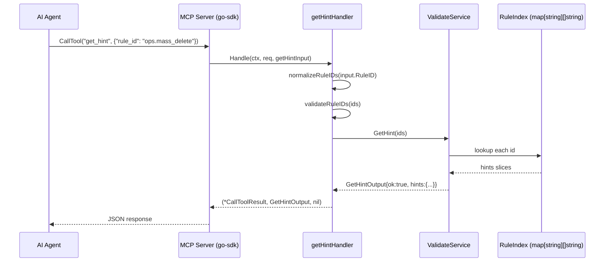

# MCP Tool Design: get_hint

**Status:** Draft
**Date:** 2026-02-25
**Package:** `samebits.com/evidra/pkg/mcpserver`
**Go version:** 1.22+

---

## 1. Purpose

`get_hint` is a lightweight, read-only MCP tool that returns remediation hint strings for one or more rule IDs. It is the lowest-cost tool in the Evidra MCP server: a pure in-memory key lookup against a cached `RuleIndex` populated at server startup.

### Why agents need this

`validate` already returns hints in its response. However, agents operating in long reasoning chains encounter two specific scenarios where a dedicated hint-retrieval tool is necessary:

**Context truncation re-fetch:** An agent's working context window is finite. After many tool calls, early turns (including the `validate` response containing hints) may be evicted from the context. The agent retains only the `rule_ids` from the denial (often extracted into a persistent note or state variable) but no longer has the hint text. Calling `get_event` to recover the hints is wasteful — it returns a full `EvidenceRecord` including actor metadata, timestamps, hashes, and policy decision fields. `get_hint` returns only what the agent needs: the remediation strings.

**Pre-action hint lookup:** An agent planning a batch of operations may call `validate` on each, accumulate the fired `rule_ids`, and then call `get_hint` in one batch call to collect all remediation hints before entering a planning loop. This avoids re-parsing multiple full `validate` responses.

**Operational difference from `get_event`:**

| | `get_event` | `get_hint` |
|---|---|---|
| Input | `event_id` (UUIDv4-style string) | `rule_id` or `[]rule_id` |
| Data source | Evidence store (JSONL on disk) | RuleIndex (in-memory map) |
| I/O at request time | Yes — file read | None |
| Response size | Full EvidenceRecord (actor, params, hashes) | `map[string][]string` — hints only |
| Unknown input | Error (`not_found`) | Empty array (not error) |
| Use case | Audit, chain validation | Remediation guidance |

---

## 2. Functional Specification

### Inputs

- `rule_id`: a single rule ID string, **or** an array of rule ID strings.
- Maximum 20 rule IDs per request (DoS mitigation; see Section 6).

### Outputs

- A JSON object mapping each requested `rule_id` to its hints array (`[]string`).
- If a rule ID is known, its value is the array of hint strings from `rule_hints/data.json`.
- If a rule ID is unknown (not present in the RuleIndex), its value is an empty array `[]`. This is an explicit design decision: an agent must never receive an error just because a rule ID was not found in the index — the denial has already happened and the agent is trying to recover. Returning an error here would force the agent to implement a try/catch pattern around what is conceptually an informational lookup. An empty hints array is the correct signal that no remediation guidance exists for that rule.
- No side effects. The function reads from an immutable in-memory map and writes nothing.
- Fully deterministic: the same input always produces the same output within a server lifetime.
- Fully idempotent: calling `get_hint` zero, one, or ten times with the same input has identical observable effect.

### What it does not do

- Does not call OPA.
- Does not read any file at request time.
- Does not write to the evidence store.
- Does not accept wildcards or prefix matching — only exact rule ID strings.

---

## 3. MCP Contract

### Input Schema

The schema uses `oneOf` on the `rule_id` field to support both a single string and an array of strings, matching the existing Go custom unmarshaling (see Section 5).

```json
{
  "type": "object",
  "required": ["rule_id"],
  "properties": {
    "rule_id": {
      "oneOf": [
        {
          "type": "string",
          "description": "Single rule ID (e.g. \"ops.mass_delete\").",
          "pattern": "^[a-z][a-z0-9_]*\\.[a-z][a-z0-9_]*$",
          "maxLength": 64
        },
        {
          "type": "array",
          "description": "Up to 20 rule IDs.",
          "items": {
            "type": "string",
            "pattern": "^[a-z][a-z0-9_]*\\.[a-z][a-z0-9_]*$",
            "maxLength": 64
          },
          "minItems": 1,
          "maxItems": 20
        }
      ]
    }
  }
}
```

### Response Schema

The structured output is a `GetHintOutput` value serialized to JSON.

```json
{
  "type": "object",
  "properties": {
    "ok": {
      "type": "boolean",
      "description": "true when the lookup succeeded; false only on validation or index errors."
    },
    "hints": {
      "type": "object",
      "description": "Map of rule_id to hints array. Unknown rule IDs map to [].",
      "additionalProperties": {
        "type": "array",
        "items": { "type": "string" }
      }
    },
    "error": {
      "type": "object",
      "nullable": true,
      "properties": {
        "code": { "type": "string" },
        "message": { "type": "string" }
      }
    }
  }
}
```

### Error Schema

Errors set `ok: false` and populate the `error` field. The `hints` field is omitted when `ok` is false.

| Code | Condition |
|---|---|
| `invalid_input` | Rule ID fails regex validation or array exceeds 20 items |
| `index_not_ready` | RuleIndex is nil (server started without a bundle path) |
| `internal_error` | Unexpected panic during lookup (should not occur in normal operation) |

### Concrete JSON Examples

**Single rule lookup — known rule:**

Request:
```json
{ "rule_id": "ops.mass_delete" }
```

Response:
```json
{
  "ok": true,
  "hints": {
    "ops.mass_delete": [
      "Reduce deletion scope",
      "Or add risk_tag: breakglass"
    ]
  }
}
```

**Multi-rule lookup:**

Request:
```json
{ "rule_id": ["ops.mass_delete", "k8s.protected_namespace"] }
```

Response:
```json
{
  "ok": true,
  "hints": {
    "ops.mass_delete": [
      "Reduce deletion scope",
      "Or add risk_tag: breakglass"
    ],
    "k8s.protected_namespace": [
      "Add risk_tag: breakglass",
      "Or apply changes outside kube-system"
    ]
  }
}
```

**Unknown rule ID — returns empty array, not error:**

Request:
```json
{ "rule_id": "ops.nonexistent_rule" }
```

Response:
```json
{
  "ok": true,
  "hints": {
    "ops.nonexistent_rule": []
  }
}
```

**Mixed known/unknown:**

Request:
```json
{ "rule_id": ["ops.mass_delete", "ops.nonexistent_rule"] }
```

Response:
```json
{
  "ok": true,
  "hints": {
    "ops.mass_delete": [
      "Reduce deletion scope",
      "Or add risk_tag: breakglass"
    ],
    "ops.nonexistent_rule": []
  }
}
```

**Invalid rule ID format:**

Request:
```json
{ "rule_id": "INVALID_FORMAT" }
```

Response:
```json
{
  "ok": false,
  "error": {
    "code": "invalid_input",
    "message": "rule_id \"INVALID_FORMAT\" does not match required pattern [a-z][a-z0-9_]*.[a-z][a-z0-9_]*"
  }
}
```

**Index not ready:**

Response:
```json
{
  "ok": false,
  "error": {
    "code": "index_not_ready",
    "message": "rule hint index is not available; server may have started without a bundle path"
  }
}
```

---

## 4. Internal Architecture

`get_hint` performs a pure in-memory map lookup. There is no OPA evaluation, no evidence store access, and no file I/O at request time. The `RuleIndex` is populated once during `NewServer` by loading `rule_hints/data.json` from the bundle directory via `bundlesource.BundleSource.LoadData()` (or an equivalent direct read), unmarshaling the top-level map, and storing it on the `ValidateService`.



The `RuleIndex` is a `map[string][]string` field on `ValidateService`, populated at startup. If the server is started without a bundle path (e.g., using `--policy`/`--data` flags for individual files), the `RuleIndex` will be nil, and `get_hint` will return an `index_not_ready` error.

---

## 5. Data Structures (Go)

### `getHintInput`

The `rule_id` field in the JSON wire format accepts either a string or an array of strings. The standard `encoding/json` decoder cannot unmarshal into a field of a fixed type when the source may be either a JSON string or a JSON array. The solution is to declare the field as `json.RawMessage` and implement a custom `UnmarshalJSON` that handles both cases, normalizing to `[]string` internally.

```go
// getHintInput is the parsed input for the get_hint MCP tool.
// RuleIDRaw holds the raw JSON value, which may be a string or array of strings.
type getHintInput struct {
    RuleIDRaw json.RawMessage `json:"rule_id"`
    // normalized is populated by UnmarshalJSON; do not access directly.
    normalized []string
}

func (g *getHintInput) UnmarshalJSON(data []byte) error {
    // Use an alias to avoid infinite recursion.
    type alias struct {
        RuleIDRaw json.RawMessage `json:"rule_id"`
    }
    var a alias
    if err := json.Unmarshal(data, &a); err != nil {
        return err
    }
    g.RuleIDRaw = a.RuleIDRaw
    ids, err := normalizeRuleIDs(a.RuleIDRaw)
    if err != nil {
        return err
    }
    g.normalized = ids
    return nil
}

// RuleIDs returns the normalized list of rule IDs after unmarshaling.
func (g *getHintInput) RuleIDs() []string {
    return g.normalized
}
```

### `normalizeRuleIDs`

```go
// normalizeRuleIDs accepts a json.RawMessage that is either a JSON string
// or a JSON array of strings. It returns a deduplicated []string.
// Returns an error if the raw value is neither a string nor an array of strings.
func normalizeRuleIDs(raw json.RawMessage) ([]string, error) {
    if len(raw) == 0 {
        return nil, fmt.Errorf("rule_id is required")
    }
    // Determine whether the raw value starts with '"' (string) or '[' (array).
    trimmed := bytes.TrimSpace(raw)
    if len(trimmed) == 0 {
        return nil, fmt.Errorf("rule_id is required")
    }
    switch trimmed[0] {
    case '"':
        var s string
        if err := json.Unmarshal(trimmed, &s); err != nil {
            return nil, fmt.Errorf("rule_id: %w", err)
        }
        return []string{s}, nil
    case '[':
        var arr []string
        if err := json.Unmarshal(trimmed, &arr); err != nil {
            return nil, fmt.Errorf("rule_id array: %w", err)
        }
        return dedupStrings(arr), nil
    default:
        return nil, fmt.Errorf("rule_id must be a string or array of strings, got unexpected token")
    }
}
```

### `GetHintOutput`

```go
// GetHintOutput is the structured response for the get_hint MCP tool.
type GetHintOutput struct {
    OK    bool              `json:"ok"`
    Hints map[string][]string `json:"hints,omitempty"`
    Error *ErrorSummary     `json:"error,omitempty"`
}
```

### `getHintHandler`

```go
// getHintHandler is the MCP tool handler for get_hint.
type getHintHandler struct {
    service *ValidateService
}

func (h *getHintHandler) Handle(
    ctx context.Context,
    _ *mcp.CallToolRequest,
    input getHintInput,
) (*mcp.CallToolResult, GetHintOutput, error) {
    output := h.service.GetHint(ctx, input.RuleIDs())
    return &mcp.CallToolResult{}, output, nil
}
```

### `ValidateService.GetHint`

```go
// GetHint looks up hints for the given rule IDs from the cached RuleIndex.
// Unknown rule IDs return an empty slice, not an error.
func (s *ValidateService) GetHint(_ context.Context, ruleIDs []string) GetHintOutput {
    if s.ruleIndex == nil {
        return GetHintOutput{
            OK: false,
            Error: &ErrorSummary{
                Code:    ErrCodeIndexNotReady,
                Message: "rule hint index is not available; server may have started without a bundle path",
            },
        }
    }
    if err := validateRuleIDList(ruleIDs); err != nil {
        return GetHintOutput{
            OK:    false,
            Error: &ErrorSummary{Code: ErrCodeInvalidInput, Message: err.Error()},
        }
    }
    hints := make(map[string][]string, len(ruleIDs))
    for _, id := range ruleIDs {
        if h, ok := s.ruleIndex[id]; ok {
            hints[id] = h
        } else {
            hints[id] = []string{}
        }
    }
    return GetHintOutput{OK: true, Hints: hints}
}
```

### Rule ID validation

```go
// ruleIDPattern matches the canonical dotted format: namespace.rule_name.
// Both segments must start with a lowercase letter and contain only
// lowercase letters, digits, and underscores.
var ruleIDPattern = regexp.MustCompile(`^[a-z][a-z0-9_]*\.[a-z][a-z0-9_]*$`)

const (
    maxRuleIDLength    = 64
    maxRuleIDsPerBatch = 20
    ErrCodeIndexNotReady = "index_not_ready"
)

func validateRuleIDList(ids []string) error {
    if len(ids) == 0 {
        return fmt.Errorf("at least one rule_id is required")
    }
    if len(ids) > maxRuleIDsPerBatch {
        return fmt.Errorf("too many rule_ids: %d exceeds maximum of %d", len(ids), maxRuleIDsPerBatch)
    }
    for _, id := range ids {
        if len(id) > maxRuleIDLength {
            return fmt.Errorf("rule_id %q exceeds maximum length of %d characters", id, maxRuleIDLength)
        }
        if !ruleIDPattern.MatchString(id) {
            return fmt.Errorf("rule_id %q does not match required pattern [a-z][a-z0-9_]*.[a-z][a-z0-9_]*", id)
        }
    }
    return nil
}
```

### `RuleIndex` field on `ValidateService`

Add to `ValidateService`:

```go
type ValidateService struct {
    // ... existing fields ...
    ruleIndex map[string][]string // populated at startup from rule_hints/data.json
}
```

Population in `newValidateService`: load rule hints via `bundlesource.BundleSource.LoadData()`, then extract the `evidra.data.rule_hints` sub-map and unmarshal it into `map[string][]string`. If the bundle path is empty or loading fails, `ruleIndex` remains nil and `get_hint` returns `index_not_ready`.

---

## 6. Concurrency and Safety Model

The `RuleIndex` is a `map[string][]string` that is:

1. Written exactly once, during `newValidateService` at server startup, before the server begins accepting connections.
2. Never mutated after that point.

Because Go maps are safe for concurrent reads when no concurrent writes occur, and because all writes complete before the first read, no mutex is required. The `getHintHandler.Handle` method can be called concurrently by any number of goroutines (the go-sdk dispatches tool calls concurrently) with zero contention.

**DoS mitigation:** The `maxRuleIDsPerBatch = 20` limit bounds the per-request work to O(20) map lookups regardless of how large the rule index grows. With a bounded index (the current bundle has 7 rules; a large production bundle might have 200), this means a worst-case of 20 map lookups per request, each O(1). There is no allocation beyond the output map (bounded at 20 entries) and the response JSON encoding.

---

## 7. Security Model

### Input validation

All rule IDs are validated against `ruleIDPattern` (`^[a-z][a-z0-9_]*\.[a-z][a-z0-9_]*$`) and a 64-character length cap before any lookup is performed. This rejects:

- SQL-injection-style strings (contain characters outside `[a-z0-9_.]`).
- Path traversal attempts (no `/`, `..`, or `\`).
- Overly long strings that might cause performance issues in regex matching.
- Uppercase letters, spaces, or other characters outside the canonical rule ID format.

The pattern is compiled once at package initialization (`regexp.MustCompile`), not per-request.

### Batch size cap

The `maxRuleIDsPerBatch = 20` limit prevents a caller from constructing a request with thousands of rule IDs to force repeated map lookups or large response allocations.

### Data disclosure

The hints returned by `get_hint` are policy metadata: remediation guidance strings authored by the policy writer. This is the same data returned in `validate` responses and is intentionally public within the MCP server's trust boundary. An agent that can call `validate` can trivially obtain all hints by calling `validate` with a known-denying input for each rule. `get_hint` adds no new disclosure surface.

The `ruleIndex` map contains only the keys and values from `rule_hints/data.json`. It does not contain user data, actor identities, evidence chain hashes, or policy parameters.

### No user data stored

`get_hint` records nothing. It does not call `evidence.Store`, does not write logs containing rule IDs at any level above `DEBUG`, and does not retain state from one call to the next.

---

## 8. Observability

### Structured logging (`log/slog`)

At the start of each `GetHint` call, emit a single `DEBUG`-level log line:

```
slog.DebugContext(ctx, "get_hint",
    "rule_ids", ruleIDs,
    "count", len(ruleIDs),
)
```

After the lookup, emit a single `DEBUG`-level line with hit/miss counts:

```
slog.DebugContext(ctx, "get_hint result",
    "hits", hitCount,
    "misses", missCount,
)
```

No `INFO`-level logging. `get_hint` is expected to be called frequently in agent reasoning loops; `INFO`-level logs would produce excessive noise in production deployments.

### Prometheus counter

```
evidra_get_hint_total{result="hit"}   — incremented once per rule ID found
evidra_get_hint_total{result="miss"}  — incremented once per rule ID not found
```

This provides per-rule-ID-resolution visibility when aggregated. Implementation uses `promauto.NewCounterVec` consistent with any other Prometheus metrics in the package.

### OpenTelemetry span

Wrap the body of `GetHint` in a child span:

```go
ctx, span := otel.Tracer("evidra-mcp").Start(ctx, "get_hint")
defer span.End()
span.SetAttributes(
    attribute.Int("rule_id.count", len(ruleIDs)),
    attribute.Int("hit.count", hitCount),
    attribute.Int("miss.count", missCount),
)
```

The span duration captures only the in-process lookup time (expected sub-microsecond). This is useful for catching unexpected latency spikes in pathological Go runtime states.

---

## 9. Performance Considerations

**Time complexity:** O(k) where k is the number of rule IDs in the request (bounded by `maxRuleIDsPerBatch = 20`). Each individual lookup is O(1) average case for map access.

**Space complexity:** O(k) for the output map allocated per request. The `RuleIndex` itself is O(n) where n is the number of rules in the bundle (currently 7; expected to remain under 500 for any foreseeable production bundle).

**Target latency:** Under 1ms end-to-end (from handler entry to `GetHintOutput` return). Actual wall-clock time is dominated by JSON encoding of the response, not the lookup. On a modern machine, 20 map lookups on string keys of length ≤ 64 takes under 1 microsecond.

**Zero I/O at request time.** This is the fundamental design constraint. `get_hint` must never trigger a file read, a syscall, or a network call in the request path. If the rule index needs to be refreshed (bundle hot-reload), this is done on a background goroutine with an atomic pointer swap — not on the request path.

**Suitable for agent reasoning loops.** Agents that call `get_hint` after every `validate` denial will not introduce latency into their reasoning cycles. The tool is cheap enough to call speculatively.

---

## 10. Failure Modes

### Unknown rule ID

**Behavior:** Returns `ok: true` with an empty array for that rule ID.

**Rationale:** The agent has already received a denial. The hint lookup is a best-effort informational step. Returning an error would force the agent to implement error handling for what is conceptually a cache miss. An empty hints array is the correct signal: "this rule fired but the policy author did not provide remediation hints." The agent can proceed without hints.

### RuleIndex not built

**Condition:** `ValidateService.ruleIndex == nil`. This happens when the server starts with `--policy`/`--data` flags (pointing to individual `.rego` and `data.json` files) rather than `--bundle`. In this mode, `bundlesource` is not used and the rule hints data is not loaded.

**Behavior:** Returns `ok: false` with code `index_not_ready`.

**Message:** `"rule hint index is not available; server may have started without a bundle path"`

**Remediation:** Restart the server with `--bundle` pointing to a valid bundle directory.

### Invalid rule ID format

**Condition:** Any rule ID in the request fails `validateRuleIDList`.

**Behavior:** Returns `ok: false` with code `invalid_input` and a message identifying the first offending rule ID. No partial lookup is performed — the entire request is rejected.

**Rationale:** Partial-success semantics (lookup valid IDs, reject invalid ones) would require a more complex response schema and create ambiguity for callers. Fail-fast is consistent with how `validate` handles invalid invocation structure.

### Batch size exceeded

**Condition:** `len(ruleIDs) > 20`.

**Behavior:** Returns `ok: false` with code `invalid_input`.

**Message:** `"too many rule_ids: 25 exceeds maximum of 20"`

---

## 11. Backward Compatibility

### String-or-array input

The `normalizeRuleIDs` function accepts both `"ops.mass_delete"` (scalar string) and `["ops.mass_delete", "k8s.protected_namespace"]` (array). The scalar form is the ergonomic default for single-rule re-fetches. The array form is the efficient path for batch lookups. Both are first-class inputs; neither is a "legacy" form.

Future versions of the tool will not remove scalar support. Agents written against the scalar API will continue to work even if the server is updated to require no changes on the agent side.

### Response map stability

The response is a flat `map[string][]string` keyed by rule ID. New hint strings are additive (they are appended to the array for a given rule ID as the bundle is updated). Existing hint strings may be revised in new bundle versions but will not be silently removed — bundle version is tracked in `.manifest` revision and in `ValidateOutput.Policy.PolicyRef`. Agents that need stable hints for a fixed bundle revision should pin the server to a specific bundle.

### New fields

Future versions may add fields to `GetHintOutput` (e.g., `rule_description`, `params`, `decision_type`). New fields are added with `omitempty`; existing fields are never removed. This follows the same contract as `ValidateOutput` and `GetEventOutput`.

---

## 12. Testing Strategy

All tests live in `pkg/mcpserver/` and follow the table-driven pattern established in `server_test.go`.

### Unit tests for `normalizeRuleIDs`

```go
// TestNormalizeRuleIDs covers the full input surface.
var normalizeRuleIDsTests = []struct {
    name    string
    raw     json.RawMessage
    want    []string
    wantErr bool
}{
    {name: "single string", raw: `"ops.mass_delete"`, want: []string{"ops.mass_delete"}},
    {name: "array single", raw: `["ops.mass_delete"]`, want: []string{"ops.mass_delete"}},
    {name: "array multi", raw: `["ops.mass_delete","k8s.protected_namespace"]`,
        want: []string{"ops.mass_delete", "k8s.protected_namespace"}},
    {name: "array dedup", raw: `["ops.mass_delete","ops.mass_delete"]`,
        want: []string{"ops.mass_delete"}},
    {name: "empty string", raw: `""`, wantErr: true},
    {name: "null", raw: `null`, wantErr: true},
    {name: "number", raw: `42`, wantErr: true},
    {name: "object", raw: `{}`, wantErr: true},
}
```

### Unit tests for `validateRuleIDList`

```go
var validateRuleIDListTests = []struct {
    name    string
    ids     []string
    wantErr bool
}{
    {name: "valid single", ids: []string{"ops.mass_delete"}},
    {name: "valid multi", ids: []string{"ops.mass_delete", "k8s.protected_namespace"}},
    {name: "invalid uppercase", ids: []string{"OPS.MASS_DELETE"}, wantErr: true},
    {name: "invalid no dot", ids: []string{"opsmassdelete"}, wantErr: true},
    {name: "invalid starts with digit", ids: []string{"1ops.mass_delete"}, wantErr: true},
    {name: "invalid too long", ids: []string{strings.Repeat("a", 32) + "." + strings.Repeat("b", 33)}, wantErr: true},
    {name: "empty slice", ids: []string{}, wantErr: true},
    {name: "exceeds batch limit", ids: make([]string, 21), wantErr: true}, // 21 copies of ""
    {name: "at batch limit", ids: validRuleIDs(20)}, // 20 valid IDs should pass
}
```

### Integration tests for `ValidateService.GetHint`

```go
func TestGetHintKnownRule(t *testing.T) {
    svc := newValidateServiceWithBundle(t)
    out := svc.GetHint(context.Background(), []string{"ops.mass_delete"})
    if !out.OK { t.Fatalf("expected ok: %v", out.Error) }
    hints := out.Hints["ops.mass_delete"]
    if len(hints) == 0 { t.Fatal("expected non-empty hints for ops.mass_delete") }
}

func TestGetHintUnknownRule(t *testing.T) {
    svc := newValidateServiceWithBundle(t)
    out := svc.GetHint(context.Background(), []string{"ops.nonexistent_rule"})
    if !out.OK { t.Fatalf("expected ok for unknown rule: %v", out.Error) }
    if out.Hints["ops.nonexistent_rule"] == nil {
        t.Fatal("expected empty slice (not nil) for unknown rule")
    }
    if len(out.Hints["ops.nonexistent_rule"]) != 0 {
        t.Fatal("expected empty slice for unknown rule")
    }
}

func TestGetHintMixedKnownUnknown(t *testing.T) { ... }
func TestGetHintIndexNotReady(t *testing.T) { ... }  // svc.ruleIndex = nil
func TestGetHintInvalidFormat(t *testing.T) { ... }
func TestGetHintBatchLimitExceeded(t *testing.T) { ... }
```

### Concurrent request test

```go
func TestGetHintConcurrent(t *testing.T) {
    svc := newValidateServiceWithBundle(t)
    var wg sync.WaitGroup
    for i := 0; i < 100; i++ {
        wg.Add(1)
        go func() {
            defer wg.Done()
            out := svc.GetHint(context.Background(), []string{"ops.mass_delete"})
            if !out.OK {
                t.Errorf("concurrent get_hint failed: %v", out.Error)
            }
        }()
    }
    wg.Wait()
}
```

### MCP tool registration test

Add a case to `TestServerRegistersValidateTool` (or create `TestServerRegistersGetHintTool`):

```go
func TestServerRegistersGetHintTool(t *testing.T) {
    server := newTestServer(t)
    tools := listToolNamesFromServer(t, server)
    if !containsTool(tools, "get_hint") {
        t.Fatalf("expected get_hint tool in %v", tools)
    }
}
```

---

## 13. Implementation Plan

All tasks are in `pkg/mcpserver/` unless otherwise specified. This is the simplest tool to implement in the codebase. Estimated total time: **2–3 hours**.

**Task 1 — Define `getHintInput` with custom JSON unmarshaling (30 min)**

Add `getHintInput` struct to `server.go` with `UnmarshalJSON` implementing string-or-array normalization via `normalizeRuleIDs`. Write unit tests for `normalizeRuleIDs` covering all cases in Section 12 before writing the implementation (TDD).

**Task 2 — Define `GetHintOutput` (5 min)**

Add `GetHintOutput` struct to `server.go`. It is a trivial struct; no logic required.

**Task 3 — Implement `normalizeRuleIDs` and `validateRuleIDList` (30 min)**

Implement both functions. `normalizeRuleIDs` handles the raw `json.RawMessage` dispatch. `validateRuleIDList` applies regex and length validation. Add `ErrCodeIndexNotReady = "index_not_ready"` constant to the error code block in `server.go`.

**Task 4 — Add `ruleIndex` to `ValidateService` and populate it in `newValidateService` (30 min)**

Add `ruleIndex map[string][]string` field to `ValidateService`. In `newValidateService`, after constructing the service, attempt to load the rule hints: create a `bundlesource.BundleSource` from `opts.BundlePath`, call `LoadData()`, parse the returned JSON, and extract `["evidra"]["data"]["rule_hints"]` as a `map[string][]string`. Assign to `svc.ruleIndex`. If any step fails (no bundle path, parse error), log a warning and leave `ruleIndex` as nil — do not fail server startup.

**Task 5 — Implement `ValidateService.GetHint` and `getHintHandler` (20 min)**

Implement `GetHint` on `ValidateService` as specified in Section 5. Implement `getHintHandler.Handle` delegating to `svc.GetHint`.

**Task 6 — Register `get_hint` in `NewServer` (10 min)**

Add `mcp.AddTool` call in `NewServer` following the same pattern as `get_event`. The `InputSchema` uses the `oneOf` JSON Schema from Section 3.

```go
getHintTool := &getHintHandler{service: svc}
mcp.AddTool(server, &mcp.Tool{
    Name:        "get_hint",
    Title:       "Get Rule Hints",
    Description: "Return remediation hints for one or more rule IDs. Accepts a single rule_id string or an array of up to 20 rule_id strings. Unknown rule IDs return an empty hints array, not an error.",
    Annotations: &mcp.ToolAnnotations{
        Title:           "Rule Hint Lookup",
        ReadOnlyHint:    true,
        IdempotentHint:  true,
        DestructiveHint: boolPtr(false),
        OpenWorldHint:   boolPtr(false),
    },
    InputSchema: map[string]any{ /* see Section 3 */ },
}, getHintTool.Handle)
```

**Task 7 — Write tests (30 min)**

Write all tests from Section 12 before submitting. Run `go test -race ./pkg/mcpserver/` to verify zero data races on the concurrent test.

**Note:** Observability hooks (slog, Prometheus counter, OTel span) described in Section 8 are a follow-up task. The initial implementation ships without them to keep the scope minimal. Add them when the metrics infrastructure is wired into the server.
