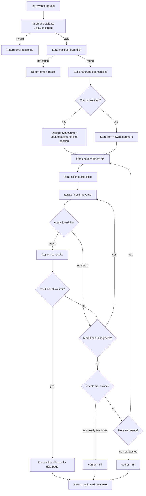

# MCP Tool Design: list_events

**Status:** Draft
**Date:** 2026-02-25
**Author:** AI-assisted design (Claude Sonnet 4.6)
**Related files:** `pkg/evidence/`, `pkg/mcpserver/server.go`

---

## Table of Contents

1. [Purpose](#1-purpose)
2. [Functional Specification](#2-functional-specification)
3. [MCP Contract](#3-mcp-contract)
4. [Internal Architecture](#4-internal-architecture)
5. [Data Structures (Go)](#5-data-structures-go)
6. [Concurrency and Safety Model](#6-concurrency-and-safety-model)
7. [Security Model](#7-security-model)
8. [Observability](#8-observability)
9. [Performance Considerations](#9-performance-considerations)
10. [Failure Modes](#10-failure-modes)
11. [Backward Compatibility](#11-backward-compatibility)
12. [Testing Strategy](#12-testing-strategy)
13. [Implementation Plan](#13-implementation-plan)

---

## 1. Purpose

### Supervisory agent use cases

A supervising agent orchestrates one or more subordinate AI agents and needs to audit what those agents have been doing without fetching every full evidence record. `list_events` provides the efficient first step in a two-phase lookup pattern:

- "Show me all events from `agent-worker-3` in the last 15 minutes" — real-time supervision during a long-running job.
- "Show me all denied events in the last hour" — triage after an alert fires.
- "Show me all high-risk events since the deployment at 14:00 UTC" — post-deployment safety review.
- "Are there any events matching `actor_id=agent-batch` that were allowed with risk_level=high?" — breakglass detection.

The supervising agent receives `EventSummary` objects — compact representations that contain the fields required to decide whether to escalate — and then calls `get_event` with specific `event_id` values to retrieve the complete immutable record with full params and execution output.

### Operator audit use cases

A human operator using an MCP-capable client (e.g., Claude Desktop, a custom dashboard) needs to review recent AI agent activity:

- Paginate through the last 200 events to build an audit report.
- Filter by `allow=false` to enumerate every denial for a compliance review.
- Cross-reference actor activity by filtering on `actor_id`.

### How it complements `get_event` — the list-then-fetch pattern

`get_event` fetches a single complete `EvidenceRecord` by `event_id`. It is expensive to call in bulk because each call independently scans all segments. `list_events` solves the discovery problem: callers obtain `event_id` values matching a filter with a single scan, then call `get_event` once per record they need in full. This pattern is fundamental to keeping individual tool calls cheap.

---

## 2. Functional Specification

### 2.1 Inputs

| Field | Type | Required | Default | Constraints |
|---|---|---|---|---|
| `since` | string | No | — | RFC3339 timestamp or relative duration: `"1h"`, `"24h"`, `"7d"`. Parsed at call time. |
| `until` | string | No | — | RFC3339 timestamp only. Must be after `since` if both provided. |
| `actor_id` | string | No | — | Exact match against `EvidenceRecord.Actor.ID`. |
| `risk_level` | string | No | — | One of `"low"`, `"medium"`, `"high"`. |
| `allow` | *bool | No | — | `true` = passed, `false` = denied. Omit to return both. |
| `limit` | int | No | 50 | 1–200 inclusive. Values above 200 are clamped to 200. |
| `cursor` | string | No | — | Opaque pagination cursor from a previous `list_events` response. |

**Relative duration parsing** for `since`: supported units are `h` (hours), `d` (days). Value is interpreted as `time.Now().UTC().Add(-duration)`. Examples:

- `"1h"` → one hour ago
- `"24h"` → 24 hours ago
- `"7d"` → 7 days ago (168 hours)

Any other format is rejected with `invalid_input`.

### 2.2 Outputs

The response contains:

| Field | Type | Description |
|---|---|---|
| `ok` | bool | `true` when the scan completed without a hard error. |
| `events` | `[]EventSummary` | Matched event summaries, newest-first. Empty array when no matches. |
| `cursor` | string \| null | Opaque cursor for fetching the next page. `null` when the scan is exhausted. |
| `total_scanned` | int | Number of JSONL records read from disk (across all segments visited). Useful for observability and caller reasoning about scan cost. |
| `segments_scanned` | int | Number of segment files opened. |
| `truncated` | bool | `true` when the scan was halted early due to the `max_scan_bytes` safety limit rather than because `limit` was reached or the store was exhausted. |
| `warnings` | `[]string` | Non-fatal warnings (e.g., a missing segment file that was skipped). |
| `error` | `*ErrorSummary` | Present only when `ok=false`. |

### 2.3 No side effects

`list_events` is strictly read-only. It does not write to the evidence store, does not modify the manifest, does not acquire the write lock, and does not update the forwarder state. It holds a read-compatible lock only for the duration of the manifest load; segment files are read without holding the store lock (see Section 6).

### 2.4 Scan order: newest-first

Segments are iterated from highest index to lowest (e.g., `evidence-000005.jsonl` before `evidence-000004.jsonl`). Within each segment, records are read from the last line to the first (reverse order). This design is deliberate:

- Supervising agents and operators almost always want the most recent events.
- The `since` filter enables early termination: once the record timestamp falls below the `since` threshold, all remaining records in all earlier segments are also below the threshold, and scanning can stop. This is the primary performance optimization available without a secondary index.
- Newest-first is the natural display order for audit UIs.

### 2.5 Idempotency

Given the same filter parameters and the same `cursor` value, the call returns the same results as long as no new records have been appended to the store and no segment sealing has occurred between the two calls. This is not strict idempotency (the store is live-appended), but the scan is deterministic over a stable store. Callers must not assume cursor stability across store mutations.

---

## 3. MCP Contract

### 3.1 Tool registration metadata

```json
{
  "name": "list_events",
  "title": "List Evidence Events",
  "description": "Query the evidence store for matching event summaries. Supports filtering by time range, actor, risk level, and allow/deny outcome. Returns paginated results newest-first. Use get_event to fetch a full record by event_id.",
  "annotations": {
    "readOnlyHint": true,
    "idempotentHint": true,
    "destructiveHint": false,
    "openWorldHint": false
  }
}
```

### 3.2 JSON request schema

```json
{
  "type": "object",
  "properties": {
    "since": {
      "type": "string",
      "description": "Return events after this time. RFC3339 timestamp (e.g. '2026-02-25T14:00:00Z') or relative duration (e.g. '1h', '24h', '7d'). Maximum range from 'since' to 'until' is 30 days."
    },
    "until": {
      "type": "string",
      "description": "Return events before this time. RFC3339 timestamp only. Optional; defaults to now."
    },
    "actor_id": {
      "type": "string",
      "description": "Filter by exact actor.id value.",
      "maxLength": 256
    },
    "risk_level": {
      "type": "string",
      "enum": ["low", "medium", "high"],
      "description": "Filter by risk level."
    },
    "allow": {
      "type": "boolean",
      "description": "Filter by policy outcome: true=passed, false=denied. Omit to return both."
    },
    "limit": {
      "type": "integer",
      "minimum": 1,
      "maximum": 200,
      "default": 50,
      "description": "Maximum number of events to return."
    },
    "cursor": {
      "type": "string",
      "description": "Pagination cursor from a previous list_events response. Opaque to callers."
    }
  },
  "additionalProperties": false
}
```

### 3.3 JSON response schema

```json
{
  "type": "object",
  "required": ["ok", "events", "total_scanned", "segments_scanned", "truncated"],
  "properties": {
    "ok": {
      "type": "boolean"
    },
    "events": {
      "type": "array",
      "items": { "$ref": "#/definitions/EventSummary" }
    },
    "cursor": {
      "type": ["string", "null"],
      "description": "Opaque cursor for the next page. null when exhausted."
    },
    "total_scanned": {
      "type": "integer",
      "description": "Total JSONL records read from disk."
    },
    "segments_scanned": {
      "type": "integer",
      "description": "Number of segment files opened."
    },
    "truncated": {
      "type": "boolean",
      "description": "True when results were cut short by the max_scan_bytes safety limit."
    },
    "warnings": {
      "type": "array",
      "items": { "type": "string" }
    },
    "error": { "$ref": "#/definitions/ErrorSummary" }
  },
  "definitions": {
    "EventSummary": {
      "type": "object",
      "required": ["event_id", "timestamp", "actor", "tool", "operation", "allow", "risk_level"],
      "properties": {
        "event_id":    { "type": "string" },
        "timestamp":   { "type": "string", "format": "date-time" },
        "actor": {
          "type": "object",
          "properties": {
            "type":   { "type": "string" },
            "id":     { "type": "string" },
            "origin": { "type": "string" }
          }
        },
        "tool":        { "type": "string" },
        "operation":   { "type": "string" },
        "allow":       { "type": "boolean" },
        "risk_level":  { "type": "string", "enum": ["low", "medium", "high"] },
        "rule_ids":    { "type": "array", "items": { "type": "string" } },
        "environment": { "type": "string" }
      }
    },
    "ErrorSummary": {
      "type": "object",
      "properties": {
        "code":    { "type": "string" },
        "message": { "type": "string" }
      }
    }
  }
}
```

### 3.4 Error schema

```json
{
  "ok": false,
  "events": [],
  "total_scanned": 0,
  "segments_scanned": 0,
  "truncated": false,
  "error": {
    "code": "invalid_input",
    "message": "'since' duration '999d' exceeds the 30-day maximum range"
  }
}
```

Error codes:

| Code | HTTP analogy | Meaning |
|---|---|---|
| `invalid_input` | 400 | Malformed filter (bad timestamp, unknown risk_level, limit > 200, range > 30 days) |
| `internal_error` | 500 | Unexpected read or parse failure |
| `store_not_initialized` | — | Evidence directory does not exist; treated as warning in most cases |

### 3.5 Concrete JSON examples

**Example 1: Unfiltered — last 50 events**

Request:
```json
{}
```

Response:
```json
{
  "ok": true,
  "events": [
    {
      "event_id": "01JPXW3Z8KQF6SRTNA27VMBX0E",
      "timestamp": "2026-02-25T14:22:05Z",
      "actor": { "type": "agent", "id": "agent-worker-1", "origin": "mcp" },
      "tool": "terraform",
      "operation": "apply",
      "allow": false,
      "risk_level": "high",
      "rule_ids": ["ops.unapproved_change"],
      "environment": "production"
    },
    {
      "event_id": "01JPXW1A4BKQF3NTRA17VMBX0C",
      "timestamp": "2026-02-25T14:21:47Z",
      "actor": { "type": "agent", "id": "agent-worker-1", "origin": "mcp" },
      "tool": "kubectl",
      "operation": "delete",
      "allow": true,
      "risk_level": "low",
      "rule_ids": [],
      "environment": "staging"
    }
  ],
  "cursor": "v1:eyJzZWdtZW50IjoiZXZpZGVuY2UtMDAwMDAxLmpzb25sIiwibGluZSI6NDh9",
  "total_scanned": 50,
  "segments_scanned": 1,
  "truncated": false,
  "warnings": []
}
```

**Example 2: Filter by risk_level=high**

Request:
```json
{
  "risk_level": "high",
  "since": "1h",
  "limit": 10
}
```

Response:
```json
{
  "ok": true,
  "events": [
    {
      "event_id": "01JPXW3Z8KQF6SRTNA27VMBX0E",
      "timestamp": "2026-02-25T14:22:05Z",
      "actor": { "type": "agent", "id": "agent-worker-3", "origin": "mcp" },
      "tool": "terraform",
      "operation": "apply",
      "allow": false,
      "risk_level": "high",
      "rule_ids": ["ops.unapproved_change", "k8s.protected_namespace"],
      "environment": "production"
    }
  ],
  "cursor": null,
  "total_scanned": 34,
  "segments_scanned": 1,
  "truncated": false,
  "warnings": []
}
```

**Example 3: Pagination — first page, then cursor-based second page**

First request:
```json
{
  "since": "24h",
  "limit": 2
}
```

First response:
```json
{
  "ok": true,
  "events": [
    {
      "event_id": "01JPXZ1A4BKQF3NTX17VMBX0C",
      "timestamp": "2026-02-25T14:30:00Z",
      "actor": { "type": "agent", "id": "agent-1", "origin": "mcp" },
      "tool": "kubectl",
      "operation": "apply",
      "allow": true,
      "risk_level": "low",
      "rule_ids": [],
      "environment": "staging"
    },
    {
      "event_id": "01JPXW3Z8KQF6SRTNA27VMBX0E",
      "timestamp": "2026-02-25T14:22:05Z",
      "actor": { "type": "agent", "id": "agent-1", "origin": "mcp" },
      "tool": "terraform",
      "operation": "plan",
      "allow": true,
      "risk_level": "medium",
      "rule_ids": ["ops.breakglass"],
      "environment": "production"
    }
  ],
  "cursor": "v1:eyJzZWdtZW50IjoiZXZpZGVuY2UtMDAwMDAyLmpzb25sIiwibGluZSI6MTIsInNpbmNlX2Vwb2NoIjoxNzQwMzkwMjAwfQ==",
  "total_scanned": 2,
  "segments_scanned": 1,
  "truncated": false,
  "warnings": []
}
```

Second request (using cursor from first response):
```json
{
  "since": "24h",
  "limit": 2,
  "cursor": "v1:eyJzZWdtZW50IjoiZXZpZGVuY2UtMDAwMDAyLmpzb25sIiwibGluZSI6MTIsInNpbmNlX2Vwb2NoIjoxNzQwMzkwMjAwfQ=="
}
```

Second response:
```json
{
  "ok": true,
  "events": [
    {
      "event_id": "01JPXV8B2CKQ73NTRA09VMBX09",
      "timestamp": "2026-02-25T13:58:11Z",
      "actor": { "type": "human", "id": "ops-alice", "origin": "cli" },
      "tool": "terraform",
      "operation": "apply",
      "allow": false,
      "risk_level": "high",
      "rule_ids": ["ops.mass_delete"],
      "environment": "production"
    }
  ],
  "cursor": null,
  "total_scanned": 1,
  "segments_scanned": 2,
  "truncated": false,
  "warnings": []
}
```

---

## 4. Internal Architecture

### 4.1 Scan approach

The evidence store has no secondary index. There is no timestamp index, no actor index, no in-memory structure. The only data structures are:

- `manifest.json`: contains the segment list (`SealedSegments` + `CurrentSegment`) and aggregate metadata.
- `segments/evidence-NNNNNN.jsonl`: append-only JSONL files with one `EvidenceRecord` per line.

`list_events` implements a linear backward scan:

1. Load the manifest to obtain the ordered segment list.
2. Build a reversed segment list (highest index first: `evidence-000005.jsonl`, `evidence-000004.jsonl`, ...).
3. For each segment (newest to oldest):
   a. Read all lines into memory (or stream with buffered reverse iterator).
   b. Iterate lines in reverse order (last line first).
   c. Apply the `ScanFilter` to each record.
   d. On a match, append to the result set.
   e. If `result_count == limit`, record the current `(segment, line_offset)` position as the next cursor and stop.
   f. If the record's timestamp is before `since`, stop all scanning (early termination).
4. If the store is exhausted without reaching `limit`, set `cursor = nil`.

**Note on in-segment reverse iteration**: JSONL files do not have a built-in reverse index. The implementation reads all lines of a segment into a `[]string` slice, then iterates the slice in reverse. For a 5 MB segment with ~500-byte average records, this allocates approximately 10,000 line strings. This is acceptable given the max segment size of `defaultSegmentMaxBytes = 5_000_000` bytes and the `max_scan_bytes` safety limit (see Section 6).

### 4.2 Mermaid diagram



### 4.3 New function: `evidence.ScanFiltered`

`ScanFiltered` is the new exported function in `pkg/evidence` that implements the scan. It is intentionally decoupled from the MCP layer so it can also be used by the `evidra evidence` CLI sub-commands in the future.

Signature:

```go
// ScanFiltered scans the evidence store at root applying filter,
// resuming from cursor if non-nil. It returns matched records in
// newest-first order, the next-page cursor (nil if exhausted),
// and scan statistics.
func ScanFiltered(root string, filter ScanFilter, cursor *ScanCursor) (ScanResult, error)
```

Where `ScanResult` carries the matched records, next cursor, and scan statistics. See Section 5 for all type definitions.

### 4.4 Cursor encoding

The cursor is an opaque string externally. Internally it encodes the exact resume position: the segment filename and the 0-based line offset within that segment that was the last line read (exclusive — the next call resumes from `line - 1`).

Format: `v1:<base64url-encoded-JSON>` where the inner JSON is the `scanCursorPayload` struct. The `v1:` prefix allows future format changes without breaking the opaque contract. Unknown version prefixes cause a graceful restart (not an error).

---

## 5. Data Structures (Go)

All new types belong in `pkg/evidence` unless noted. New types in `pkg/mcpserver` are noted explicitly.

### 5.1 `EventSummary`

`EventSummary` is a strict subset of `EvidenceRecord`. It contains all fields needed for triage without the large `Params`, `ExecutionResult`, `Hash`, or `PreviousHash` fields.

```go
// EventSummary is a compact projection of EvidenceRecord returned by
// ScanFiltered. It contains the fields required for supervisory triage.
// Full records are fetched via get_event.
type EventSummary struct {
    EventID     string          `json:"event_id"`
    Timestamp   time.Time       `json:"timestamp"`
    Actor       invocation.Actor `json:"actor"`
    Tool        string          `json:"tool"`
    Operation   string          `json:"operation"`
    Allow       bool            `json:"allow"`
    RiskLevel   string          `json:"risk_level"`
    RuleIDs     []string        `json:"rule_ids,omitempty"`
    Environment string          `json:"environment,omitempty"`
}

// summaryFromRecord projects an EvidenceRecord into an EventSummary.
func summaryFromRecord(r EvidenceRecord) EventSummary {
    return EventSummary{
        EventID:     r.EventID,
        Timestamp:   r.Timestamp,
        Actor:       r.Actor,
        Tool:        r.Tool,
        Operation:   r.Operation,
        Allow:       r.PolicyDecision.Allow,
        RiskLevel:   r.PolicyDecision.RiskLevel,
        RuleIDs:     r.PolicyDecision.RuleIDs,
        Environment: r.EnvironmentLabel,
    }
}
```

### 5.2 `ScanFilter`

```go
// ScanFilter specifies filter criteria for ScanFiltered.
// All fields are optional; a nil or zero-value field means "no constraint".
type ScanFilter struct {
    // Since, if non-zero, excludes records with Timestamp before Since.
    // Also enables early termination: scanning stops when a record's
    // timestamp falls below Since because segments are scanned newest-first.
    Since time.Time

    // Until, if non-zero, excludes records with Timestamp at or after Until.
    Until time.Time

    // ActorID, if non-empty, requires exact match on Actor.ID.
    ActorID string

    // RiskLevel, if non-empty, requires exact match ("low"|"medium"|"high").
    RiskLevel string

    // Allow, if non-nil, filters by PolicyDecision.Allow.
    Allow *bool

    // Limit is the maximum number of matching records to return.
    // Values <= 0 default to defaultScanLimit. Values > maxScanLimit
    // are clamped to maxScanLimit.
    Limit int

    // MaxScanBytes is the safety cap on total bytes read from segment files.
    // ScanFiltered sets truncated=true and stops early if exceeded.
    // Values <= 0 use defaultMaxScanBytes.
    MaxScanBytes int64
}

const (
    defaultScanLimit    = 50
    maxScanLimit        = 200
    defaultMaxScanBytes = 50 * 1024 * 1024 // 50 MB
)
```

### 5.3 `ScanCursor`

```go
// ScanCursor encodes a resume position for ScanFiltered pagination.
// It is opaque to external callers: the string representation is
// "v1:<base64url-nopad-json>" where the inner JSON is scanCursorPayload.
//
// Version prefix allows future format changes. An unrecognized version
// causes ScanFiltered to restart the scan from the beginning (not error).
type ScanCursor struct {
    payload scanCursorPayload
}

// scanCursorPayload is the internal versioned cursor state.
type scanCursorPayload struct {
    // Segment is the filename (not full path) of the segment being resumed,
    // e.g. "evidence-000003.jsonl".
    Segment string `json:"segment"`

    // Line is the 0-based index of the next line to process within Segment
    // (i.e. the first line not yet returned to the caller).
    // A value of -1 means this segment is exhausted; resume from the
    // next older segment.
    Line int `json:"line"`

    // SinceEpoch, if > 0, is the Unix timestamp of the original Since filter.
    // Stored in the cursor so the caller does not need to re-supply it on
    // subsequent pages, and to detect stale cursors relative to filter drift.
    SinceEpoch int64 `json:"since_epoch,omitempty"`
}

// Encode serialises the cursor to the "v1:<base64url>" opaque string.
func (c ScanCursor) Encode() string

// DecodeScanCursor parses the opaque cursor string.
// Returns (cursor, true, nil) on success.
// Returns (zero, false, nil) if the version prefix is unrecognized —
// caller should restart the scan.
// Returns (zero, false, err) if the string is structurally corrupt.
func DecodeScanCursor(s string) (ScanCursor, bool, error)
```

Internal implementation of `Encode`:

```go
func (c ScanCursor) Encode() string {
    b, _ := json.Marshal(c.payload)
    return "v1:" + base64.RawURLEncoding.EncodeToString(b)
}
```

Internal implementation of `DecodeScanCursor`:

```go
func DecodeScanCursor(s string) (ScanCursor, bool, error) {
    if !strings.HasPrefix(s, "v1:") {
        // Unknown version — signal restart, not error.
        return ScanCursor{}, false, nil
    }
    raw, err := base64.RawURLEncoding.DecodeString(strings.TrimPrefix(s, "v1:"))
    if err != nil {
        return ScanCursor{}, false, fmt.Errorf("decode cursor: %w", err)
    }
    var p scanCursorPayload
    if err := json.Unmarshal(raw, &p); err != nil {
        return ScanCursor{}, false, fmt.Errorf("unmarshal cursor: %w", err)
    }
    return ScanCursor{payload: p}, true, nil
}
```

### 5.4 `ScanResult`

```go
// ScanResult is returned by ScanFiltered and contains matched summaries
// plus scan statistics.
type ScanResult struct {
    // Events holds matched EventSummary values in newest-first order.
    Events []EventSummary

    // NextCursor, if non-nil, encodes the resume position for the next page.
    // nil when the scan is fully exhausted.
    NextCursor *ScanCursor

    // TotalScanned is the number of JSONL records decoded from disk,
    // regardless of whether they matched the filter.
    TotalScanned int

    // SegmentsScanned is the count of segment files opened.
    SegmentsScanned int

    // Truncated is true if scanning was stopped by the MaxScanBytes limit.
    Truncated bool

    // Warnings accumulates non-fatal issues encountered during the scan
    // (e.g., a segment file listed in the manifest that could not be opened).
    Warnings []string
}
```

### 5.5 `ScanFiltered` full signature

```go
// ScanFiltered scans the evidence store at root applying filter,
// resuming from cursor if non-nil.
//
// The store is NOT locked during segment file reads. Only the manifest
// load acquires the store lock momentarily. This is safe because:
//   - JSONL segment files are append-only; existing lines are never mutated.
//   - The current segment may grow during the scan; new lines appended
//     after the slice was read are not visible to this call (consistent snapshot).
//   - Sealed segments are immutable after sealing.
//
// ScanFiltered does not validate the hash chain. It is a best-effort
// listing tool; chain integrity is enforced by get_event and ValidateChain.
func ScanFiltered(root string, filter ScanFilter, cursor *ScanCursor) (ScanResult, error)
```

### 5.6 `ListEventsInput` and `ListEventsOutput` — in `pkg/mcpserver`

```go
// ListEventsInput is the deserialized MCP tool input for list_events.
// Generated by AI | 2026-02-25 | list_events tool input schema | Related prompt file: ai/AI_PROMPTS_LOG.md
type ListEventsInput struct {
    Since     string  `json:"since,omitempty"`
    Until     string  `json:"until,omitempty"`
    ActorID   string  `json:"actor_id,omitempty"`
    RiskLevel string  `json:"risk_level,omitempty"`
    Allow     *bool   `json:"allow,omitempty"`
    Limit     int     `json:"limit,omitempty"`
    Cursor    string  `json:"cursor,omitempty"`
}

// ListEventsOutput is the MCP tool response for list_events.
// Generated by AI | 2026-02-25 | list_events tool output schema | Related prompt file: ai/AI_PROMPTS_LOG.md
type ListEventsOutput struct {
    OK              bool                    `json:"ok"`
    Events          []evidence.EventSummary `json:"events"`
    Cursor          *string                 `json:"cursor"`
    TotalScanned    int                     `json:"total_scanned"`
    SegmentsScanned int                     `json:"segments_scanned"`
    Truncated       bool                    `json:"truncated"`
    Warnings        []string                `json:"warnings,omitempty"`
    Error           *ErrorSummary           `json:"error,omitempty"`
}
```

---

## 6. Concurrency and Safety Model

### 6.1 Read-only scan: no write lock

`ScanFiltered` acquires the store lock **only** for the manifest load. Segment file reads are performed without holding the lock. This is safe by design:

- **JSONL files are append-only.** Existing records are never overwritten or deleted. A concurrent `Append` call adds a new line at the end of `CurrentSegment`. Lines already read into the in-memory slice are immutable.
- **Segment sealing during scan.** If the current segment is sealed mid-scan (i.e., it appears in `SealedSegments` after `CurrentSegment` advances), the scan has already loaded the segment's lines into a slice. The seal operation does not modify existing lines; it only updates the manifest. The scan's in-memory slice remains valid and consistent.
- **New current segment.** If a new current segment is created during the scan, it was not in the manifest's segment list when `ScanFiltered` started. It will not be visited. This is acceptable: records appended after the scan started are not included, which is a consistent snapshot from the start of the call.

**Lock acquisition sequence for manifest:**

```
withStoreLock(root, func() {
    manifest = loadOrInitManifest(root, ...)
    segmentNames = reversedSegmentList(manifest)
})
// Lock released here.
// Segment files read WITHOUT lock.
for _, segName := range segmentNames {
    lines = readAllLinesFromFile(segPath)
    for i := len(lines)-1; i >= 0; i-- { ... }
}
```

This ensures writers are never blocked by a slow scan.

### 6.2 Partial lines

`bufio.Scanner` with the default `ScanLines` split function produces only complete newline-terminated lines. If a concurrent append is writing a record at the moment the file is read, the `os.Open` + `bufio.Scanner` combination will either:

- Not see the partial line at all (if the append began after `ReadFile`/`Open` reached EOF), or
- See a partial line that fails `json.Unmarshal`.

A JSON parse failure on a line during `ScanFiltered` is treated as a warning, not an abort. The line is skipped and a warning is appended to `ScanResult.Warnings`. This is distinct from the chain validation path in `FindByEventID` which treats any parse error as fatal.

### 6.3 Segment sealing during scan

When `appendSegmented` seals a segment, it:
1. Appends the segment to `SealedSegments` in the manifest.
2. Creates a new empty `CurrentSegment` file.
3. Writes the updated manifest atomically (rename).

None of these operations modify the content of the segment file that was sealed. The scan holds a reference to the file path (not a file descriptor) and reads lines after the seal completes. The sealed segment's content is identical to what it contained at seal time. Safe.

### 6.4 Max scan bytes limit

To prevent runaway queries (e.g., `limit=200` on a 10 GB store with no `since` filter), `ScanFiltered` tracks the total bytes read from segment files. When `bytesRead > filter.MaxScanBytes` (default 50 MB), the scan stops and sets `ScanResult.Truncated = true`. A non-nil `NextCursor` is still returned so the caller can continue if desired.

The 50 MB default covers approximately 100,000 records at 500 bytes average. Operators who need deeper scans should supply a `since` filter or use the CLI's `evidra evidence report` command which operates outside the per-call budget.

---

## 7. Security Model

### 7.1 Time range validation

The `since`-to-`until` window is capped at 30 days. This prevents:

- Accidental unbounded full-store scans from a misconfigured client.
- Deliberate denial-of-service via a single `list_events` call that forces reading gigabytes of JSONL.

Validation logic (in the mcpserver layer, before calling `ScanFiltered`):

```go
if !filter.Since.IsZero() && !filter.Until.IsZero() {
    if filter.Until.Sub(filter.Since) > 30*24*time.Hour {
        return ListEventsOutput{...error: "range exceeds 30 days"}
    }
}
// Open-ended queries (no until) are also limited:
// if since is more than 30 days ago, reject.
if !filter.Since.IsZero() && time.Since(filter.Since) > 30*24*time.Hour {
    return ListEventsOutput{...error: "since is more than 30 days ago"}
}
```

### 7.2 Limit cap

Values above 200 are clamped silently (not rejected) to avoid breaking callers that rely on server-side clamping. Values of 0 or negative are treated as the default of 50.

### 7.3 `actor_id` input sanitization

`actor_id` is used only as a string comparison against `EvidenceRecord.Actor.ID`. It is never interpolated into a file path, SQL query, or shell command. There is no path traversal risk. The only sanitization required is a length cap (256 characters) to prevent memory pressure from an excessively long filter string.

### 7.4 Disclosure risk: actor IDs and tool names

`list_events` returns `actor.id`, `actor.type`, `actor.origin`, `tool`, and `operation` for every matched record. These fields reveal:

- The identities of AI agents and human operators who have invoked tools.
- The tools and operations used.

This is **intended behavior** for a trusted-deployment audit tool. Evidra is designed for local or operator-controlled deployments, not multi-tenant SaaS. The MCP server runs on the same machine as the agent or is exposed only to trusted operator clients. There is no authentication or authorization layer in `v0.1`.

**Risk documentation**: Operators deploying Evidra in environments where the MCP server is accessible to untrusted clients (e.g., exposed via HTTP without TLS or authentication) must understand that `list_events` will leak agent identity and activity patterns. This is out of scope for `v0.1` — document in `SECURITY.md` as a known limitation.

---

## 8. Observability

### 8.1 Structured logging with `slog`

All logging uses Go's `log/slog` package, consistent with the rest of the codebase pattern.

In `listEventsHandler.Handle`:

```go
slog.Info("list_events scan complete",
    "since", input.Since,
    "until", input.Until,
    "actor_id", input.ActorID,
    "risk_level", input.RiskLevel,
    "allow", input.Allow,
    "limit", effectiveLimit,
    "cursor_present", input.Cursor != "",
    "result_count", len(output.Events),
    "total_scanned", output.TotalScanned,
    "segments_scanned", output.SegmentsScanned,
    "truncated", output.Truncated,
    "duration_ms", time.Since(start).Milliseconds(),
)
```

On filter validation failure:

```go
slog.Warn("list_events invalid input",
    "error", validationErr.Error(),
    "since", input.Since,
    "until", input.Until,
)
```

On non-fatal scan warnings (e.g., skipped segment):

```go
slog.Warn("list_events scan warning",
    "warning", w,
    "segment", segName,
)
```

### 8.2 Prometheus metrics

Two new metrics are added in `pkg/mcpserver` (or a shared `pkg/metrics` package if one is introduced):

```go
// Histogram: scan duration in seconds, bucketed for 10ms–10s range.
// Labels: truncated (true|false), has_cursor (true|false)
evidraListEventsScanDuration = prometheus.NewHistogramVec(
    prometheus.HistogramOpts{
        Name:    "evidra_list_events_scan_duration_seconds",
        Help:    "Duration of list_events store scan operations.",
        Buckets: []float64{0.005, 0.01, 0.025, 0.05, 0.1, 0.25, 0.5, 1.0, 2.5, 5.0, 10.0},
    },
    []string{"truncated", "has_cursor"},
)

// Counter: total list_events calls.
// Labels: ok (true|false), truncated (true|false)
evidraListEventsTotal = prometheus.NewCounterVec(
    prometheus.CounterOpts{
        Name: "evidra_list_events_total",
        Help: "Total number of list_events tool invocations.",
    },
    []string{"ok", "truncated"},
)
```

These metrics are registered only when Prometheus is enabled (the existing pattern in the codebase should be followed — if no Prometheus integration exists in `v0.1`, these are recorded as future additions in this document and implemented when the metrics package is introduced).

### 8.3 OpenTelemetry span

If an OTel tracer is configured on the context, `listEventsHandler.Handle` creates a child span:

```go
ctx, span := otel.Tracer("evidra").Start(ctx, "list_events")
defer span.End()

// After scan completes:
span.SetAttributes(
    attribute.Int("evidra.segments_scanned", result.SegmentsScanned),
    attribute.Int("evidra.records_returned", len(result.Events)),
    attribute.Int("evidra.total_scanned", result.TotalScanned),
    attribute.Bool("evidra.truncated", result.Truncated),
)
```

OTel integration is also conditional on the server being configured with a tracer; if none is set the `otel.Tracer` call returns a no-op tracer and there is no overhead.

---

## 9. Performance Considerations

### 9.1 Algorithmic complexity

`list_events` is O(n) in the number of records scanned. There is **no secondary index**. This is the defining architectural constraint of the `v0.1` evidence store. Every query that cannot terminate early (no `since` filter, or `since` is very old) must read every record in every segment.

For context, the existing `FindByEventID` also does a full scan. `list_events` is the first function to offer early termination via the `since` filter, making it substantially more efficient for the most common queries (recent activity review).

### 9.2 Early termination with `since`

When `since` is provided and the scan is proceeding newest-first, the scan can terminate as soon as it encounters a record with `Timestamp < since`. Because segments are ordered by sequential index (oldest segment = lowest index) and records within a segment are ordered by insertion time (oldest record = first line), a newest-first scan guarantees monotonically decreasing timestamps **across segments**. Within a segment, timestamps are also monotonically non-decreasing by insertion order, so the reverse-line iteration within a segment also produces monotonically decreasing timestamps.

Therefore: once any record's timestamp is before `since`, all subsequent records (lower line numbers in the same segment, and all lines in older segments) are also before `since`. The scan exits immediately.

This makes `since=1h` queries very fast on active stores: only the records from the last hour need to be read, regardless of total store size.

### 9.3 Expected latency benchmarks

Based on `defaultSegmentMaxBytes = 5_000_000` bytes per segment and ~500 bytes average record size (~10,000 records per segment):

| Scenario | Expected latency | Notes |
|---|---|---|
| `since=1h`, active store (< 1k records in window) | < 10 ms | Early termination after < 1 segment |
| `since=1h`, high-volume store (10k records in window) | < 100 ms | 1 full segment read |
| No filter, `limit=50` on 100k-record store | < 50 ms | Reads ~50 records then stops |
| No filter, no limit, `max_scan_bytes` hit at 50 MB | < 2 s | ~10 segments read |
| `since=7d` with `risk_level=high` filter on 500k records | 1–5 s | Multiple segments, heavy filter |

The absence of a secondary index means there is no way to make the `since=7d` case fast without either (a) a separate index or (b) per-segment timestamp metadata in the manifest (a lighter-weight optimization).

### 9.4 Architectural debt: absence of secondary index

The evidence store deliberately avoids a database dependency in `v0.1`. This is the right tradeoff for a local-deployment audit tool, but it means:

- `list_events` performance degrades linearly with store age for open-ended queries.
- There is no way to efficiently look up by `actor_id` without scanning all records.
- The `since` early termination only works because segments are time-ordered by insertion.

**Proposed upgrade path**: Introduce an optional SQLite index file at `~/.evidra/evidence/index.db` that is populated lazily from existing segments on first use and kept current by the append path. The index would contain at minimum: `(event_id, timestamp, actor_id, risk_level, allow, segment_name, line_offset)`. `ScanFiltered` would query the SQLite index when it exists, falling back to JSONL scan when it does not. The index is advisory (not authoritative); chain integrity remains in the JSONL files.

This upgrade path is explicitly out of scope for `v0.1` and should be filed as a technical debt item.

---

## 10. Failure Modes

### 10.1 No records match filter

Not an error. Returns `ok=true`, `events=[]`, `cursor=null`, `total_scanned=N` where N is the number of records examined before scan termination.

### 10.2 Store not initialized

If the evidence directory does not exist (`os.ErrNotExist` from `detectStoreMode`), `ScanFiltered` returns an empty `ScanResult` with a warning string:

```
"evidence store not found at path /home/user/.evidra/evidence"
```

The MCP response has `ok=true` (not an error) because an absent store is a valid state for a freshly installed system. The caller can inspect `warnings` to distinguish "store empty" from "store missing".

### 10.3 Segment file missing

If a segment listed in the manifest (sealed or current) cannot be opened (`os.ErrNotExist`), the scan **skips** that segment and appends a warning:

```
"segment evidence-000003.jsonl listed in manifest but not found on disk — skipping"
```

This is non-fatal because:
- The scan may still return useful results from other segments.
- The missing segment may have been manually deleted or archived.
- Chain integrity detection is a separate concern; `ScanFiltered` does not validate hashes.

The scan continues with the next older segment. `ok=true` with a populated `warnings` array.

### 10.4 Cursor invalid or expired

An invalid cursor (corrupt base64, corrupt JSON payload) returns a decode error, which causes `ScanFiltered` to restart the scan from the beginning rather than returning an error to the caller. This is the "graceful restart" policy. Rationale: cursors are invalidated by any segment sealing event; requiring callers to handle cursor expiry errors is a poor API contract. Restarting the scan is always correct, just potentially more expensive.

An unrecognized version prefix (not `v1:`) also triggers a graceful restart, enabling forward compatibility with future cursor format versions.

The `ScanResult.Warnings` field will contain:

```
"cursor could not be decoded; restarting scan from newest record"
```

### 10.5 Scan exceeds `max_scan_bytes`

When `bytesRead > filter.MaxScanBytes`, the scan stops immediately. The response has:

- `ok=true`
- `events`: whatever was collected so far
- `cursor`: encodes the position where the scan stopped (caller can continue)
- `truncated=true`
- No error

The caller should communicate `truncated=true` to the user and suggest adding a `since` filter to narrow the query.

### 10.6 JSON parse error on a line

A corrupt JSONL line (truncated record, encoding error) is skipped with a warning. This is intentional: `ScanFiltered` is a best-effort listing tool. Chain validation (which would make parse errors fatal) is not performed during a list scan.

---

## 11. Backward Compatibility

### 11.1 `EventSummary` is a strict subset of `EvidenceRecord`

No field in `EventSummary` is absent from `EvidenceRecord`. Adding a new field to `EventSummary` in the future is always safe — it is a projection of existing data. Removing a field from `EventSummary` is a breaking change (callers may depend on it). The approved evolution path is additive only.

### 11.2 Response envelope additions are safe

Adding new optional top-level fields to `ListEventsOutput` (e.g., a `facets` object for aggregated counts) is backward-compatible: JSON decoders that do not know the field will ignore it. Removing existing fields is a breaking change.

### 11.3 Cursor format versioning

The `v1:` prefix is the cursor format version. Consumers of the cursor treat it as an opaque string. When the cursor format needs to change (e.g., to encode a segment file hash for stronger staleness detection), a new prefix `v2:` is introduced. Existing `v1:` cursors remain valid until the server is upgraded, at which point `v1:` cursors trigger a graceful restart (not an error) because `DecodeScanCursor` will encounter an unrecognized `v1:` scheme after the `v2:` decoder is the primary path.

This means cursor format migrations do not require coordinated client upgrades.

### 11.4 Filter additions are backward-compatible

New filter fields added to `ListEventsInput` must have safe defaults (i.e., an absent field means "no constraint"). Existing callers that do not send the new field receive the same results as before. This is enforced by Go's zero-value semantics: an absent JSON field leaves the struct field at its zero value, and all filter fields are designed so that their zero value means "unfiltered".

---

## 12. Testing Strategy

### 12.1 Unit tests for `ScanFiltered` — `pkg/evidence`

**Fixture JSONL files**: Create test helper `writeFixtureSegments(t, root, records []EvidenceRecord)` that writes a deterministic set of segments for each test case. Segment sizes are controlled by `EVIDRA_EVIDENCE_SEGMENT_MAX_BYTES` env var in tests.

**Filter combination tests** (each as a separate `t.Run`):

| Test name | Setup | Filter | Expected result |
|---|---|---|---|
| `TestScanFiltered_Unfiltered` | 10 records across 2 segments | no filter, limit=5 | 5 newest records, cursor non-nil |
| `TestScanFiltered_SinceFilter` | 20 records spanning 2 hours | since=1h | only records in last hour, cursor nil |
| `TestScanFiltered_SinceEarlyTermination` | 100 records, since=5min | since=5min | scan stops early; total_scanned < 100 |
| `TestScanFiltered_UntilFilter` | 10 records | until=specific_timestamp | only records before that time |
| `TestScanFiltered_ActorID` | 10 records, 2 actors | actor_id="agent-1" | only records from agent-1 |
| `TestScanFiltered_RiskLevel` | 10 records, mixed risk | risk_level="high" | only high-risk records |
| `TestScanFiltered_AllowTrue` | 10 records, 5 allow, 5 deny | allow=true | only allowed records |
| `TestScanFiltered_AllowFalse` | 10 records, 5 allow, 5 deny | allow=false | only denied records |
| `TestScanFiltered_EmptyStore` | no records | no filter | empty events, ok=true |
| `TestScanFiltered_StoreNotFound` | directory absent | no filter | empty events, warning present |

### 12.2 Pagination correctness tests

```go
func TestScanFiltered_PaginationComplete(t *testing.T) {
    // Write 25 records across 3 segments.
    // Call ScanFiltered with limit=10, collect page 1.
    // Call again with cursor from page 1, collect page 2.
    // Call again with cursor from page 2, collect page 3.
    // Verify: total events across all pages == 25, no duplicates, no gaps.
    // Verify: event ordering is newest-first across pages.
}

func TestScanFiltered_CursorSegmentBoundary(t *testing.T) {
    // Write records such that the limit=5 boundary falls exactly at a
    // segment boundary. Verify the cursor correctly resumes at the start
    // of the next (older) segment.
}

func TestScanFiltered_InvalidCursorRestartsGracefully(t *testing.T) {
    // Pass a corrupt cursor string. Verify scan restarts from newest record.
    // Verify warnings contains cursor error message.
}

func TestScanFiltered_UnknownCursorVersionRestartsGracefully(t *testing.T) {
    // Pass "v99:abc" cursor. Verify restart, no error returned.
}
```

### 12.3 Concurrent read+append test

```go
func TestScanFiltered_ConcurrentAppend(t *testing.T) {
    // Start a goroutine that appends 100 records at 1ms intervals.
    // Concurrently call ScanFiltered 10 times.
    // Verify: no data races (run with -race).
    // Verify: no panics.
    // Verify: each scan returns a consistent (not necessarily complete) result.
    // Do NOT verify exact record counts (appends happen concurrently).
}
```

This test must be run with `go test -race ./pkg/evidence`.

### 12.4 Segment boundary tests (event at seal boundary)

```go
func TestScanFiltered_RecordAtSealBoundary(t *testing.T) {
    // Force segment sealing by setting EVIDRA_EVIDENCE_SEGMENT_MAX_BYTES
    // to a small value (e.g., 500 bytes).
    // Append records until 3 segments exist.
    // Verify that all records are returned by paginated scan with no gaps.
    // Verify that the last record in a sealed segment and first record in
    // the next segment are both present when the cursor straddles the boundary.
}
```

### 12.5 Performance benchmark

```go
func BenchmarkScanFiltered_10k(b *testing.B) {
    root := b.TempDir()
    writeNRecords(b, root, 10_000)
    filter := ScanFilter{
        Since: time.Now().Add(-1 * time.Hour),
        Limit: 50,
    }
    b.ResetTimer()
    for i := 0; i < b.N; i++ {
        _, _ = ScanFiltered(root, filter, nil)
    }
}

func BenchmarkScanFiltered_10k_NoFilter(b *testing.B) {
    root := b.TempDir()
    writeNRecords(b, root, 10_000)
    filter := ScanFilter{Limit: 200}
    b.ResetTimer()
    for i := 0; i < b.N; i++ {
        _, _ = ScanFiltered(root, filter, nil)
    }
}
```

The `since=1h` benchmark is expected to terminate after reading a small fraction of the 10k records. The no-filter benchmark exercises the full `max_scan_bytes` path.

### 12.6 MCP handler integration tests — `pkg/mcpserver`

```go
func TestListEventsHandler_BasicSmoke(t *testing.T) {
    // Write 5 records to a temp evidence dir.
    // Call the MCP handler via NewServer + mcp.CallTool.
    // Verify response schema: ok=true, len(events)==5, cursor==nil.
}

func TestListEventsHandler_InvalidSince(t *testing.T) {
    // Call with since="not-a-date".
    // Verify ok=false, error.code=="invalid_input".
}

func TestListEventsHandler_RangeExceeds30Days(t *testing.T) {
    // Call with since="31d".
    // Verify ok=false, error.code=="invalid_input".
}

func TestListEventsHandler_LimitClamped(t *testing.T) {
    // Call with limit=999.
    // Verify response returns at most 200 events (no error).
}
```

---

## 13. Implementation Plan

This section describes the ordered set of tasks required to ship `list_events`. This is the most complex new tool in the set. Estimated implementation time: **2–3 days** for an experienced Go engineer familiar with the codebase.

### Task 1: Define `EventSummary`, `ScanFilter`, `ScanCursor`, `ScanResult` in `pkg/evidence/types.go`

- Add `EventSummary` struct.
- Add `ScanFilter` struct with constants (`defaultScanLimit`, `maxScanLimit`, `defaultMaxScanBytes`).
- Add `ScanCursor` struct with `scanCursorPayload` (unexported).
- Add `ScanResult` struct.
- Add sentinel errors: `ErrScanCursorInvalid` (used internally, not surfaced to callers as an error response).

No logic, only type definitions. This is the smallest reviewable unit.

### Task 2: Implement `ScanFiltered` scanning logic in `pkg/evidence/scan.go` (new file)

- Implement `ScanFiltered(root string, filter ScanFilter, cursor *ScanCursor) (ScanResult, error)`.
- Implement `summaryFromRecord(r EvidenceRecord) EventSummary` (unexported helper).
- Implement `applyFilter(rec EvidenceRecord, f ScanFilter) bool` (unexported helper).
- Implement reverse segment iteration using `orderedSegmentNames` (already exists in `segment.go`).
- Implement in-segment reverse line iteration by reading all lines into `[]string` then iterating backwards.
- Implement `max_scan_bytes` tracking.
- Do NOT implement cursor encode/decode in this task (that is Task 3).

### Task 3: Implement `ScanCursor.Encode()` and `DecodeScanCursor()` in `pkg/evidence/scan.go`

- Implement `Encode()` using `encoding/json` + `encoding/base64`.
- Implement `DecodeScanCursor(s string) (ScanCursor, bool, error)`.
- Wire cursor into `ScanFiltered`: when limit is reached, encode the current position. When a cursor is provided as input, decode it and seek to the encoded segment+line position before collecting results.
- Add `TestDecodeScanCursor_*` unit tests in `pkg/evidence/scan_test.go`.

### Task 4: Define `ListEventsInput` and `ListEventsOutput` in `pkg/mcpserver`

- Add structs to a new file `pkg/mcpserver/list_events.go`.
- Add `parseSince(s string) (time.Time, error)` that handles both RFC3339 and relative durations.
- Add `validateListEventsInput(input ListEventsInput) (*evidence.ScanFilter, *ScanCursor, error)` that performs range validation and limit clamping.

### Task 5: Implement `listEventsHandler` in `pkg/mcpserver/list_events.go`

- Define `listEventsHandler` struct with a `*ValidateService` field (same pattern as `validateHandler` and `getEventHandler`).
- Implement `Handle(ctx, req, input ListEventsInput) (*mcp.CallToolResult, ListEventsOutput, error)`.
- Wire through: call `validateListEventsInput`, call `evidence.ScanFiltered`, map `ScanResult` to `ListEventsOutput`.
- Add slog instrumentation.

### Task 6: Register `list_events` in `NewServer` in `pkg/mcpserver/server.go`

- Instantiate `listEventsHandler` alongside `validateHandler` and `getEventHandler`.
- Call `mcp.AddTool` with the full `InputSchema` matching Section 3.2.
- Add `ToolAnnotations` with `ReadOnlyHint=true`, `IdempotentHint=true`, `DestructiveHint=false`.

### Task 7: Unit tests for `ScanFiltered` in `pkg/evidence/scan_test.go`

- Implement all test cases from Section 12.1 and 12.2.
- Implement the concurrent read+append test from Section 12.3.
- Implement the segment boundary test from Section 12.4.
- Implement benchmarks from Section 12.5.
- Run `go test -race ./pkg/evidence` to verify no data races.

### Task 8: Integration tests in `pkg/mcpserver/list_events_test.go`

- Implement all MCP handler tests from Section 12.6.
- Smoke test the full tool registration by verifying the tool appears in `mcp.ListTools` response.

### Implementation notes

- The `parseSince` function in Task 4 is the most error-prone piece: it must handle both `"2026-02-25T14:00:00Z"` (RFC3339) and `"1h"`, `"24h"`, `"7d"` (relative). Use `time.Parse(time.RFC3339, s)` first; if that fails, parse the suffix character (`h` or `d`) and convert to `time.Duration`.
- The reverse-line iteration approach (read all lines into `[]string`, then iterate backwards) is simple and correct. A streaming approach using `io.ReadSeeker` and scanning backwards from EOF would be more memory-efficient for very large segments but significantly more complex to implement correctly given that JSONL line lengths are variable. The simple approach is preferred for `v0.1`.
- `ScanFiltered` must NOT call `withStoreLock` for the segment reads. Only the manifest load should be inside the lock. This is essential for performance — a full scan under the write lock would block all appends for the duration of the scan.
- The architectural debt of the absent secondary index must be captured in a comment at the top of `scan.go`:

```go
// NOTE: ScanFiltered performs a linear backward scan of JSONL segment files.
// There is no secondary index. Performance is O(n) in records scanned.
// The 'since' filter enables early termination for time-bounded queries.
// See ai/TOOL_DESIGN_list_events.md §9 for performance characterization
// and the proposed SQLite index upgrade path.
```
