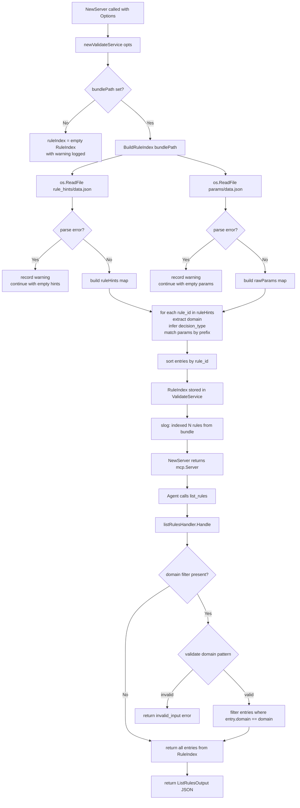

# MCP Tool Design: list_rules

**Status:** Design — not yet implemented
**Author:** AI (Claude Sonnet 4.6) | 2026-02-25
**Bundle revision targeted:** `ops-v0.1.0-dev`
**Module path:** `samebits.com/evidra`

---

## Table of Contents

1. [Purpose](#1-purpose)
2. [Functional Specification](#2-functional-specification)
3. [MCP Contract](#3-mcp-contract)
4. [Internal Architecture](#4-internal-architecture)
5. [Data Structures (Go)](#5-data-structures-go)
6. [Concurrency and Safety Model](#6-concurrency-and-safety-model)
7. [Security Model](#7-security-model)
8. [Observability](#8-observability)
9. [Performance Considerations](#9-performance-considerations)
10. [Failure Modes](#10-failure-modes)
11. [Backward Compatibility](#11-backward-compatibility)
12. [Testing Strategy](#12-testing-strategy)
13. [Implementation Plan](#13-implementation-plan)

---

## 1. Purpose

### 1.1 The Problem: Reactive Denial Is Insufficient for Autonomous Agents

The existing `validate` tool returns policy hits after-the-fact: the agent submits a full `ToolInvocation` and receives either an `allow` or a denial with rule IDs and hints. This reactive model has a significant operational cost for autonomous agents:

- An agent must construct a complete, fully-specified invocation to discover which guardrails apply.
- If the invocation is denied, the agent must interpret structured hints, translate them into corrective actions, and re-submit — incurring at least two round trips and potentially many more for multi-step scenarios.
- Agents operating in automated pipelines have no mechanism to pre-screen a planned operation sequence before beginning execution.
- The agent has no visibility into _which domains_ are guarded, _what thresholds_ govern numeric limits, or _which risk tags_ unlock restricted operations without attempting a live evaluation.

### 1.2 The Proactive Safety Pattern

`list_rules` enables a proactive compliance model. The intended call sequence is:

```
list_rules()          → discover active guardrails and their unlock conditions
validate(scenario)    → pre-flight check a planned operation
[take action]         → act only if validate returns allow=true
```

This pattern eliminates surprise denials, reduces retry loops, and allows agents to make informed decisions about whether to assert risk tags, request human approval, or abort planned operations before any side effects occur.

### 1.3 What Data Sources Feed This Tool

The tool draws from two data files within the OPA bundle, both of which are static after bundle load:

**`evidra/data/rule_hints/data.json`** — A flat JSON object keyed by canonical rule ID (e.g., `"ops.mass_delete"`). Values are arrays of hint strings that describe corrective actions an agent can take. These keys are the authoritative source of truth for which rule IDs are active in this bundle.

**`evidra/data/params/data.json`** — A flat JSON object keyed by parameter path (e.g., `"ops.mass_delete.max_deletes"`). Each value is an object with a `by_env` map containing environment-keyed scalar or list values. The mapping from rule ID to relevant params is inferred by prefix: a param key whose prefix matches a rule ID (e.g., `ops.mass_delete.max_deletes` → rule `ops.mass_delete`) is associated with that rule.

The current bundle (`ops-v0.1.0-dev`) defines:

| Rule ID | Decision Type | Associated Params |
|---|---|---|
| `k8s.protected_namespace` | deny | `k8s.namespaces.restricted` |
| `ops.unapproved_change` | deny | `k8s.namespaces.protected` |
| `ops.public_exposure` | deny | _(none)_ |
| `ops.mass_delete` | deny | `ops.mass_delete.max_deletes` |
| `ops.autonomous_execution` | warn | _(none)_ |
| `ops.breakglass_used` | warn | _(none)_ |
| `sys.unlabeled_deny` | warn | _(none)_ |

Note: `k8s.namespaces.restricted` and `k8s.namespaces.protected` share the `k8s.` prefix with the `k8s.protected_namespace` rule; their association must be resolved by prefix matching logic described in Section 4.

### 1.4 Scope Boundaries

`list_rules` is explicitly NOT:

- A policy simulation or evaluation tool. It does not execute OPA.
- A substitute for `validate`. It does not tell the agent whether a specific operation will pass.
- A dynamic query. It reflects the state of the bundle at startup time, not live.
- An evidence-producing operation. No `EvidenceRecord` is written.

---

## 2. Functional Specification

### 2.1 Inputs

The tool accepts a single optional input parameter:

| Field | Type | Required | Description |
|---|---|---|---|
| `domain` | `string` | No | If provided, filters results to rule entries whose `domain` field exactly matches this value (e.g., `"ops"`, `"k8s"`). If omitted or empty string, all rules are returned. |

### 2.2 Outputs

The tool returns a structured object containing:

| Field | Type | Description |
|---|---|---|
| `ok` | `bool` | Always `true` for this tool (see Section 10 for partial-index case). |
| `bundle_revision` | `string` | The OPA bundle revision string from `.manifest` (e.g., `"ops-v0.1.0-dev"`). |
| `profile_name` | `string` | The `metadata.profile_name` from `.manifest` (e.g., `"ops-v0.1"`). |
| `rules` | `[]RuleEntry` | Array of rule entries. May be empty if domain filter matches nothing or index is empty. |
| `warnings` | `[]string` | Non-fatal warnings (e.g., data file missing, param parse error). Present only when the index is partial. |

Each `RuleEntry` contains:

| Field | Type | Description |
|---|---|---|
| `rule_id` | `string` | Canonical dotted rule ID (e.g., `"ops.mass_delete"`). |
| `domain` | `string` | The prefix segment before the first dot (e.g., `"ops"`). |
| `decision_type` | `string` | `"deny"` or `"warn"` or `"unknown"`. See Section 4.3 for inference. |
| `hints` | `[]string` | Corrective hint strings from `rule_hints/data.json`. |
| `params` | `[]ParamEntry` | Parameters associated with this rule by prefix matching. May be empty. |

Each `ParamEntry` contains:

| Field | Type | Description |
|---|---|---|
| `key` | `string` | Full parameter key (e.g., `"ops.mass_delete.max_deletes"`). |
| `type` | `string` | Inferred JSON type of the default value: `"number"`, `"string"`, `"array"`, `"object"`, or `"unknown"`. |
| `default` | `any` | The `by_env["default"]` value. `null` if no default defined. |
| `env_aware` | `bool` | `true` if the `by_env` map has more than one key (i.e., environment-specific overrides exist). |

### 2.3 Side Effects

None. This tool:

- Does not write to the evidence store.
- Does not invoke OPA.
- Does not modify any server state.
- Does not read from disk at request time (the index is pre-built).

### 2.4 Determinism and Idempotency

The response is fully deterministic per bundle load:

- The same `domain` filter always produces the same output for the same server instance.
- Repeated calls with identical inputs produce byte-identical JSON responses (rule array is sorted by `rule_id` lexicographically at index construction time).
- The response changes only if the server is restarted with a different bundle.

---

## 3. MCP Contract

### 3.1 Tool Registration

```go
mcp.AddTool(server, &mcp.Tool{
    Name:        "list_rules",
    Title:       "List Policy Rules",
    Description: "Return the index of active policy rules from the loaded bundle. Use this before calling validate to discover guardrails, unlock conditions (risk tags), and parameter thresholds.",
    Annotations: &mcp.ToolAnnotations{
        Title:           "Policy Rule Index",
        ReadOnlyHint:    true,
        IdempotentHint:  true,
        DestructiveHint: boolPtr(false),
        OpenWorldHint:   boolPtr(false),
    },
    InputSchema: map[string]any{
        "type": "object",
        "properties": map[string]any{
            "domain": map[string]any{
                "type":        "string",
                "description": "Optional domain filter. If provided, only rules in this domain are returned (e.g. \"ops\", \"k8s\"). Must match [a-z0-9.]{1,64}.",
                "pattern":     "^[a-z0-9.]{1,64}$",
            },
        },
    },
}, listRulesHandler.Handle)
```

Note: `"required"` is intentionally absent from `InputSchema` — no fields are required.

### 3.2 JSON Request Schema

```json
{
  "$schema": "http://json-schema.org/draft-07/schema#",
  "title": "list_rules input",
  "type": "object",
  "additionalProperties": false,
  "properties": {
    "domain": {
      "type": "string",
      "description": "Filter results to a single domain segment (e.g. \"ops\"). Omit to return all rules.",
      "pattern": "^[a-z0-9.]{1,64}$"
    }
  }
}
```

### 3.3 JSON Response Schema

```json
{
  "$schema": "http://json-schema.org/draft-07/schema#",
  "title": "list_rules output",
  "type": "object",
  "required": ["ok", "bundle_revision", "profile_name", "rules"],
  "properties": {
    "ok": { "type": "boolean" },
    "bundle_revision": { "type": "string" },
    "profile_name": { "type": "string" },
    "rules": {
      "type": "array",
      "items": {
        "type": "object",
        "required": ["rule_id", "domain", "decision_type", "hints", "params"],
        "properties": {
          "rule_id":       { "type": "string" },
          "domain":        { "type": "string" },
          "decision_type": { "type": "string", "enum": ["deny", "warn", "unknown"] },
          "hints":         { "type": "array", "items": { "type": "string" } },
          "params": {
            "type": "array",
            "items": {
              "type": "object",
              "required": ["key", "type", "default", "env_aware"],
              "properties": {
                "key":       { "type": "string" },
                "type":      { "type": "string", "enum": ["number", "string", "array", "object", "unknown"] },
                "default":   {},
                "env_aware": { "type": "boolean" }
              }
            }
          }
        }
      }
    },
    "warnings": {
      "type": "array",
      "items": { "type": "string" }
    }
  }
}
```

### 3.4 Concrete JSON Example: Unfiltered Response

Request (no domain filter):

```json
{}
```

Response:

```json
{
  "ok": true,
  "bundle_revision": "ops-v0.1.0-dev",
  "profile_name": "ops-v0.1",
  "rules": [
    {
      "rule_id": "k8s.protected_namespace",
      "domain": "k8s",
      "decision_type": "deny",
      "hints": [
        "Add risk_tag: breakglass",
        "Or apply changes outside kube-system"
      ],
      "params": [
        {
          "key": "k8s.namespaces.restricted",
          "type": "array",
          "default": ["kube-system"],
          "env_aware": false
        },
        {
          "key": "k8s.namespaces.protected",
          "type": "array",
          "default": ["prod"],
          "env_aware": false
        }
      ]
    },
    {
      "rule_id": "ops.autonomous_execution",
      "domain": "ops",
      "decision_type": "warn",
      "hints": [
        "Review changes manually before apply"
      ],
      "params": []
    },
    {
      "rule_id": "ops.breakglass_used",
      "domain": "ops",
      "decision_type": "warn",
      "hints": [
        "Use breakglass only for emergencies.",
        "Prefer change-approved tags for non-emergency production changes."
      ],
      "params": []
    },
    {
      "rule_id": "ops.mass_delete",
      "domain": "ops",
      "decision_type": "deny",
      "hints": [
        "Reduce deletion scope",
        "Or add risk_tag: breakglass"
      ],
      "params": [
        {
          "key": "ops.mass_delete.max_deletes",
          "type": "number",
          "default": 5,
          "env_aware": true
        }
      ]
    },
    {
      "rule_id": "ops.public_exposure",
      "domain": "ops",
      "decision_type": "deny",
      "hints": [
        "Add risk_tag: approved_public",
        "Or remove public exposure"
      ],
      "params": []
    },
    {
      "rule_id": "ops.unapproved_change",
      "domain": "ops",
      "decision_type": "deny",
      "hints": [
        "Add risk_tag: change-approved",
        "Or run in --observe mode"
      ],
      "params": []
    },
    {
      "rule_id": "sys.unlabeled_deny",
      "domain": "sys",
      "decision_type": "warn",
      "hints": [
        "Add stable rule labels to deny rules.",
        "Ensure each deny rule emits a label and message."
      ],
      "params": []
    }
  ]
}
```

### 3.5 Concrete JSON Example: Domain-Filtered Response

Request:

```json
{ "domain": "ops" }
```

Response (abbreviated — contains only `ops.*` rules):

```json
{
  "ok": true,
  "bundle_revision": "ops-v0.1.0-dev",
  "profile_name": "ops-v0.1",
  "rules": [
    {
      "rule_id": "ops.autonomous_execution",
      "domain": "ops",
      "decision_type": "warn",
      "hints": ["Review changes manually before apply"],
      "params": []
    },
    {
      "rule_id": "ops.breakglass_used",
      "domain": "ops",
      "decision_type": "warn",
      "hints": [
        "Use breakglass only for emergencies.",
        "Prefer change-approved tags for non-emergency production changes."
      ],
      "params": []
    },
    {
      "rule_id": "ops.mass_delete",
      "domain": "ops",
      "decision_type": "deny",
      "hints": [
        "Reduce deletion scope",
        "Or add risk_tag: breakglass"
      ],
      "params": [
        {
          "key": "ops.mass_delete.max_deletes",
          "type": "number",
          "default": 5,
          "env_aware": true
        }
      ]
    },
    {
      "rule_id": "ops.public_exposure",
      "domain": "ops",
      "decision_type": "deny",
      "hints": [
        "Add risk_tag: approved_public",
        "Or remove public exposure"
      ],
      "params": []
    },
    {
      "rule_id": "ops.unapproved_change",
      "domain": "ops",
      "decision_type": "deny",
      "hints": [
        "Add risk_tag: change-approved",
        "Or run in --observe mode"
      ],
      "params": []
    }
  ]
}
```

### 3.6 Example: Domain Filter No Matches

Request:

```json
{ "domain": "azure" }
```

Response:

```json
{
  "ok": true,
  "bundle_revision": "ops-v0.1.0-dev",
  "profile_name": "ops-v0.1",
  "rules": []
}
```

### 3.7 Example: Invalid Domain Filter

Request:

```json
{ "domain": "OPS/invalid!" }
```

Response (tool error, not a content-level error):

```json
{
  "ok": false,
  "bundle_revision": "",
  "profile_name": "",
  "rules": null,
  "error": {
    "code": "invalid_input",
    "message": "domain filter must match [a-z0-9.]{1,64}"
  }
}
```

---

## 4. Internal Architecture

### 4.1 Overview

The rule index is a pure data structure built once at server startup from two JSON data files in the bundle directory. It is stored as an unexported field on `ValidateService` and never mutated. Per-request handling consists of a domain filter check and a JSON marshal — no file I/O, no OPA invocation.

### 4.2 Startup Index Construction vs Per-Request Serving



### 4.3 Decision Type Inference

The rule index is built from data files, not from Rego source. The `rule_hints/data.json` keys are the canonical rule IDs; however, neither that file nor `params/data.json` records whether a rule is a `deny` or `warn` rule.

The inference strategy for the current implementation is **filename-based**: at bundle load time, `BuildRuleIndex` scans the `evidra/policy/rules/` directory. Filenames following the convention `deny_*.rego` indicate `deny` rules; filenames following `warn_*.rego` indicate `warn` rules. The mapping is constructed by parsing the Rego filename prefix only — Rego source is never parsed.

Specifically:

1. Walk `<bundlePath>/evidra/policy/rules/` for files matching `*.rego` (excluding `*_test.rego`).
2. For each file, strip the `.rego` extension and split on `_` to get prefix tokens. If the first token is `"deny"`, all rule IDs mentioned in that file belong to the `deny` type. If `"warn"`, they belong to `"warn"`.
3. The rule ID is embedded in the filename after the prefix: `deny_mass_delete.rego` → candidate rule ID fragment `mass_delete`. However, the canonical rule ID may differ (`ops.mass_delete`). Therefore, the filename fragment is used only as a hint to match against rule hint keys: for each `rule_hints` key, if the key ends with the filename fragment (after replacing `_` with `.` and `.`→`_`), the decision type is assigned.
4. A simpler and more reliable alternative (preferred for implementation): build a map of `rule_id → decision_type` by reading each Rego file just far enough to extract the first occurrence of `deny["<id>"]` or `warn["<id>"]` via a string scan (no AST parsing). This is a single `strings.Contains` / `regexp.MustCompile` check per file.

**Known Gap:** This inference is fragile. The authoritative fix is to add a `decision_type` field to `rule_hints/data.json` entries, making the data files self-describing. This is tracked as a future bundle schema change. Until then, `decision_type` defaults to `"unknown"` for any rule whose type cannot be inferred from the Rego filename/content scan.

The current bundle maps as follows (for reference):

| Filename | Inferred Type | Rule ID |
|---|---|---|
| `deny_kube_system.rego` | deny | `k8s.protected_namespace` |
| `deny_mass_delete.rego` | deny | `ops.mass_delete` |
| `deny_prod_without_approval.rego` | deny | `ops.unapproved_change` |
| `deny_public_exposure.rego` | deny | `ops.public_exposure` |
| `warn_autonomous_execution.rego` | warn | `ops.autonomous_execution` |
| `warn_breakglass.rego` | warn | `ops.breakglass_used` |

`sys.unlabeled_deny` has no corresponding `rules/*.rego` file in the current bundle — it is a meta-rule that fires when other deny rules omit labels. Its decision type will be inferred as `"warn"` by scanning for `warn["sys.unlabeled_deny"]` in any Rego file, or fall back to `"unknown"`.

### 4.4 Param-to-Rule Association by Prefix Matching

Given the current `params/data.json`:

```
ops.mass_delete.max_deletes  → rule ops.mass_delete  (exact rule_id prefix match)
k8s.namespaces.restricted    → rule k8s.protected_namespace  (domain prefix match only)
k8s.namespaces.protected     → rule k8s.protected_namespace  (domain prefix match only)
```

The algorithm:

1. For each param key `P` and each rule ID `R`:
   - If `P` has `R` as a prefix (i.e., `strings.HasPrefix(P, R+".")`), associate `P` with `R`. This handles `ops.mass_delete.max_deletes` → `ops.mass_delete`.
2. If no rule prefix match, fall back to domain prefix: if `strings.HasPrefix(P, domain+".")` where `domain` is the first segment of the rule ID, associate `P` with `R`. This handles `k8s.namespaces.*` → `k8s.protected_namespace`.
3. A param key is associated with at most one rule. If both rule-prefix and domain-prefix matches exist for different rules, rule-prefix match wins (it is more specific).

**Caveat:** The domain-prefix fallback associates `k8s.namespaces.restricted` and `k8s.namespaces.protected` with `k8s.protected_namespace` even though `ops.unapproved_change` also uses `k8s.namespaces.protected` in its Rego. This is a known approximation in the current bundle. It will become inaccurate if a second `k8s.*` rule is added. The authoritative fix is to add an explicit `params` field to rule metadata. This is tracked as a future bundle schema change alongside the `decision_type` gap above.

### 4.5 Data File Paths (relative to bundlePath)

```
evidra/data/rule_hints/data.json   → map[string][]string  (rule_id → hints)
evidra/data/params/data.json       → map[string]paramRaw  (param_key → {by_env: map})
evidra/policy/rules/*.rego         → scanned for deny/warn rule ID extraction
```

All paths are constructed with `filepath.Join(bundlePath, ...)`. No environment variables are used in path construction.

---

## 5. Data Structures (Go)

All types below are defined in package `samebits.com/evidra/pkg/mcpserver`.

### 5.1 Core Types

```go
// RuleIndex is the pre-built, read-only catalog of all active policy rules.
// It is constructed once at server startup by BuildRuleIndex and never mutated.
type RuleIndex struct {
    BundleRevision string      // from .manifest revision field
    ProfileName    string      // from .manifest metadata.profile_name
    Entries        []RuleEntry // sorted by RuleEntry.RuleID, lexicographic ascending
    Warnings       []string    // non-fatal warnings from index construction (e.g. missing data file)
}

// RuleEntry describes a single active policy rule.
type RuleEntry struct {
    RuleID       string       `json:"rule_id"`
    Domain       string       `json:"domain"`
    DecisionType string       `json:"decision_type"` // "deny" | "warn" | "unknown"
    Hints        []string     `json:"hints"`
    Params       []ParamEntry `json:"params"`
}

// ParamEntry describes one parameter associated with a rule.
type ParamEntry struct {
    Key      string `json:"key"`
    Type     string `json:"type"`    // "number" | "string" | "array" | "object" | "unknown"
    Default  any    `json:"default"` // the by_env["default"] value; nil if not set
    EnvAware bool   `json:"env_aware"`
}
```

### 5.2 Input and Output Types

```go
// listRulesInput is the decoded MCP tool input for list_rules.
// Domain is optional; empty string means "return all rules".
type listRulesInput struct {
    Domain string `json:"domain,omitempty"`
}

// ListRulesOutput is the JSON-serializable response returned by list_rules.
type ListRulesOutput struct {
    OK             bool        `json:"ok"`
    BundleRevision string      `json:"bundle_revision"`
    ProfileName    string      `json:"profile_name"`
    Rules          []RuleEntry `json:"rules"`
    Warnings       []string    `json:"warnings,omitempty"`
    Error          *ErrorSummary `json:"error,omitempty"`
}
```

### 5.3 BuildRuleIndex Signature

```go
// BuildRuleIndex constructs a RuleIndex from the OPA bundle at bundlePath.
// It reads rule_hints/data.json and params/data.json, infers decision types
// by scanning Rego filenames and content in evidra/policy/rules/, and
// associates params with rules by prefix matching.
//
// BuildRuleIndex never returns an error. Instead, construction failures are
// recorded in RuleIndex.Warnings and the index is returned in the most
// complete state achievable. A caller that requires a valid bundle must
// check Warnings and decide whether to abort server startup.
//
// This function is called exactly once per server instance, from newValidateService.
func BuildRuleIndex(bundlePath string) RuleIndex
```

The decision to return `RuleIndex` (not `(*RuleIndex, error)`) is deliberate: construction failures are non-fatal by design (see Section 10). Callers that enforce strict startup correctness can check `len(index.Warnings) > 0`.

### 5.4 Internal Helper Types (unexported)

```go
// paramRaw mirrors the structure of a single entry in params/data.json.
type paramRaw struct {
    ByEnv map[string]any `json:"by_env"`
}
```

### 5.5 Changes to ValidateService

```go
// Before (current):
type ValidateService struct {
    policyPath               string
    dataPath                 string
    bundlePath               string
    environment              string
    evidencePath             string
    policyRef                string
    mode                     Mode
    includeFileResourceLinks bool
}

// After (with list_rules support):
type ValidateService struct {
    policyPath               string
    dataPath                 string
    bundlePath               string
    environment              string
    evidencePath             string
    policyRef                string
    mode                     Mode
    includeFileResourceLinks bool
    ruleIndex                RuleIndex  // NEW: read-only after construction
}
```

### 5.6 Changes to newValidateService

```go
// Before:
func newValidateService(opts Options) *ValidateService {
    return &ValidateService{
        policyPath:               opts.PolicyPath,
        dataPath:                 opts.DataPath,
        bundlePath:               opts.BundlePath,
        environment:              opts.Environment,
        evidencePath:             opts.EvidencePath,
        policyRef:                opts.PolicyRef,
        mode:                     opts.Mode,
        includeFileResourceLinks: opts.IncludeFileResourceLinks,
    }
}

// After:
func newValidateService(opts Options) *ValidateService {
    idx := BuildRuleIndex(opts.BundlePath) // never errors; warnings logged inside
    return &ValidateService{
        policyPath:               opts.PolicyPath,
        dataPath:                 opts.DataPath,
        bundlePath:               opts.BundlePath,
        environment:              opts.Environment,
        evidencePath:             opts.EvidencePath,
        policyRef:                opts.PolicyRef,
        mode:                     opts.Mode,
        includeFileResourceLinks: opts.IncludeFileResourceLinks,
        ruleIndex:                idx,
    }
}
```

### 5.7 Handler Type and Registration

```go
// listRulesHandler wraps ValidateService for the list_rules MCP tool.
type listRulesHandler struct {
    service *ValidateService
}

// Handle implements the mcp.ToolHandler signature for list_rules.
func (h *listRulesHandler) Handle(
    ctx context.Context,
    _ *mcp.CallToolRequest,
    input listRulesInput,
) (*mcp.CallToolResult, ListRulesOutput, error) {
    output := h.service.ListRules(ctx, input)
    return &mcp.CallToolResult{}, output, nil
}

// ListRules is the service-level method. It validates the domain filter,
// applies it to the pre-built RuleIndex, and returns ListRulesOutput.
func (s *ValidateService) ListRules(_ context.Context, input listRulesInput) ListRulesOutput {
    if input.Domain != "" {
        if !domainFilterPattern.MatchString(input.Domain) {
            return ListRulesOutput{
                OK:    false,
                Error: &ErrorSummary{Code: ErrCodeInvalidInput, Message: "domain filter must match [a-z0-9.]{1,64}"},
            }
        }
    }

    entries := s.ruleIndex.Entries
    if input.Domain != "" {
        filtered := make([]RuleEntry, 0, len(entries))
        for _, e := range entries {
            if e.Domain == input.Domain {
                filtered = append(filtered, e)
            }
        }
        entries = filtered
    }

    return ListRulesOutput{
        OK:             true,
        BundleRevision: s.ruleIndex.BundleRevision,
        ProfileName:    s.ruleIndex.ProfileName,
        Rules:          entries,
        Warnings:       s.ruleIndex.Warnings,
    }
}

// domainFilterPattern is compiled once at package init.
// Matches: lowercase alphanumeric and dots, 1–64 chars.
var domainFilterPattern = regexp.MustCompile(`^[a-z0-9.]{1,64}$`)
```

### 5.8 Changes to NewServer

```go
// In NewServer, after constructing svc:
listRulesTool := &listRulesHandler{service: svc}

mcp.AddTool(server, &mcp.Tool{
    Name:        "list_rules",
    Title:       "List Policy Rules",
    Description: "Return the index of active policy rules from the loaded bundle. ...",
    Annotations: &mcp.ToolAnnotations{
        Title:           "Policy Rule Index",
        ReadOnlyHint:    true,
        IdempotentHint:  true,
        DestructiveHint: boolPtr(false),
        OpenWorldHint:   boolPtr(false),
    },
    InputSchema: map[string]any{
        "type": "object",
        "properties": map[string]any{
            "domain": map[string]any{
                "type":        "string",
                "description": "Optional domain filter (e.g. \"ops\", \"k8s\"). Must match [a-z0-9.]{1,64}.",
                "pattern":     "^[a-z0-9.]{1,64}$",
            },
        },
    },
}, listRulesTool.Handle)
```

---

## 6. Concurrency and Safety Model

### 6.1 Read-Only After Construction

`RuleIndex` is constructed synchronously in `newValidateService`, which is called once from `NewServer` before the MCP server begins accepting connections. By the time any tool handler is invoked, the `ruleIndex` field is fully populated and will never be written to again.

The Go memory model guarantees that all goroutines that start after `newValidateService` returns see the fully-initialized `ruleIndex` value, because there is a happens-before relationship between `newValidateService` returning and any subsequent `mcp.Server.Serve` call. No mutex or `sync/atomic` protection is needed for reads.

This is the same pattern used by all other fields of `ValidateService` (e.g., `policyPath`, `mode`). Those fields are set at construction and read concurrently by handler goroutines without locking.

### 6.2 Single-Threaded Construction

`BuildRuleIndex` is not safe for concurrent use (it reads files and builds maps). However, it is only ever called from `newValidateService`, which is not concurrent. No goroutines are spawned during construction.

### 6.3 Slice Safety

`ListRules` returns a slice of `RuleEntry` from the pre-built index. Because `RuleEntry` contains only value types (string, bool, `[]string`, `[]ParamEntry`), the returned slice is a copy of the underlying array header but shares the backing arrays for `Hints` and `Params` slices. This is safe because:

- The `RuleIndex` backing arrays are never mutated after construction.
- The JSON marshaler in `mcp.CallToolResult` serializes the data before the handler returns; no caller holds a persistent reference to the returned slice.

If a future change introduces mutation of returned slices, the entries should be deep-copied before returning. For now, shallow return is sufficient and allocation-efficient.

### 6.4 Bundle Reload (Not Supported)

There is no hot-reload mechanism. If a bundle is updated on disk, the server must be restarted to pick up changes. Attempting to add hot-reload without a full restart would require making `ruleIndex` a `sync/atomic.Pointer[RuleIndex]`, updating all read sites, and coordinating with the OPA evaluator's bundle reload. This is outside the scope of this design.

### 6.5 What Happens if Bundle Fails to Load

`BuildRuleIndex` never returns an error. Two failure scenarios:

**Scenario A: `bundlePath` is empty or points to a non-existent directory.**
- `BuildRuleIndex` logs a `slog.Warn` message with the path and the underlying error.
- Returns a `RuleIndex` with empty `Entries`, empty `BundleRevision`, empty `ProfileName`, and a single entry in `Warnings` describing the failure.
- Server startup succeeds (the MCP server comes up). `list_rules` returns an empty rule list with the warning. `validate` calls will fail at OPA evaluation time (same failure mode as today when no bundle is configured).

**Scenario B: `bundlePath` exists but one data file is missing or malformed.**
- The affected data source (hints or params) contributes no data. The other source is used normally.
- A warning is added to `RuleIndex.Warnings`.
- Server startup succeeds. `list_rules` returns a partial index with the warning surfaced in the response.

In neither scenario is server startup aborted by `BuildRuleIndex` itself. If operators require startup failure on bundle load error, the caller (`newValidateService`) can inspect `len(idx.Warnings) > 0` and panic or call `log.Fatal`. This policy decision is left to the operator configuration — it is not encoded in `BuildRuleIndex`.

---

## 7. Security Model

### 7.1 What Is Exposed

`list_rules` exposes only policy metadata:

- Rule IDs and their canonical domain grouping.
- Hint strings that describe how to satisfy a rule (these are already embedded in `validate` responses when a rule fires).
- Parameter keys and their default values (numeric thresholds, namespace lists).
- Bundle revision and profile name.

No input data, invocation history, actor identities, or evidence records are exposed. The tool does not accept user-supplied data beyond the domain filter string.

### 7.2 Accepted Risk: Guardrail Discovery

An attacker with access to the MCP server can call `list_rules` to enumerate:

- Which risk tags (`breakglass`, `change-approved`, `approved_public`) unlock restricted operations.
- Numeric thresholds (e.g., max 5 deletes in default environment, max 3 in production).
- Which namespaces are protected.

This information enables an adversary to construct invocations that will pass policy evaluation by including the appropriate tags or staying below thresholds.

**This risk is accepted** for the following reasons:

1. Evidra is designed for local/trusted deployments where the MCP server is not exposed to untrusted callers. The server runs as a local process accessed by the agent runtime, not as a public HTTP endpoint.
2. The same information is already surfaced (on-demand) via `validate` response hints when a rule fires. `list_rules` reduces round-trip friction but does not expose information that is otherwise secret.
3. Breakglass and change-approved tags are intended to be visible to agents operating in legitimate emergency or approval workflows. Their existence is not a secret.
4. If future deployments require access control on `list_rules`, the `mcp.Server` middleware layer (auth, TLS, transport-level ACL) is the appropriate enforcement point. This tool does not need to implement its own access control.

### 7.3 Input Validation

The `domain` filter is the only user-supplied input. It is validated against the pattern `^[a-z0-9.]{1,64}$` before use. This ensures:

- No path traversal: the domain value is never used in file paths.
- No injection: the domain is only compared against in-memory strings using `==`.
- Bounded length: maximum 64 characters prevents degenerate inputs.
- No uppercase, no hyphens, no slashes: matches the canonical rule ID domain segment format.

The validation is performed in `ValidateService.ListRules` using a compiled `*regexp.Regexp`. No allocation occurs on the validation path for valid inputs (match check is O(n) in input length, bounded by 64).

### 7.4 No Rego Execution on Request Path

`list_rules` does not invoke OPA. There is no policy execution, no data document construction, and no Rego evaluation. The attack surface from Rego evaluation (e.g., infinite loops, memory exhaustion from malformed input documents) is not present for this tool.

---

## 8. Observability

### 8.1 Structured Logging (slog)

All log calls use the `log/slog` package (Go 1.21+). No third-party logging dependencies are introduced.

**At index construction time (startup):**

```go
slog.Info("rule index built",
    "bundle_path", bundlePath,
    "bundle_revision", idx.BundleRevision,
    "profile_name", idx.ProfileName,
    "rule_count", len(idx.Entries),
)
```

If warnings are present:

```go
for _, w := range idx.Warnings {
    slog.Warn("rule index warning", "warning", w, "bundle_path", bundlePath)
}
```

If bundle path is empty:

```go
slog.Warn("rule index not built: bundlePath is empty; list_rules will return empty index")
```

**Per request (debug level):**

```go
slog.Debug("list_rules called",
    "domain_filter", input.Domain,
    "result_count", len(output.Rules),
)
```

Debug logging is only emitted when the slog default level is set to `slog.LevelDebug`. At the default `slog.LevelInfo`, no per-request log lines are emitted by `list_rules`.

### 8.2 Prometheus Metrics

One new gauge metric is registered in a `init()` function in a new file `pkg/mcpserver/metrics.go` (or appended to an existing metrics file if one is created before this feature):

```go
var rulesIndexedTotal = promauto.NewGauge(prometheus.GaugeOpts{
    Name: "evidra_rules_indexed_total",
    Help: "Number of policy rules in the active rule index. Set once at server startup.",
})
```

The gauge is set in `BuildRuleIndex` after construction:

```go
rulesIndexedTotal.Set(float64(len(idx.Entries)))
```

**Note:** If the Evidra project does not yet use Prometheus (`github.com/prometheus/client_golang`), the metrics gauge must be introduced as a new dependency. This requires an entry in `ai/AI_DECISIONS.md` per project governance rules. If the project policy prohibits the dependency, the gauge should be omitted and this section reduced to a `// TODO: add prometheus metric` comment in the implementation.

### 8.3 OpenTelemetry Tracing

One span is emitted per `list_rules` invocation:

```go
ctx, span := otel.Tracer("evidra").Start(ctx, "evidra.list_rules")
defer span.End()

span.SetAttributes(
    attribute.String("list_rules.domain_filter", input.Domain),
    attribute.Int("list_rules.result_count", len(output.Rules)),
)
if !output.OK {
    span.SetStatus(codes.Error, output.Error.Message)
}
```

The span is a child of whatever trace context is propagated into the MCP request. If no OTel SDK is configured (the default for local deployments), the `otel.Tracer` returns a no-op tracer and no overhead is incurred.

**Note:** Same dependency caveat as Prometheus — if `go.opentelemetry.io/otel` is not yet a dependency, document in `ai/AI_DECISIONS.md`.

### 8.4 No New Health Check Endpoints

The existing `evidra-mcp` binary does not expose an HTTP health endpoint distinct from the MCP transport. No new HTTP server is introduced for metrics or health as part of this feature. If metrics scraping is required, it must be added at the binary level (out of scope for this tool design).

---

## 9. Performance Considerations

### 9.1 Response Time

`list_rules` is O(N) in the number of rules, where N is bounded by the number of keys in `rule_hints/data.json`. For the current bundle, N=7. Even for bundles with 1000 rules, the operation consists of:

1. A regex match on the domain filter string (O(D), D ≤ 64).
2. A linear scan of the in-memory `[]RuleEntry` slice (O(N)).
3. JSON marshaling of the result (O(N * avg_entry_size)).

There is no disk I/O, no OPA invocation, no network call, and no lock acquisition on the hot path. Expected p99 latency is sub-millisecond for any realistic bundle size.

### 9.2 Memory Footprint of the Rule Index

Estimated memory for the current bundle (7 rules, 3 params, ~10 hints total):

| Component | Estimate |
|---|---|
| `RuleIndex` struct header | 64 bytes |
| `[]RuleEntry` backing array (7 entries) | ~7 × 200 bytes = ~1.4 KB |
| String data (rule IDs, hints, param keys) | ~800 bytes |
| `[]ParamEntry` for params | ~3 × 100 bytes = ~300 bytes |
| **Total** | **~2.6 KB** |

For a bundle with 100 rules and proportional hint/param data, estimated index size is ~40 KB. This is negligible relative to the OPA engine's own memory footprint (which is in the MB range for a loaded bundle).

### 9.3 No OPA Invocation

Critically, `list_rules` does not invoke OPA. The `validate` tool creates an OPA evaluator per call (via `pkg/runtime.Evaluator`), which involves loading the bundle into the Rego engine and evaluating `data.evidra.policy.decision`. That path has non-trivial latency (tens to hundreds of milliseconds depending on bundle size). `list_rules` avoids this entirely.

### 9.4 Allocation Profile

The `listRulesInput` struct (16 bytes for an empty domain string) is allocated once per request by the MCP SDK decoder. The `ListRulesOutput` struct is allocated once. If domain filtering is applied, one `[]RuleEntry` slice is allocated (N_filtered entries). JSON marshaling allocates a byte slice proportional to the output size. Total allocations per request: ~3 heap allocations for the unfiltered case, ~4 for the filtered case. This is comparable to `get_event` in the no-filter case.

---

## 10. Failure Modes

### 10.1 Bundle Not Loaded / Index Empty

**Trigger:** `bundlePath` is not set in `Options`, or `BuildRuleIndex` encounters a fatal error reading both data files.

**Behavior:** `RuleIndex.Entries` is empty (nil slice). `ListRulesOutput.Rules` is an empty JSON array `[]`. `ok` is `true`. The `warnings` field contains one or more warning strings explaining why the index is empty.

**Rationale:** An empty rule list is a valid, honest response. The agent can infer that no rules are configured or that the bundle could not be read. Returning an error would require the MCP SDK to surface a tool error, which is handled differently by different agent runtimes. An empty rule list with a warning is more useful to an agent than an opaque error.

### 10.2 Domain Filter No Matches

**Trigger:** The `domain` filter is valid but no rule has a matching domain.

**Behavior:** `ListRulesOutput.Rules` is an empty JSON array `[]`. `ok` is `true`. No warning is emitted. This is not an error condition — agents should expect to query domains that exist in future bundle versions but are not present in the current one.

### 10.3 Domain Filter Invalid

**Trigger:** The `domain` field value does not match `^[a-z0-9.]{1,64}$`.

**Behavior:** `ListRulesOutput.OK` is `false`. `Error.Code` is `"invalid_input"`. `Error.Message` is `"domain filter must match [a-z0-9.]{1,64}"`. No rules are returned. The MCP tool handler returns `nil` for the Go error (the error is embedded in the output struct, not returned as a Go error, consistent with the `validate` and `get_event` pattern in this codebase).

### 10.4 Rule Hints File Missing

**Trigger:** `<bundlePath>/evidra/data/rule_hints/data.json` does not exist or cannot be read.

**Behavior:** `BuildRuleIndex` logs `slog.Warn`. The `Entries` slice will contain zero rules (since rule hints keys are the source of rule IDs). `Warnings` will contain `"rule_hints data file not found: <path>: <error>"`. `BundleRevision` and `ProfileName` are still populated from `.manifest` if that file is readable.

### 10.5 Params File Missing

**Trigger:** `<bundlePath>/evidra/data/params/data.json` does not exist or cannot be read.

**Behavior:** `BuildRuleIndex` logs `slog.Warn`. The `Entries` slice is built from hints only. All `ParamEntry` slices will be empty (no params associated with any rule). `Warnings` will contain `"params data file not found: <path>: <error>"`. Rules themselves are still returned with their hints.

### 10.6 Malformed JSON in Data Files

**Trigger:** Either data file contains invalid JSON.

**Behavior:** Same as file missing for that data source. `BuildRuleIndex` adds a warning of the form `"rule_hints data file parse error: <path>: invalid character ..."`. The index is built from whatever data is available.

### 10.7 Rego Directory Missing (Decision Type Inference Failure)

**Trigger:** `<bundlePath>/evidra/policy/rules/` does not exist.

**Behavior:** Decision type inference is skipped. All `RuleEntry.DecisionType` values are set to `"unknown"`. A warning is added: `"rules directory not found: <path>; decision_type will be unknown for all rules"`. The index is still built and returned.

---

## 11. Backward Compatibility

### 11.1 Additive Change

`list_rules` is a new tool with no prior callers. Adding it to `NewServer` is purely additive:

- Existing `validate` and `get_event` tool behavior is unchanged.
- Existing resource handlers are unchanged.
- `ValidateService` gains one new field (`ruleIndex`) which is zero-valued (empty `RuleIndex`) if `BuildRuleIndex` is not called — but `newValidateService` always calls it.
- No existing tests need modification.

### 11.2 Stability of rule_id Values

Rule IDs in the response are drawn from `rule_hints/data.json` keys, which are version-controlled in the bundle. Rule IDs are stable across minor bundle revisions. If a rule ID is renamed in the bundle, the old ID will disappear from the index and the new one will appear. Agents that hardcode rule IDs in their logic (e.g., to detect specific denial types in `validate` responses) must be updated when the bundle is updated.

The `bundle_revision` field in the response allows agents to detect when the bundle has changed and invalidate their rule ID assumptions.

### 11.3 Optional Domain Filter

The `domain` filter field is optional with no default. Callers that do not provide it receive all rules (unfiltered). Future callers can provide it to filter. There is no version negotiation required.

### 11.4 Future RuleEntry Fields

Fields added to `RuleEntry` in future designs (e.g., `required_tags`, `severity`, `remediation_url`) will be additive JSON fields. Old clients that deserialize `RuleEntry` with strict field validation may fail. Clients using `json.Unmarshal` into a `struct` with `json:",omitempty"` ignore unknown fields by default in Go. Clients written in other languages should use permissive JSON parsers.

### 11.5 ListRulesOutput warnings Field

The `warnings` field is omitted from JSON when empty (via `json:",omitempty"`). Clients that check for the field's presence will find it absent in the healthy case, which is the expected Go JSON convention used throughout this codebase.

---

## 12. Testing Strategy

### 12.1 Unit Tests for BuildRuleIndex

File: `pkg/mcpserver/rule_index_test.go`

**Test: TestBuildRuleIndex_WithRealBundle**

```go
func TestBuildRuleIndex_WithRealBundle(t *testing.T) {
    bundleDir := filepath.Join("..", "..", "policy", "bundles", "ops-v0.1")
    idx := BuildRuleIndex(bundleDir)

    if len(idx.Warnings) > 0 {
        t.Errorf("unexpected warnings: %v", idx.Warnings)
    }
    if idx.BundleRevision == "" {
        t.Error("expected non-empty BundleRevision")
    }
    if idx.ProfileName != "ops-v0.1" {
        t.Errorf("expected ProfileName ops-v0.1, got %q", idx.ProfileName)
    }
    if len(idx.Entries) == 0 {
        t.Fatal("expected at least one rule entry")
    }
    // Verify sort order
    for i := 1; i < len(idx.Entries); i++ {
        if idx.Entries[i].RuleID <= idx.Entries[i-1].RuleID {
            t.Errorf("entries not sorted: %q <= %q", idx.Entries[i].RuleID, idx.Entries[i-1].RuleID)
        }
    }
}
```

**Test: TestBuildRuleIndex_KnownRules** — asserts specific rule IDs, decision types, and hint counts for the known bundle fixture:

```go
func TestBuildRuleIndex_KnownRules(t *testing.T) {
    bundleDir := filepath.Join("..", "..", "policy", "bundles", "ops-v0.1")
    idx := BuildRuleIndex(bundleDir)

    wantRules := map[string]struct {
        decisionType string
        wantHintCount int
    }{
        "k8s.protected_namespace": {"deny", 2},
        "ops.unapproved_change":   {"deny", 2},
        "ops.public_exposure":     {"deny", 2},
        "ops.mass_delete":         {"deny", 2},
        "ops.autonomous_execution":{"warn", 1},
        "ops.breakglass_used":     {"warn", 2},
    }

    byID := make(map[string]RuleEntry, len(idx.Entries))
    for _, e := range idx.Entries {
        byID[e.RuleID] = e
    }

    for ruleID, want := range wantRules {
        e, ok := byID[ruleID]
        if !ok {
            t.Errorf("missing rule %q", ruleID)
            continue
        }
        if e.DecisionType != want.decisionType {
            t.Errorf("rule %q: want decision_type %q, got %q", ruleID, want.decisionType, e.DecisionType)
        }
        if len(e.Hints) != want.wantHintCount {
            t.Errorf("rule %q: want %d hints, got %d", ruleID, want.wantHintCount, len(e.Hints))
        }
    }
}
```

**Test: TestBuildRuleIndex_ParamAssociation** — asserts that `ops.mass_delete.max_deletes` is associated with `ops.mass_delete` and has correct type and env-awareness:

```go
func TestBuildRuleIndex_ParamAssociation(t *testing.T) {
    bundleDir := filepath.Join("..", "..", "policy", "bundles", "ops-v0.1")
    idx := BuildRuleIndex(bundleDir)

    var massDelete *RuleEntry
    for i := range idx.Entries {
        if idx.Entries[i].RuleID == "ops.mass_delete" {
            massDelete = &idx.Entries[i]
            break
        }
    }
    if massDelete == nil {
        t.Fatal("ops.mass_delete not found")
    }
    found := false
    for _, p := range massDelete.Params {
        if p.Key == "ops.mass_delete.max_deletes" {
            found = true
            if p.Type != "number" {
                t.Errorf("want type number, got %q", p.Type)
            }
            if !p.EnvAware {
                t.Error("want env_aware=true for ops.mass_delete.max_deletes")
            }
            if p.Default != float64(5) {
                t.Errorf("want default 5, got %v", p.Default)
            }
        }
    }
    if !found {
        t.Error("ops.mass_delete.max_deletes param not associated with ops.mass_delete")
    }
}
```

### 12.2 Table-Driven Domain Filter Tests

File: `pkg/mcpserver/rule_index_test.go` (continued)

```go
func TestListRules_DomainFilter(t *testing.T) {
    bundleDir := filepath.Join("..", "..", "policy", "bundles", "ops-v0.1")
    svc := newValidateService(Options{BundlePath: bundleDir, EvidencePath: t.TempDir()})

    tests := []struct {
        name        string
        domain      string
        wantOK      bool
        wantCount   int  // -1 = don't check
        wantErrCode string
    }{
        {"no filter returns all", "", true, 7, ""},
        {"ops filter", "ops", true, 5, ""},
        {"k8s filter", "k8s", true, 1, ""},
        {"sys filter", "sys", true, 1, ""},
        {"nonexistent domain", "azure", true, 0, ""},
        {"invalid chars uppercase", "OPS", false, -1, "invalid_input"},
        {"invalid chars slash", "ops/k8s", false, -1, "invalid_input"},
        {"empty string no filter", "", true, 7, ""},
        {"too long domain", strings.Repeat("a", 65), false, -1, "invalid_input"},
        {"max valid length", strings.Repeat("a", 64), true, 0, ""},
    }

    for _, tc := range tests {
        t.Run(tc.name, func(t *testing.T) {
            out := svc.ListRules(context.Background(), listRulesInput{Domain: tc.domain})
            if out.OK != tc.wantOK {
                t.Errorf("ok: want %v got %v", tc.wantOK, out.OK)
            }
            if tc.wantErrCode != "" {
                if out.Error == nil || out.Error.Code != tc.wantErrCode {
                    t.Errorf("want error code %q, got %v", tc.wantErrCode, out.Error)
                }
            }
            if tc.wantCount >= 0 && len(out.Rules) != tc.wantCount {
                t.Errorf("want %d rules, got %d: %v", tc.wantCount, len(out.Rules), ruleIDs(out.Rules))
            }
        })
    }
}
```

### 12.3 JSON Golden Output Test

File: `pkg/mcpserver/testdata/list_rules_all.golden.json` (checked in)

```go
func TestListRules_GoldenOutput(t *testing.T) {
    bundleDir := filepath.Join("..", "..", "policy", "bundles", "ops-v0.1")
    svc := newValidateService(Options{BundlePath: bundleDir, EvidencePath: t.TempDir()})
    out := svc.ListRules(context.Background(), listRulesInput{})

    b, err := json.MarshalIndent(out, "", "  ")
    if err != nil {
        t.Fatal(err)
    }
    goldenPath := filepath.Join("testdata", "list_rules_all.golden.json")
    if *update {
        os.WriteFile(goldenPath, b, 0644)
        return
    }
    want, err := os.ReadFile(goldenPath)
    if err != nil {
        t.Fatalf("read golden: %v", err)
    }
    if !bytes.Equal(b, want) {
        t.Errorf("output does not match golden file.\ngot:\n%s\nwant:\n%s", b, want)
    }
}

var update = flag.Bool("update", false, "update golden files")
```

Run `go test -run TestListRules_GoldenOutput -update` to regenerate the golden file after intentional bundle changes.

### 12.4 Test: Missing rule_hints File

```go
func TestBuildRuleIndex_MissingHintsFile(t *testing.T) {
    dir := t.TempDir()
    // Create a valid .manifest but no data files
    writeManifest(t, dir, `{"revision":"test-rev","roots":["evidra"],"metadata":{"profile_name":"test"}}`)

    idx := BuildRuleIndex(dir)
    if len(idx.Entries) != 0 {
        t.Errorf("expected no entries with missing hints file, got %d", len(idx.Entries))
    }
    if len(idx.Warnings) == 0 {
        t.Error("expected at least one warning for missing hints file")
    }
    if idx.BundleRevision != "test-rev" {
        t.Errorf("expected BundleRevision from manifest even without data files")
    }
}
```

### 12.5 Test: Missing params File

```go
func TestBuildRuleIndex_MissingParamsFile(t *testing.T) {
    dir := t.TempDir()
    writeManifest(t, dir, `{"revision":"test-rev","roots":["evidra"],"metadata":{"profile_name":"test"}}`)
    // Write a valid hints file but no params file
    hintsDir := filepath.Join(dir, "evidra", "data", "rule_hints")
    os.MkdirAll(hintsDir, 0755)
    os.WriteFile(filepath.Join(hintsDir, "data.json"), []byte(`{"ops.test_rule":["hint one"]}`), 0644)

    idx := BuildRuleIndex(dir)
    if len(idx.Entries) != 1 {
        t.Errorf("expected 1 entry from hints, got %d", len(idx.Entries))
    }
    if len(idx.Entries[0].Params) != 0 {
        t.Errorf("expected no params with missing params file, got %v", idx.Entries[0].Params)
    }
    if len(idx.Warnings) == 0 {
        t.Error("expected warning for missing params file")
    }
}
```

### 12.6 Test: Malformed JSON

```go
func TestBuildRuleIndex_MalformedHintsJSON(t *testing.T) {
    dir := t.TempDir()
    writeManifest(t, dir, `{"revision":"r","roots":["evidra"],"metadata":{"profile_name":"p"}}`)
    hintsDir := filepath.Join(dir, "evidra", "data", "rule_hints")
    os.MkdirAll(hintsDir, 0755)
    os.WriteFile(filepath.Join(hintsDir, "data.json"), []byte(`{invalid json`), 0644)

    idx := BuildRuleIndex(dir)
    if len(idx.Entries) != 0 {
        t.Errorf("expected no entries with malformed hints JSON")
    }
    found := false
    for _, w := range idx.Warnings {
        if strings.Contains(w, "parse error") {
            found = true
        }
    }
    if !found {
        t.Errorf("expected parse error warning, got: %v", idx.Warnings)
    }
}
```

### 12.7 Test: Handler Integration via mcp.Server

```go
func TestNewServer_ListRulesTool_Registered(t *testing.T) {
    bundleDir := filepath.Join("..", "..", "policy", "bundles", "ops-v0.1")
    server := NewServer(Options{BundlePath: bundleDir, EvidencePath: t.TempDir()})
    // Verify the tool is listed
    // (depends on mcp.Server exposing tool list — adapt to go-sdk API)
    _ = server
    // Smoke test: call list_rules via server transport
}
```

---

## 13. Implementation Plan

The following tasks are ordered by dependency. Each task is self-contained and can be reviewed independently.

### Task 1: Define RuleEntry / RuleIndex / ParamEntry / ListRulesOutput types

**File:** `pkg/mcpserver/rule_index.go` (new file)
**Contents:**
- `RuleIndex`, `RuleEntry`, `ParamEntry` structs (Section 5.1)
- `listRulesInput`, `ListRulesOutput` structs (Section 5.2)
- `paramRaw` unexported helper struct (Section 5.4)
- `domainFilterPattern` compiled regexp (Section 5.7)
- Package-level doc comment: `// Generated by AI | 2026-02-25 | list_rules tool — type definitions | TOOL_DESIGN_list_rules.md`

**Dependencies:** None.

### Task 2: Implement BuildRuleIndex reading data files from bundlePath

**File:** `pkg/mcpserver/rule_index.go` (same file as Task 1)
**Contents:**
- `BuildRuleIndex(bundlePath string) RuleIndex` function (Section 4, Section 5.3)
- Reading and decoding `rule_hints/data.json` (Section 4.5)
- Reading and decoding `params/data.json` (Section 4.5)
- Decision type inference by scanning `evidra/policy/rules/*.rego` filenames and content (Section 4.3)
- Param-to-rule association by prefix matching (Section 4.4)
- `inferParamType(v any) string` helper
- Sort `Entries` by `RuleID` using `slices.SortFunc` (Go 1.21+)
- Reading `.manifest` for `BundleRevision` and `ProfileName` (re-read or accept as separate call)
- slog at startup (Section 8.1)
- Set Prometheus gauge if metric is in scope (Section 8.2)

**Dependencies:** Task 1 (types).

**Note on manifest reading:** `BuildRuleIndex` needs to read `.manifest` for revision and profile name. It should do this itself (direct `os.ReadFile` + `json.Unmarshal`) rather than importing `bundlesource`, to keep the dependency clean. `bundlesource.BundleSource` is used by the OPA evaluator path; `BuildRuleIndex` is a lighter-weight data reader that does not need the full `BundleSource` contract.

### Task 3: Extend ValidateService with ruleIndex field

**File:** `pkg/mcpserver/server.go`
**Changes:**
- Add `ruleIndex RuleIndex` field to `ValidateService` struct (Section 5.5)
- No other changes to existing fields or methods.

**Dependencies:** Task 1 (types).

### Task 4: Build index in newValidateService

**File:** `pkg/mcpserver/server.go`
**Changes:**
- In `newValidateService`, call `BuildRuleIndex(opts.BundlePath)` and assign to `ruleIndex` field (Section 5.6)

**Dependencies:** Task 2 (BuildRuleIndex), Task 3 (ValidateService field).

### Task 5: Add listRulesHandler and ValidateService.ListRules method

**File:** `pkg/mcpserver/server.go` (or a new file `pkg/mcpserver/list_rules.go`)
**Contents:**
- `listRulesHandler` struct (Section 5.7)
- `listRulesHandler.Handle` method (Section 5.7)
- `ValidateService.ListRules` method (Section 5.7)
- Domain filter validation using `domainFilterPattern` (Section 7.3)
- OTel span wrapping (Section 8.3)
- slog debug per request (Section 8.1)

**Recommendation:** Add to a separate file `pkg/mcpserver/list_rules.go` to keep `server.go` clean. The handler pattern established by `validateHandler` and `getEventHandler` in `server.go` is followed exactly.

**Dependencies:** Task 1, Task 3, Task 4.

### Task 6: Register tool in NewServer

**File:** `pkg/mcpserver/server.go`
**Changes:**
- Instantiate `listRulesTool := &listRulesHandler{service: svc}` after `svc` is created.
- Call `mcp.AddTool(server, ..., listRulesTool.Handle)` with the full `mcp.Tool` definition from Section 3.1.

**Dependencies:** Task 5.

### Task 7: Unit tests

**Files:**
- `pkg/mcpserver/rule_index_test.go` (new) — all `BuildRuleIndex` tests from Section 12
- `pkg/mcpserver/testdata/list_rules_all.golden.json` (new) — golden output file
- `pkg/mcpserver/server_test.go` (extend) — `TestListRules_DomainFilter` and integration smoke test

**Test commands:**

```bash
go test -run TestBuildRuleIndex ./pkg/mcpserver/...
go test -run TestListRules ./pkg/mcpserver/...
go test -run TestListRules_GoldenOutput -update ./pkg/mcpserver/...  # regenerate golden
go test -race ./pkg/mcpserver/...
```

**Dependencies:** Tasks 1–6.

---

## Appendix A: Gap Register

These are known limitations in the current design that should be addressed in future bundle schema revisions:

| Gap ID | Description | Affected Section |
|---|---|---|
| GAP-01 | `decision_type` is inferred from Rego filenames/content, not from authoritative metadata. Will be unreliable if filename convention is not followed. Fix: add `decision_type` field to `rule_hints/data.json` entries. | 4.3 |
| GAP-02 | Param-to-rule association uses domain-prefix fallback for params whose key prefix does not match any rule ID exactly. This may incorrectly associate params with the wrong rule if multiple rules share a domain. Fix: add explicit `params` list to rule hints entries. | 4.4 |
| GAP-03 | `BuildRuleIndex` re-reads `.manifest` independently of `bundlesource.BundleSource`, duplicating manifest parse logic. Fix: extract manifest reading into a shared `bundlesource` function and call it from both. | 5.3 |
| GAP-04 | No hot-reload support. Bundle changes require server restart. Fix: add a `sync/atomic.Pointer[RuleIndex]` and a file-watch mechanism (out of scope). | 6.4 |
| GAP-05 | Prometheus and OTel dependencies are not yet present in the module. Fix: document dependency addition in `ai/AI_DECISIONS.md` before implementation and add to `go.mod`. | 8.2, 8.3 |

---

## Appendix B: Bundle Data File Schemas (Reference)

### rule_hints/data.json schema

```
object: map<rule_id:string, hints:[]string>
```

Current content (ops-v0.1.0-dev):

```json
{
  "k8s.protected_namespace": ["Add risk_tag: breakglass", "Or apply changes outside kube-system"],
  "ops.unapproved_change":   ["Add risk_tag: change-approved", "Or run in --observe mode"],
  "ops.public_exposure":     ["Add risk_tag: approved_public", "Or remove public exposure"],
  "ops.mass_delete":         ["Reduce deletion scope", "Or add risk_tag: breakglass"],
  "ops.autonomous_execution":["Review changes manually before apply"],
  "sys.unlabeled_deny":      ["Add stable rule labels to deny rules.", "Ensure each deny rule emits a label and message."],
  "ops.breakglass_used":     ["Use breakglass only for emergencies.", "Prefer change-approved tags for non-emergency production changes."]
}
```

### params/data.json schema

```
object: map<param_key:string, { by_env: map<env:string, value:any> }>
```

Current content (ops-v0.1.0-dev):

```json
{
  "ops.mass_delete.max_deletes":  { "by_env": { "default": 5, "production": 3 } },
  "k8s.namespaces.restricted":    { "by_env": { "default": ["kube-system"] } },
  "k8s.namespaces.protected":     { "by_env": { "default": ["prod"] } }
}
```
