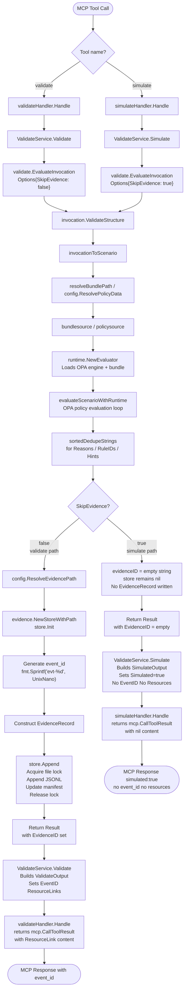

# MCP Tool Design: simulate

**Document status:** Implementation-ready internal design
**Date:** 2026-02-25
**Author:** AI-assisted (see AI governance section below)
**Module:** `samebits.com/evidra`
**Go version:** 1.22+

---

## Table of Contents

1. [Purpose](#1-purpose)
2. [Functional Specification](#2-functional-specification)
3. [MCP Contract](#3-mcp-contract)
4. [Internal Architecture](#4-internal-architecture)
5. [Data Structures (Go)](#5-data-structures-go)
6. [Concurrency and Safety Model](#6-concurrency-and-safety-model)
7. [Security Model](#7-security-model)
8. [Observability](#8-observability)
9. [Performance Considerations](#9-performance-considerations)
10. [Failure Modes](#10-failure-modes)
11. [Backward Compatibility](#11-backward-compatibility)
12. [Testing Strategy](#12-testing-strategy)
13. [Implementation Plan](#13-implementation-plan)

---

## 1. Purpose

### 1.1 The Pre-flight Safety Pattern

AI agents operating in production environments must not discover policy violations reactively — that is, by attempting an action, receiving a denial, and then altering course. Reactive denial handling creates three compounding problems:

1. **Partial state mutation risk.** A multi-step agent workflow may have already executed earlier steps before encountering a denial on a later step. Those earlier steps may have been evidence-recorded as allowed, while the later denial renders the overall workflow invalid. Unwinding is hard.
2. **Evidence store pollution.** Every `validate` call that results in a denial writes an `EvidenceRecord` with `allow: false` and `risk_level: "high"`. If an agent is attempting speculative planning — trying multiple parameter combinations to find one that passes — the evidence store accumulates records for actions that were never actually attempted. This degrades audit quality.
3. **Latency amplification under HTTP transport.** A `validate` call that writes to the JSONL evidence store must acquire an advisory file lock (`pkg/evidence/lock.go`). Under concurrent load or slow filesystem, this adds latency. A planning agent doing speculative parameter search should not pay this cost.

`simulate` solves all three problems by providing a true dry-run path: the OPA policy evaluation executes identically to `validate`, but the evidence store is never touched, no lock is acquired, and no `event_id` is generated. The agent can call `simulate` as many times as needed with different parameters until it finds a configuration that passes, then call `validate` exactly once to commit the evidence record for the action it will actually perform.

### 1.2 Relationship to `validate`

`simulate` is not a separate evaluation path. It is the same evaluation kernel (`validate.EvaluateInvocation`) invoked with `validate.Options{SkipEvidence: true}`. The OPA engine, the bundle loading, the `data.evidra.policy.decision` evaluation, the `Decision` struct mapping — all are identical. The only fork point is in `pkg/validate.EvaluateScenario` at the conditional block that gates evidence store operations:

```go
// pkg/validate/validate.go lines 107-119
if !opts.SkipEvidence {
    evidenceDir, err := config.ResolveEvidencePath(opts.EvidenceDir)
    // ...
    store = evidence.NewStoreWithPath(evidenceDir)
    if err := store.Init(); err != nil { ... }
    evidenceID = fmt.Sprintf("evt-%d", time.Now().UTC().UnixNano())
}
```

When `SkipEvidence: true`, this entire block is bypassed. The `store` pointer remains `nil`, no `evidenceID` is generated, and the `store.Append(rec)` call at line 155 is skipped.

### 1.3 Comparison with `validate`

| Attribute | `validate` | `simulate` |
|---|---|---|
| OPA evaluation | Yes | Yes (identical) |
| Evidence store write | Yes | No |
| File lock acquisition | Yes | No |
| `event_id` in response | Yes (non-empty) | No (always `""`) |
| `resources` links | Yes | No |
| `simulated` field | Not present | `true` |
| Idempotent | No (each call writes a new record) | Yes (fully idempotent) |
| Side effects | Evidence JSONL append, manifest update | None |
| Call frequency | Rate-limited by file lock contention | Limited only by OPA eval throughput |
| Suitable for speculative planning | No | Yes |

---

## 2. Functional Specification

### 2.1 Inputs

The input schema for `simulate` is byte-for-byte identical to `validate`. The `ToolInvocation` struct in `pkg/invocation/invocation.go` is the canonical input type for both tools. All field validation rules defined in `invocation.ValidateStructure()` apply to `simulate` without modification:

- `actor.type`, `actor.id`, `actor.origin` must be non-empty strings
- `tool` and `operation` must be non-empty strings
- `params` must be a non-nil JSON object
- `params.target` and `params.payload`, if present, must be JSON objects
- `params.risk_tags`, if present, must be an array of strings
- Unknown keys in `params` are rejected (`rejectUnknownKeys`)
- Unknown keys in `context`, if provided, are rejected

This validation strictness is intentional: `simulate` should reject the same inputs that `validate` would reject, so that a passing `simulate` call guarantees the subsequent `validate` call will not fail with `ErrInvalidInput`.

### 2.2 Outputs

The `SimulateOutput` struct (defined in section 5) carries the full policy decision information. The fields present are:

| Field | Type | Description |
|---|---|---|
| `ok` | `bool` | `true` if the action would be allowed; `false` if it would be denied or if evaluation failed |
| `policy` | `PolicySummary` | `allow`, `risk_level`, `reason`, `policy_ref` — identical semantics to validate |
| `rule_ids` | `[]string` | Sorted, deduplicated canonical rule IDs that fired (deny or warn) |
| `hints` | `[]string` | Sorted, deduplicated hint strings from `data.evidra.rule_hints` |
| `reasons` | `[]string` | Sorted, deduplicated human-readable denial reasons |
| `simulated` | `bool` | Always `true`. Distinguishes simulate responses from validate responses. |
| `error` | `*ErrorSummary` | Present only on evaluation failure; absent on success |

Fields present in `ValidateOutput` that are **absent** from `SimulateOutput`:

- `event_id` — not generated; no record was written
- `resources` — no evidence URI exists; nothing to link to

The `ok` field has a subtlety regarding `ModeObserve`. In `validate`, `ModeObserve` forces `ok = true` regardless of policy result, because the tool is configured in observe mode and should never block. For `simulate`, `ok` reflects the raw policy decision: `res.Pass`. The caller is asking "would this be allowed?" — not "would this block my workflow?". Mode-override of `ok` is therefore intentionally absent from the simulate path. Agents should interpret `ok: false` from simulate as "this action would be denied in enforce mode" regardless of the server's current mode setting.

### 2.3 Zero Side Effects Guarantee

`simulate` makes no writes of any kind. Specifically:

- No JSONL records are appended to any segment file under `~/.evidra/evidence/segments/`
- No `manifest.json` is updated
- No advisory lock file (`.evidra.lock`) is created or acquired
- No temporary files are created
- No environment variables are set
- No network calls are made (OPA evaluation is in-process via `github.com/open-policy-agent/opa`)

The only shared mutable state touched by `simulate` is the OPA `rego.PreparedEvalQuery` inside `policy.Engine`. This state is read-only during evaluation (see section 6 for OPA thread safety analysis).

### 2.4 Determinism

For a given `(input, policy_bundle)` pair, `simulate` produces deterministic output. The OPA Rego evaluation is a pure function of the input document and the policy/data documents loaded at `NewEvaluator` time. `simulate` never generates timestamps, UUIDs, or any other non-deterministic values that would appear in the output. This property is what makes `simulate` suitable for use in testing harnesses, caching layers, and speculative planning loops.

Note: `validate` is *not* deterministic in this sense — it generates `evidenceID = fmt.Sprintf("evt-%d", time.Now().UTC().UnixNano())` on each call, and the `EvidenceRecord.Timestamp` is wall-clock time. `simulate` eliminates both of these.

### 2.5 Full Idempotency

`simulate` is fully idempotent: calling it N times with identical inputs produces identical outputs and leaves the system state unchanged after the first call just as after the Nth call. This is a stronger guarantee than MCP's `IdempotentHint` annotation, which is advisory. The guarantee is structural: no writes means no state accumulation.

### 2.6 No Evidence Recording

The evidence store (`pkg/evidence.Store`) is never instantiated during a `simulate` call. The code path in `validate.EvaluateScenario` gated by `!opts.SkipEvidence` (lines 109-119, `validate.go`) is the sole location where the store is touched. Setting `SkipEvidence: true` ensures this block is never entered. The `store` variable remains `nil` for the duration of the call, and the `if store != nil { store.Append(rec) }` guard at line 154 ensures no write is attempted even if the control flow were somehow modified.

---

## 3. MCP Contract

### 3.1 Request Schema

The JSON Schema for the `simulate` tool input is identical to `validate`. This is a design constraint, not a coincidence: the agent workflow requires that the same JSON object can be submitted to both tools.

```json
{
  "type": "object",
  "required": ["actor", "tool", "operation", "params", "context"],
  "properties": {
    "actor": {
      "type": "object",
      "description": "Invocation initiator identity.",
      "required": ["type", "id", "origin"],
      "properties": {
        "type":   { "type": "string", "description": "Actor category (human|agent|system)." },
        "id":     { "type": "string", "description": "Actor identifier." },
        "origin": { "type": "string", "description": "Invocation source (mcp|cli|api)." }
      }
    },
    "tool":      { "type": "string", "description": "Tool name (e.g. terraform, kubectl)." },
    "operation": { "type": "string", "description": "Operation (e.g. plan, apply, delete)." },
    "params": {
      "type": "object",
      "description": "Operation parameters. Keys: target (object), payload (object), risk_tags (array of strings), scenario_id (string). Unknown keys are rejected.",
      "properties": {
        "target":      { "type": "object", "description": "Target resource descriptor." },
        "payload":     { "type": "object", "description": "Operation payload data." },
        "risk_tags":   { "type": "array", "items": { "type": "string" }, "description": "Asserted risk classification tags." },
        "scenario_id": { "type": "string", "description": "Optional stable scenario identifier for grouping." }
      },
      "additionalProperties": false
    },
    "context": {
      "type": "object",
      "description": "Optional context metadata. Keys: source (string), intent (string), scenario_id (string). Unknown keys are rejected.",
      "properties": {
        "source":      { "type": "string" },
        "intent":      { "type": "string" },
        "scenario_id": { "type": "string" }
      },
      "additionalProperties": false
    }
  }
}
```

### 3.2 Response Schema

```json
{
  "type": "object",
  "required": ["ok", "policy", "simulated"],
  "properties": {
    "ok": {
      "type": "boolean",
      "description": "True if the action would be allowed by policy. False if denied or evaluation error."
    },
    "policy": {
      "type": "object",
      "required": ["allow", "risk_level", "reason"],
      "properties": {
        "allow":      { "type": "boolean" },
        "risk_level": { "type": "string", "enum": ["low", "medium", "high"] },
        "reason":     { "type": "string", "description": "Primary denial reason or 'scenario_validated'." },
        "policy_ref": { "type": "string", "description": "Content-addressed policy bundle reference." }
      }
    },
    "rule_ids": {
      "type": "array",
      "items": { "type": "string" },
      "description": "Sorted deduplicated canonical rule IDs that fired. Empty if no rules fired."
    },
    "hints": {
      "type": "array",
      "items": { "type": "string" },
      "description": "Sorted deduplicated hint strings from rule_hints data. May be non-empty even when allow=true."
    },
    "reasons": {
      "type": "array",
      "items": { "type": "string" },
      "description": "Sorted deduplicated human-readable denial reasons. Empty when allow=true."
    },
    "simulated": {
      "type": "boolean",
      "description": "Always true for simulate responses. Distinguishes from validate responses."
    },
    "error": {
      "type": "object",
      "description": "Present only on evaluation failure.",
      "properties": {
        "code":       { "type": "string" },
        "message":    { "type": "string" },
        "risk_level": { "type": "string" },
        "reason":     { "type": "string" }
      }
    }
  }
}
```

Note the explicit absence of `event_id` and `resources` from this schema. These fields are not omitted with `omitempty` — they do not exist in `SimulateOutput` at all. This prevents callers from accidentally attempting to look up an event that was never recorded.

### 3.3 Error Schema

Errors follow the same `ErrorSummary` structure used by `validate`:

```json
{
  "ok": false,
  "policy": { "allow": false, "risk_level": "high", "reason": "policy_failure" },
  "simulated": true,
  "error": {
    "code": "policy_failure",
    "message": "policy evaluation failed"
  }
}
```

Error codes for `simulate`:

| Code | Trigger condition |
|---|---|
| `invalid_input` | `invocation.ValidateStructure()` returned an error |
| `policy_failure` | Bundle load failed, OPA engine init failed, or OPA evaluation error |
| `internal_error` | Unexpected error not matching sentinel types |

Note: `evidence_write_failed` and `evidence_chain_invalid` **cannot occur** in a simulate response. If a `validate.ErrEvidenceWrite` error somehow propagates (which is impossible with `SkipEvidence: true` given current code, but defensively handled), the MCP layer maps it to `internal_error`.

### 3.4 Concrete JSON Examples

#### 3.4.1 Would-be-allowed case

Request:
```json
{
  "actor": { "type": "agent", "id": "deploy-agent-001", "origin": "mcp" },
  "tool": "kubectl",
  "operation": "apply",
  "params": {
    "target": { "namespace": "staging", "resource": "deployment/api-server" },
    "payload": { "image": "api-server:v2.3.1" },
    "risk_tags": ["reviewed", "staging-only"]
  },
  "context": { "source": "mcp", "intent": "deploy new image version to staging" }
}
```

Response:
```json
{
  "ok": true,
  "policy": {
    "allow": true,
    "risk_level": "low",
    "reason": "scenario_validated",
    "policy_ref": "sha256:a1b2c3d4..."
  },
  "rule_ids": [],
  "hints": [],
  "reasons": [],
  "simulated": true
}
```

#### 3.4.2 Would-be-denied case

Request:
```json
{
  "actor": { "type": "agent", "id": "deploy-agent-001", "origin": "mcp" },
  "tool": "kubectl",
  "operation": "delete",
  "params": {
    "target": { "namespace": "prod", "resource": "deployment/api-server" },
    "payload": {},
    "risk_tags": []
  },
  "context": { "source": "mcp", "intent": "remove deployment from prod" }
}
```

Response:
```json
{
  "ok": false,
  "policy": {
    "allow": false,
    "risk_level": "high",
    "reason": "ops.unapproved_change",
    "policy_ref": "sha256:a1b2c3d4..."
  },
  "rule_ids": ["ops.unapproved_change", "k8s.protected_namespace"],
  "hints": [
    "Add 'breakglass' risk_tag and get approval before modifying protected namespace.",
    "Destructive operations on prod require ops.unapproved_change exemption."
  ],
  "reasons": [
    "action denied: protected namespace 'prod'",
    "action denied: unapproved change to production resource"
  ],
  "simulated": true
}
```

#### 3.4.3 Agent Workflow Pattern: Simulate then Validate

The canonical usage pattern for an agent implementing pre-flight safety checking:

```
Step 1: Agent builds candidate action parameters.

Step 2: Agent calls simulate.
  - If ok: false → inspect rule_ids and hints, adjust params or risk_tags, retry simulate.
  - If ok: true  → proceed to step 3.

Step 3: Agent calls validate with the same input that passed simulate.
  - If ok: false  → policy changed between simulate and validate calls (race on bundle reload).
                    Agent should log the discrepancy and halt.
  - If ok: true   → proceed with the actual tool execution.
                    event_id is available for audit trail reference.

Step 4: Agent executes the real tool action.
  - If execution fails → (optional) update evidence record via future UpdateEvent tool.
```

Pseudo-code representation:

```python
# Pre-flight check
sim = mcp.call("simulate", action_params)
if not sim["ok"]:
    # Adjust params based on sim["hints"] and sim["rule_ids"]
    action_params["params"]["risk_tags"] += suggest_tags(sim["rule_ids"])
    sim = mcp.call("simulate", action_params)
    if not sim["ok"]:
        raise PolicyDenied(sim["reasons"])

# Commit evidence record
val = mcp.call("validate", action_params)
if not val["ok"]:
    raise PolicyChangedUnderfoot(val, sim)

# Execute with evidence reference
execute_action(action_params, audit_ref=val["event_id"])
```

Note the critical insight: the input passed to `validate` is byte-identical to the input that passed `simulate`. This ensures the OPA evaluation will produce the same result (barring a bundle hot-reload between the two calls, which is a race condition the agent must handle).

---

## 4. Internal Architecture

### 4.1 Position in `pkg/mcpserver`

`simulate` is implemented entirely within `pkg/mcpserver`. It does not require changes to any package other than `pkg/mcpserver` itself, because `validate.Options.SkipEvidence` already exists in `pkg/validate`. The entire implementation delta is:

1. A new `SimulateOutput` struct in `pkg/mcpserver/server.go` (or a new file `pkg/mcpserver/simulate.go`)
2. A new `simulateHandler` struct with a `Handle` method
3. A new `Simulate` method on `ValidateService`
4. Registration of the `simulate` tool in `NewServer`

No changes to `pkg/validate`, `pkg/runtime`, `pkg/policy`, `pkg/evidence`, or `pkg/invocation` are required.

### 4.2 Reuse of `ValidateService.Validate` Flow

`ValidateService.Validate` currently calls:

```go
res, err := validate.EvaluateInvocation(ctx, inv, validate.Options{
    PolicyPath:  s.policyPath,
    DataPath:    s.dataPath,
    BundlePath:  s.bundlePath,
    Environment: s.environment,
    EvidenceDir: s.evidencePath,
})
```

`ValidateService.Simulate` calls the identical function with one additional field:

```go
res, err := validate.EvaluateInvocation(ctx, inv, validate.Options{
    PolicyPath:   s.policyPath,
    DataPath:     s.dataPath,
    BundlePath:   s.bundlePath,
    Environment:  s.environment,
    EvidenceDir:  s.evidencePath,  // present but unused when SkipEvidence=true
    SkipEvidence: true,
})
```

`EvidenceDir` is passed through even though it will not be used, because `validate.EvaluateScenario` does not call `config.ResolveEvidencePath` when `SkipEvidence: true`. This is safe and avoids the need for a sentinel "no evidence dir" value.

The `Simulate` method then constructs a `SimulateOutput` from the `validate.Result`, omitting `EventID` and `Resources`, and setting `Simulated: true`.

### 4.3 Mermaid Diagram: Execution Flow Fork

The following diagram shows the full execution path for both `validate` and `simulate`, with the fork point annotated.



### 4.4 Bundle Loading Per-Call

A notable architectural detail: `validate.EvaluateScenario` calls `runtime.NewEvaluator(src)` on every invocation. This means the OPA engine is constructed fresh per call — there is no long-lived cached evaluator in the current implementation. Both `validate` and `simulate` pay this cost equally. This is a performance consideration but not a correctness concern, and it is outside the scope of this design document.

---

## 5. Data Structures (Go)

### 5.1 `SimulateOutput` Struct

`SimulateOutput` lives in `pkg/mcpserver/server.go` alongside `ValidateOutput`. It is a deliberately separate type — not an embedded struct or a type alias — to enforce the compile-time guarantee that `event_id` and `resources` cannot be set on a simulate response.

```go
// SimulateOutput is the response type for the simulate MCP tool.
// It is structurally similar to ValidateOutput but omits EventID and Resources,
// as simulate never writes to the evidence store and produces no recordable artifact.
// The Simulated field is always true and serves as a machine-readable discriminator.
//
// Generated by AI | 2026-02-25 | TOOL_DESIGN_simulate.md: SimulateOutput struct definition
type SimulateOutput struct {
    OK        bool          `json:"ok"`
    Policy    PolicySummary `json:"policy"`
    RuleIDs   []string      `json:"rule_ids,omitempty"`
    Hints     []string      `json:"hints,omitempty"`
    Reasons   []string      `json:"reasons,omitempty"`
    Simulated bool          `json:"simulated"`
    Error     *ErrorSummary `json:"error,omitempty"`
}
```

Design rationale for each field decision:

- `OK bool` — present; agents check this as the primary decision gate, identical semantics to `ValidateOutput.OK` but without mode-override (see section 2.2)
- `Policy PolicySummary` — present; reuses existing `PolicySummary` type; carries `allow`, `risk_level`, `reason`, `policy_ref`
- `RuleIDs []string` — present with `omitempty`; agents need these to understand why a denial occurred and what tags might unlock the action
- `Hints []string` — present with `omitempty`; agents need these to determine corrective action (add risk tag, seek approval, etc.)
- `Reasons []string` — present with `omitempty`; human-readable denial reasons; useful for agent self-explanation
- `Simulated bool` — present without `omitempty`; must serialize as `true` in all responses; the absence of `omitempty` ensures it always appears in the JSON output even if it were somehow `false` (which would indicate a bug)
- `EventID` — **absent by design**; no field, not `omitempty`; callers cannot reference an event that does not exist
- `Resources` — **absent by design**; no evidence URI was created

### 5.2 `simulateHandler` Struct

```go
// simulateHandler adapts the simulate MCP tool invocation to ValidateService.Simulate.
//
// Generated by AI | 2026-02-25 | TOOL_DESIGN_simulate.md: simulateHandler definition
type simulateHandler struct {
    service *ValidateService
}

func (h *simulateHandler) Handle(
    ctx context.Context,
    _ *mcp.CallToolRequest,
    input invocation.ToolInvocation,
) (*mcp.CallToolResult, SimulateOutput, error) {
    output := h.service.Simulate(ctx, input)
    // No resource links: simulate never writes to the evidence store.
    return &mcp.CallToolResult{}, output, nil
}
```

The `Handle` method signature is identical in shape to `validateHandler.Handle` — it satisfies the same generic `mcp.AddTool` constraint. The return differs in two ways:

1. The second return value is `SimulateOutput` rather than `ValidateOutput`
2. The `*mcp.CallToolResult` carries no `Content` (no resource links), unlike `validateHandler.Handle` which passes `resourceLinksToContent(output.Resources)`

### 5.3 `ValidateService.Simulate` Method

```go
// Simulate evaluates an invocation against policy without writing to the evidence store.
// It is the dry-run counterpart to Validate. The result is deterministic for a given
// (input, policy_bundle) pair and carries no side effects.
//
// Generated by AI | 2026-02-25 | TOOL_DESIGN_simulate.md: ValidateService.Simulate definition
func (s *ValidateService) Simulate(ctx context.Context, inv invocation.ToolInvocation) SimulateOutput {
    res, err := validate.EvaluateInvocation(ctx, inv, validate.Options{
        PolicyPath:   s.policyPath,
        DataPath:     s.dataPath,
        BundlePath:   s.bundlePath,
        Environment:  s.environment,
        EvidenceDir:  s.evidencePath,
        SkipEvidence: true,
    })
    if err != nil {
        code, msg := validateErrCode(err)
        return SimulateOutput{
            OK: false,
            Policy: PolicySummary{
                Allow:     false,
                RiskLevel: "high",
                Reason:    code,
                PolicyRef: s.policyRef,
            },
            Simulated: true,
            Error:     &ErrorSummary{Code: code, Message: msg},
        }
    }

    // Note: ok reflects the raw policy decision for simulate.
    // ModeObserve does NOT force ok=true here, unlike Validate.
    // The agent is asking "would this be denied?" not "would this block my workflow?".
    return SimulateOutput{
        OK: res.Pass,
        Policy: PolicySummary{
            Allow:     res.Pass,
            RiskLevel: res.RiskLevel,
            Reason:    firstReason(res.Reasons),
            PolicyRef: s.policyRef,
        },
        RuleIDs:   res.RuleIDs,
        Hints:     res.Hints,
        Reasons:   res.Reasons,
        Simulated: true,
    }
}
```

The `validateErrCode` helper from `server.go` is reused without modification; it already handles all three sentinel errors from `pkg/validate`. The `evidence_write_failed` path cannot be reached with `SkipEvidence: true`, but the error mapping is correct if it somehow were: it would produce `ErrCodeEvidenceWrite` from `validateErrCode`, and the simulate method would return it under `internal_error` mapping — or the caller would see `evidence_write_failed`. Either way, `Simulated: true` is always set, even in the error branch.

### 5.4 Tool Registration in `NewServer`

The `simulate` tool is registered in `NewServer` immediately after the `validate` tool. The tool annotations declare it as read-only and idempotent (both structurally true).

```go
// In NewServer, after validate tool registration:
simulateTool := &simulateHandler{service: svc}
mcp.AddTool(server, &mcp.Tool{
    Name:        "simulate",
    Title:       "Simulate Tool Invocation (Dry Run)",
    Description: "Evaluate an action against policy without recording evidence. " +
        "Use this for pre-flight safety checks before calling validate. " +
        "Returns policy decision, rule_ids, and hints. Never writes to the evidence store.",
    Annotations: &mcp.ToolAnnotations{
        Title:           "Simulate Policy Check",
        ReadOnlyHint:    true,
        IdempotentHint:  true,
        DestructiveHint: boolPtr(false),
        OpenWorldHint:   boolPtr(false),
    },
    InputSchema: map[string]any{
        // Identical to validate InputSchema — copy verbatim from validate registration.
        // This is intentional: agents must be able to pass the same input to both tools.
        "type":     "object",
        "required": []any{"actor", "tool", "operation", "params", "context"},
        "properties": map[string]any{
            "actor": map[string]any{
                "type":        "object",
                "description": "Invocation initiator identity.",
                "required":    []any{"type", "id", "origin"},
                "properties": map[string]any{
                    "type":   map[string]any{"type": "string", "description": "Actor category (human|agent|system)."},
                    "id":     map[string]any{"type": "string", "description": "Actor identifier."},
                    "origin": map[string]any{"type": "string", "description": "Invocation source (mcp|cli|api)."},
                },
            },
            "tool":      map[string]any{"type": "string", "description": "Tool name (e.g. terraform)."},
            "operation": map[string]any{"type": "string", "description": "Operation (e.g. plan, apply)."},
            "params":    map[string]any{"type": "object", "description": "Operation parameters; include risk_tags/asserted data."},
            "context":   map[string]any{"type": "object", "description": "Optional context metadata."},
        },
    },
}, simulateTool.Handle)
```

---

## 6. Concurrency and Safety Model

### 6.1 No Evidence Store Contention

The evidence store (`pkg/evidence`) uses an advisory file lock (`pkg/evidence/lock.go`) to serialize concurrent JSONL appends. This lock is acquired in `evidence.Store.Append` and released after the JSONL line and manifest update are flushed. Under concurrent `validate` calls, all callers contend on this lock.

`simulate` never calls `evidence.Store.Init()`, `evidence.Store.Append()`, or any other store method. The `store` pointer in `validate.EvaluateScenario` is `nil` for the entire duration of a simulate call. Consequently:

- `simulate` goroutines never contend with each other on the file lock
- `simulate` goroutines never contend with concurrent `validate` goroutines on the file lock
- `simulate` adds zero lock contention to the system

Under HTTP transport with a high-frequency agent running pre-flight checks, this means `simulate` calls scale horizontally up to the limit of OPA evaluation throughput.

### 6.2 OPA Evaluator Thread Safety

`validate.EvaluateScenario` constructs a new `runtime.Evaluator` (and thus a new `policy.Engine` and a new `rego.PreparedEvalQuery`) on every call. This is the current implementation pattern as seen in `validate.go` lines 91-94:

```go
runtimeEval, err := runtime.NewEvaluator(src)
```

Because each `simulate` (and `validate`) call creates its own `Evaluator` instance with its own `policy.Engine`, there is no shared mutable OPA state between concurrent calls. Each evaluation is entirely self-contained.

If the implementation is later changed to cache a shared `Evaluator` (as a performance optimization — see section 9), the thread safety properties of `rego.PreparedEvalQuery` must be re-evaluated. As of OPA v0.57+, `rego.PreparedEvalQuery.Eval` is documented as goroutine-safe when called with separate `rego.EvalOptions` per goroutine (which `policy.Engine.Evaluate` does). However, the shared evaluator optimization is out of scope for this document and must be treated as a separate architectural decision per the AI governance guidelines.

### 6.3 `ValidateService` Field Access

`ValidateService` fields (`policyPath`, `dataPath`, `bundlePath`, `environment`, `evidencePath`, `policyRef`, `mode`, `includeFileResourceLinks`) are set once at construction in `newValidateService` and are read-only thereafter. Both `Validate` and `Simulate` read these fields but never write them. No synchronization is required for concurrent calls to `Simulate` or concurrent calls mixing `Simulate` and `Validate`.

---

## 7. Security Model

### 7.1 Input Validation: Identical to `validate`

`simulate` applies the full `invocation.ValidateStructure()` validation before any policy evaluation occurs. This validation is called inside `validate.EvaluateInvocation` at line 68 of `validate.go`:

```go
if err := inv.ValidateStructure(); err != nil {
    return Result{}, fmt.Errorf("%w: %w", ErrInvalidInput, err)
}
```

The validation rejects:
- Missing required fields (actor type/id/origin, tool, operation, params)
- Non-object values for `params.target` and `params.payload`
- Non-string-array values for `params.risk_tags`
- Unknown keys in `params` (strict allowlist: `target`, `payload`, `risk_tags`, `scenario_id`)
- Unknown keys in `context` (strict allowlist: `source`, `intent`, `scenario_id`)

Denial of service via malformed input is mitigated by the strictness of this validation — malformed inputs are rejected before OPA evaluation begins.

### 7.2 Elevated Call Frequency

Because `simulate` carries no file lock overhead, it can sustain higher call rates than `validate`. This creates an asymmetric attack surface under HTTP transport: a caller that cannot trigger evidence writes at high frequency (due to lock contention) can trigger OPA evaluations at much higher frequency via `simulate`.

The mitigations for HTTP transport are:

1. **Per-connection rate limiting at the transport layer.** The `go-sdk` MCP HTTP transport (Streamable HTTP, SSE) should be fronted by a rate limiter at the HTTP middleware layer. Recommended limit: 60 simulate calls per minute per authenticated identity (compared to 10 validate calls per minute per identity). These are starting values; tuning should be based on observed OPA evaluation latency (see section 9).

2. **Bundle load cost.** The current per-call `runtime.NewEvaluator` pattern means each simulate call loads and compiles the OPA bundle. This acts as a natural brake on call frequency but is also a performance liability (see section 9). Until a shared evaluator is implemented, the bundle load cost limits realistic simulate throughput to approximately the rate at which the bundle can be loaded from disk.

3. **Input size limits.** `params.payload` and `params.target` are unbounded JSON objects in the current schema. The MCP transport layer should enforce a maximum request body size (recommended: 64 KB). OPA evaluation time is proportional to input document size for rules that iterate over payload fields.

4. **No differential resource exposure.** `simulate` cannot be used to enumerate evidence store contents (it never reads the store). It cannot be used to determine whether a specific `event_id` exists. It cannot leak information beyond what the policy decision reveals. The information content of a simulate response is a strict subset of what a validate response would reveal.

### 7.3 Stdio Transport

Under stdio transport (the default for `cmd/evidra-mcp`), the caller is the parent process that spawned the MCP server. Rate limiting is not applicable in this context. The trust boundary is the process boundary, and the security model is equivalent to running the OPA evaluator directly.

---

## 8. Observability

### 8.1 Structured Logging with `slog`

Every `simulate` call should emit a structured log entry at `INFO` level on completion (matching the convention used by `validate` if one exists, or establishing one). The log entry must include:

```go
slog.InfoContext(ctx, "simulate completed",
    slog.String("tool",        inv.Tool),
    slog.String("operation",   inv.Operation),
    slog.String("actor_id",    inv.Actor.ID),
    slog.String("actor_type",  inv.Actor.Type),
    slog.Bool("allow",         output.Policy.Allow),
    slog.String("risk_level",  output.Policy.RiskLevel),
    slog.Bool("simulated",     true),              // always true; aids log filtering
    slog.Any("rule_ids",       output.RuleIDs),
    slog.String("policy_ref",  output.Policy.PolicyRef),
    slog.Duration("latency",   time.Since(start)),
)
```

The `simulated: true` field in the log entry is the critical discriminator for metrics pipelines and log aggregators. Queries like `slog.bool.simulated=true` allow operators to separate simulate traffic from validate traffic in dashboards.

On error:
```go
slog.ErrorContext(ctx, "simulate failed",
    slog.String("error_code",  output.Error.Code),
    slog.String("error_msg",   output.Error.Message),
    slog.Bool("simulated",     true),
)
```

### 8.2 Prometheus Counter

A dedicated counter separates simulate metrics from validate metrics. They must not share a counter with a label, because the cardinality of shared labels (tool name, operation, actor type) would create a combinatorial explosion in the label space.

```
# HELP evidra_simulate_total Total number of simulate tool invocations.
# TYPE evidra_simulate_total counter
evidra_simulate_total{result="allow", risk_level="low"}
evidra_simulate_total{result="deny",  risk_level="high"}
evidra_simulate_total{result="error", risk_level="high"}
```

Corresponding existing counter for validate (for reference):
```
# HELP evidra_validate_total Total number of validate tool invocations.
# TYPE evidra_validate_total counter
evidra_validate_total{result="allow", risk_level="low"}
evidra_validate_total{result="deny",  risk_level="high"}
evidra_validate_total{result="error", risk_level="high"}
```

The `result` label uses `"allow"` / `"deny"` / `"error"` rather than the boolean `ok` to improve readability in Grafana dashboards.

A histogram for latency:
```
# HELP evidra_simulate_duration_seconds OPA evaluation latency for simulate calls (excludes store I/O).
# TYPE evidra_simulate_duration_seconds histogram
evidra_simulate_duration_seconds_bucket{le="0.005"}
evidra_simulate_duration_seconds_bucket{le="0.01"}
evidra_simulate_duration_seconds_bucket{le="0.025"}
evidra_simulate_duration_seconds_bucket{le="0.05"}
evidra_simulate_duration_seconds_bucket{le="0.1"}
evidra_simulate_duration_seconds_bucket{le="0.25"}
evidra_simulate_duration_seconds_bucket{le="+Inf"}
```

These histograms allow direct comparison of `evidra_simulate_duration_seconds` vs `evidra_validate_duration_seconds` to measure the cost of evidence store I/O.

### 8.3 OpenTelemetry Span

The OTel span for simulate calls uses a distinct span name to separate it from validate in distributed traces:

```go
ctx, span := otel.Tracer("evidra-mcp").Start(ctx, "evidra.simulate")
defer span.End()

span.SetAttributes(
    attribute.String("evidra.tool",        inv.Tool),
    attribute.String("evidra.operation",   inv.Operation),
    attribute.String("evidra.actor.type",  inv.Actor.Type),
    attribute.Bool("evidra.simulated",     true),
    attribute.Bool("evidra.policy.allow",  output.Policy.Allow),
    attribute.String("evidra.risk_level",  output.Policy.RiskLevel),
)
```

The `evidra.simulate` span will be a child of the MCP tool call span created by the `go-sdk` transport layer (if the transport propagates trace context). This allows the full latency decomposition:

```
[MCP transport span]
  └── [evidra.simulate span]
        ├── [bundle load: bundlesource.NewBundleSource]
        ├── [OPA engine init: runtime.NewEvaluator]
        └── [OPA eval: evaluateScenarioWithRuntime]
```

Note the absence of a `[store lock]` and `[JSONL append]` child span — these do not exist for simulate.

---

## 9. Performance Considerations

### 9.1 Latency Profile

The total latency of a `simulate` call decomposes into:

| Component | Typical latency | Notes |
|---|---|---|
| `invocation.ValidateStructure` | < 1 µs | Pure struct field validation |
| `invocationToScenario` | < 1 µs | Map copies |
| `bundlesource.NewBundleSource` | 1–5 ms | Reads `.manifest` file + `.rego` files from disk |
| `policy.NewOPAEngine` | 5–20 ms | Rego compilation, partial evaluation preparation |
| `evaluateScenarioWithRuntime` | 1–10 ms | OPA query evaluation per action |
| `sortedDedupeStrings` | < 1 µs | Sort on small slices |
| **Total** | **7–35 ms** | Bundle load and OPA compile dominate |

By contrast, `validate` adds:
| Component | Typical latency | Notes |
|---|---|---|
| `config.ResolveEvidencePath` | < 1 ms | `os.Stat` call |
| `evidence.Store.Init` | 1–3 ms | Reads manifest, locks file |
| `evidence.Store.Append` | 2–10 ms | File lock acquire, JSONL write, manifest update, unlock |
| **Additional for validate** | **3–14 ms** | 30–50% overhead versus simulate |

`simulate` is faster than `validate` by the cost of evidence store I/O. Under high contention (many concurrent `validate` calls), the lock wait time in `evidence.Store.Append` can grow to hundreds of milliseconds, widening this gap further. `simulate` is unaffected by evidence store contention.

### 9.2 OPA Bundle Load Optimization (Future)

The dominant latency for both `simulate` and `validate` is the per-call bundle load and OPA engine construction. A shared, cached `*runtime.Evaluator` (built once at server startup and reused across calls) would reduce per-call latency from ~10-35 ms to ~1-5 ms. This optimization benefits both tools equally.

If a cached evaluator is implemented, the cache invalidation strategy must account for bundle hot-reload (when `EVIDRA_BUNDLE_PATH` points to a live bundle that may be updated). This is a separate architectural decision and must be recorded in `ai/AI_DECISIONS.md` per project governance.

### 9.3 Suitability for High-Frequency Pre-flight Checks

With the current per-call bundle load pattern, `simulate` can sustain approximately 30–140 calls/second on a single core (inverse of 7–35 ms latency). This is adequate for agent planning loops that run a handful of speculative checks before committing an action.

If agents need sub-millisecond simulate latency (e.g., for batch planning of thousands of actions), the cached evaluator optimization is required. At that point, `simulate` latency would be dominated by the OPA query evaluation itself (~1-5 ms), giving approximately 200–1000 calls/second.

---

## 10. Failure Modes

### 10.1 Policy Evaluation Failure

If `validate.EvaluateInvocation` returns a `validate.ErrPolicyFailure`-wrapped error, `Simulate` returns a `SimulateOutput` with:

```go
SimulateOutput{
    OK: false,
    Policy: PolicySummary{
        Allow: false, RiskLevel: "high", Reason: "policy_failure", PolicyRef: s.policyRef,
    },
    Simulated: true,
    Error: &ErrorSummary{Code: "policy_failure", Message: "policy evaluation failed"},
}
```

Triggers include:
- **Bundle directory not found** — `bundlesource.NewBundleSource` returns error if the path does not exist or the `.manifest` is missing
- **Malformed `.rego` file** — `policy.NewOPAEngine` returns a compile error
- **OPA evaluation panic/error** — `rego.PreparedEvalQuery.Eval` returns a non-nil error
- **Missing `data.evidra.policy.decision` output** — the decision rule is not defined or returns an unexpected shape

All of these are wrapped as `ErrPolicyFailure` and mapped to `"policy_failure"` in the MCP response. The internal error detail is logged at `ERROR` level but not exposed to the caller.

### 10.2 Bundle Unavailable

If the bundle path resolves to an empty string (no `BundlePath` configured, no `EVIDRA_BUNDLE_PATH` env var, no file at `config.DefaultBundlePath`) and no `PolicyPath`/`DataPath` is configured either, `config.ResolvePolicyData` returns an error, which propagates as `ErrPolicyFailure`. The `simulate` response will be:

```json
{
  "ok": false,
  "policy": { "allow": false, "risk_level": "high", "reason": "policy_failure" },
  "simulated": true,
  "error": { "code": "policy_failure", "message": "policy evaluation failed" }
}
```

Agents receiving this error should halt the workflow and surface it to the operator. A missing policy bundle is a configuration error, not a policy denial.

### 10.3 Evidence Write Failures Cannot Occur

`validate.ErrEvidenceWrite` cannot be returned by `validate.EvaluateInvocation` when `SkipEvidence: true`. The only code paths that return `ErrEvidenceWrite`-wrapped errors are:

1. `config.ResolveEvidencePath` failure (line 110-113, `validate.go`) — gated by `!opts.SkipEvidence`
2. `store.Init()` failure (line 115-118) — gated by `!opts.SkipEvidence`
3. `store.Append(rec)` failure (line 155-157) — gated by `store != nil`, which is false when `SkipEvidence: true`

All three paths are unreachable in the `simulate` path. This is a structural guarantee, not a runtime check.

### 10.4 Invalid Input

`validate.ErrInvalidInput` is returned by `EvaluateInvocation` when `ValidateStructure()` fails. This is mapped to `ErrCodeInvalidInput` in the MCP response. Behavior is identical to `validate`; see section 7.1 for the full list of rejection conditions.

### 10.5 Context Cancellation

`ctx` is passed through to `validate.EvaluateInvocation` and from there to `evaluateScenarioWithRuntime` and `runtimeEval.EvaluateInvocation`. The OPA Go library respects context cancellation during evaluation. If the MCP connection is closed while a simulate call is in progress, the OPA evaluation will be cancelled and the goroutine will unblock. No cleanup is required because no store lock was acquired.

---

## 11. Backward Compatibility

### 11.1 The `simulated` Field is Additive

Agents that consume `ValidateOutput` JSON and ignore unknown fields (the standard JSON library behavior in Go with `json.Unmarshal` into a known struct) will be unaffected by `SimulateOutput`. The `simulated: true` field is an additive discriminator.

However, since `SimulateOutput` is a distinct Go type from `ValidateOutput`, type-safe Go callers (e.g., `pkg/mcpserver` tests) will get a compile error if they attempt to assign a `SimulateOutput` to a `ValidateOutput` variable. This is the intended behavior — the compiler enforces the distinction.

### 11.2 Absent `event_id` is Intentional, Not Degraded

An agent that receives a response without `event_id` (because the field is absent from `SimulateOutput`, not zero-valued) must not interpret this as a failed `validate` response. The `simulated: true` field is the primary signal. Agents must branch on `simulated` before inspecting `event_id`.

Pattern for agent code that handles both tool responses:

```python
response = mcp.call(tool_name, params)
if response.get("simulated"):
    # This is a simulate response; event_id will never be present.
    handle_simulate_response(response)
else:
    # This is a validate response; event_id will be present on success.
    handle_validate_response(response)
```

### 11.3 `resources` Absence

MCP clients that render resource links from `CallToolResult.Content` will receive no content items from a `simulate` call (the handler returns `&mcp.CallToolResult{}` with no `Content`). This is correct: there are no evidence resources to link to. Clients must handle empty `Content` gracefully, which is required by the MCP spec for all tools.

### 11.4 No Changes to Existing Tool Contracts

Adding `simulate` to `NewServer` does not modify the `validate` or `get_event` tool registrations. Existing agents that do not call `simulate` are entirely unaffected.

---

## 12. Testing Strategy

### 12.1 Unit Tests for `ValidateService.Simulate`

Tests live in `pkg/mcpserver/server_test.go` alongside the existing validate tests. They follow the same `newValidateService(opts)` pattern with a `t.TempDir()` evidence path.

**Table-driven test: policy outcome cases**

```go
func TestSimulateServicePolicyOutcomes(t *testing.T) {
    opts := Options{BundlePath: bundleDir, EvidencePath: t.TempDir(), Mode: ModeEnforce}
    svc := newValidateService(opts)

    cases := []struct {
        name         string
        inv          invocation.ToolInvocation
        wantAllow    bool
        wantRuleIDs  []string
        wantSimulated bool
    }{
        {
            name: "allowed kubectl apply to staging",
            inv: invocation.ToolInvocation{
                Actor:     invocation.Actor{Type: "agent", ID: "a1", Origin: "mcp"},
                Tool:      "kubectl", Operation: "apply",
                Params:    map[string]interface{}{},
                Context:   map[string]interface{}{},
            },
            wantAllow:    true,
            wantRuleIDs:  nil,
            wantSimulated: true,
        },
        {
            name: "denied kubectl delete on prod namespace",
            inv: invocation.ToolInvocation{
                Actor:     invocation.Actor{Type: "human", ID: "tester", Origin: "cli"},
                Tool:      "kubectl", Operation: "delete",
                Params:    map[string]interface{}{"payload": map[string]interface{}{"namespace": "prod"}},
                Context:   map[string]interface{}{},
            },
            wantAllow:    false,
            wantRuleIDs:  []string{"ops.unapproved_change"},
            wantSimulated: true,
        },
    }

    for _, tc := range cases {
        t.Run(tc.name, func(t *testing.T) {
            out := svc.Simulate(context.Background(), tc.inv)
            if out.Policy.Allow != tc.wantAllow {
                t.Errorf("allow: got %v, want %v", out.Policy.Allow, tc.wantAllow)
            }
            if !out.Simulated {
                t.Error("Simulated must be true")
            }
            if out.Simulated != tc.wantSimulated {
                t.Errorf("Simulated: got %v, want %v", out.Simulated, tc.wantSimulated)
            }
            // event_id is structurally absent from SimulateOutput, verified by compile
        })
    }
}
```

### 12.2 `event_id` Is Always Empty (Structural, Not Runtime Check)

Because `SimulateOutput` does not have an `EventID` field, the absence of `event_id` is enforced at compile time, not by a runtime assertion. Tests should not check for an empty `event_id` string — they should verify that `SimulateOutput` is used (not `ValidateOutput`), which the type system enforces.

### 12.3 Evidence Store Is Never Touched

This test verifies the zero-side-effect guarantee by checking that the evidence directory is unmodified after a simulate call.

```go
func TestSimulateDoesNotWriteEvidence(t *testing.T) {
    dir := t.TempDir()
    opts := Options{BundlePath: bundleDir, EvidencePath: dir, Mode: ModeEnforce}
    svc := newValidateService(opts)

    inv := invocation.ToolInvocation{
        Actor:     invocation.Actor{Type: "human", ID: "tester", Origin: "cli"},
        Tool:      "kubectl", Operation: "delete",
        Params:    map[string]interface{}{"payload": map[string]interface{}{"namespace": "prod"}},
        Context:   map[string]interface{}{},
    }

    // Capture directory state before simulate.
    entriesBefore, err := os.ReadDir(dir)
    if err != nil {
        t.Fatalf("ReadDir before: %v", err)
    }

    out := svc.Simulate(context.Background(), inv)
    if out.Simulated != true {
        t.Error("expected Simulated=true")
    }

    // Verify no files were created or modified in the evidence directory.
    entriesAfter, err := os.ReadDir(dir)
    if err != nil {
        t.Fatalf("ReadDir after: %v", err)
    }
    if len(entriesBefore) != len(entriesAfter) {
        t.Errorf("evidence dir changed: before=%d entries, after=%d entries",
            len(entriesBefore), len(entriesAfter))
    }
    for _, e := range entriesAfter {
        info, err := e.Info()
        if err != nil {
            t.Fatalf("file info: %v", err)
        }
        // All files in the directory should have mtime before the simulate call.
        if info.ModTime().After(time.Now().Add(-1 * time.Second)) {
            t.Errorf("file %q was modified during simulate", e.Name())
        }
    }
}
```

An alternative formulation uses `os.Stat` on the specific evidence segments directory:

```go
// If the segments dir doesn't exist, that's fine (nothing was written).
// If it does, verify the mtime didn't change.
segmentsDir := filepath.Join(dir, "segments")
if _, err := os.Stat(segmentsDir); err == nil {
    t.Error("simulate created evidence segments directory; expected no writes")
}
```

### 12.4 Shared Fixtures with `validate` Tests

Test invocations for the allowed and denied cases should be extracted into package-level variables shared by both `TestValidateService*` and `TestSimulateService*` tests:

```go
var (
    testInvAllowed = invocation.ToolInvocation{
        Actor:   invocation.Actor{Type: "agent", ID: "a1", Origin: "mcp"},
        Tool:    "kubectl", Operation: "apply",
        Params:  map[string]interface{}{},
        Context: map[string]interface{}{},
    }
    testInvDenied = invocation.ToolInvocation{
        Actor:   invocation.Actor{Type: "human", ID: "tester", Origin: "cli"},
        Tool:    "kubectl", Operation: "delete",
        Params:  map[string]interface{}{"payload": map[string]interface{}{"namespace": "prod"}},
        Context: map[string]interface{}{},
    }
)
```

This ensures that a test failure in `TestSimulateService*` using `testInvDenied` is directly comparable to a failure in `TestValidateService*` using the same fixture, confirming the evaluation is identical.

### 12.5 Golden Output Test

A golden output test captures the exact JSON of a simulate response for regression detection:

```go
func TestSimulateGoldenOutput(t *testing.T) {
    opts := Options{BundlePath: bundleDir, EvidencePath: t.TempDir(), Mode: ModeEnforce}
    svc := newValidateService(opts)

    out := svc.Simulate(context.Background(), testInvDenied)
    got, err := json.MarshalIndent(out, "", "  ")
    if err != nil {
        t.Fatalf("marshal: %v", err)
    }

    goldenPath := filepath.Join("testdata", "simulate_denied_golden.json")
    if *updateGolden {
        os.WriteFile(goldenPath, got, 0644)
        return
    }
    want, err := os.ReadFile(goldenPath)
    if err != nil {
        t.Fatalf("read golden: %v", err)
    }
    if !bytes.Equal(got, want) {
        t.Errorf("golden mismatch:\ngot:\n%s\nwant:\n%s", got, want)
    }
}

var updateGolden = flag.Bool("update-golden", false, "rewrite golden files")
```

The golden file at `pkg/mcpserver/testdata/simulate_denied_golden.json` must include `"simulated": true` and must not include `"event_id"` or `"resources"` keys.

### 12.6 Tool Registration Test

```go
func TestServerRegistersSimulateTool(t *testing.T) {
    server := newTestServer(t)
    tools := listToolNamesFromServer(t, server)
    if !containsTool(tools, "simulate") {
        t.Fatalf("expected simulate tool in %v", tools)
    }
}
```

This test reuses `listToolNamesFromServer` and `containsTool` from the existing test file.

### 12.7 `ModeObserve` Behavior Test

This test verifies that `simulate` does NOT inherit `ModeObserve`'s `ok=true` override:

```go
func TestSimulateObserveModeDoesNotForceOK(t *testing.T) {
    opts := Options{BundlePath: bundleDir, EvidencePath: t.TempDir(), Mode: ModeObserve}
    svc := newValidateService(opts)

    out := svc.Simulate(context.Background(), testInvDenied)
    if out.OK {
        t.Error("simulate in ModeObserve must not force ok=true; it must return raw policy decision")
    }
    if !out.Simulated {
        t.Error("Simulated must be true")
    }
}
```

---

## 13. Implementation Plan

The following tasks are ordered by dependency. Each task is self-contained and can be reviewed independently.

### Task 1: Add `SimulateOutput` struct to `pkg/mcpserver/server.go`

**File:** `/Users/vitas/git/evidra-mcp/pkg/mcpserver/server.go`

Add the `SimulateOutput` struct definition after the `ValidateOutput` struct (line 70 of `server.go`). No other changes to the file in this task.

```go
// SimulateOutput is the response type for the simulate MCP tool.
// Unlike ValidateOutput, it contains no EventID or Resources fields because
// simulate never writes to the evidence store.
// Simulated is always true and serves as a machine-readable discriminator.
//
// Generated by AI | 2026-02-25 | Dry-run policy check tool | ai/TOOL_DESIGN_simulate.md
type SimulateOutput struct {
    OK        bool          `json:"ok"`
    Policy    PolicySummary `json:"policy"`
    RuleIDs   []string      `json:"rule_ids,omitempty"`
    Hints     []string      `json:"hints,omitempty"`
    Reasons   []string      `json:"reasons,omitempty"`
    Simulated bool          `json:"simulated"`
    Error     *ErrorSummary `json:"error,omitempty"`
}
```

**Acceptance criteria:** `go build ./pkg/mcpserver/...` passes.

### Task 2: Add `simulateHandler` struct and `Handle` method

**File:** `/Users/vitas/git/evidra-mcp/pkg/mcpserver/server.go`

Add `simulateHandler` struct definition after `validateHandler` (line 74 of `server.go`), and its `Handle` method after `validateHandler.Handle` (line 192 of `server.go`).

```go
type simulateHandler struct {
    service *ValidateService
}
```

```go
func (h *simulateHandler) Handle(
    ctx context.Context,
    _ *mcp.CallToolRequest,
    input invocation.ToolInvocation,
) (*mcp.CallToolResult, SimulateOutput, error) {
    output := h.service.Simulate(ctx, input)
    return &mcp.CallToolResult{}, output, nil
}
```

**Acceptance criteria:** `go build ./pkg/mcpserver/...` passes.

### Task 3: Add `Simulate` method to `ValidateService`

**File:** `/Users/vitas/git/evidra-mcp/pkg/mcpserver/server.go`

Add the `Simulate` method to `ValidateService` after the `Validate` method (line 275 of `server.go`).

The method body is specified in section 5.3 of this document. Key constraints:
- Pass `SkipEvidence: true` in `validate.Options`
- Do NOT apply `ModeObserve` override to `ok`
- Set `Simulated: true` in all return paths, including error paths

**Acceptance criteria:** `go build ./pkg/mcpserver/...` passes. `go vet ./pkg/mcpserver/...` reports no issues.

### Task 4: Register `simulate` tool in `NewServer`

**File:** `/Users/vitas/git/evidra-mcp/pkg/mcpserver/server.go`

In `NewServer`, after the line `getEventTool := &getEventHandler{service: svc}` (line 103), add:

```go
simulateTool := &simulateHandler{service: svc}
```

After the `validate` tool registration block (line 140), add the `simulate` tool registration block as specified in section 5.4.

**Acceptance criteria:** `go build ./cmd/evidra-mcp/...` passes. `TestServerRegistersSimulateTool` passes.

### Task 5: Add tests

**File:** `/Users/vitas/git/evidra-mcp/pkg/mcpserver/server_test.go`

Add the following test functions in order:
1. `TestServerRegistersSimulateTool` — verifies tool registration
2. `TestSimulateServicePolicyOutcomes` — table-driven, covers allowed and denied cases
3. `TestSimulateDoesNotWriteEvidence` — verifies zero side effects
4. `TestSimulateObserveModeDoesNotForceOK` — verifies mode isolation
5. `TestSimulateInvalidInputReturnsCode` — verifies input validation (mirrors `TestValidateServiceInvalidInputReturnsCode`)
6. `TestSimulateGoldenOutput` — golden file regression test (requires creating `testdata/` directory and running with `-update-golden` once)

**Acceptance criteria:** `go test -race ./pkg/mcpserver/...` passes with all new tests.

---

## AI Governance Notice

Per `ai/AI_DEVELOPMENT_GUIDELINES.md`:

- This document introduces no new Go dependencies.
- No existing files are renamed or restructured.
- The `simulate` tool is additive; it requires no changes outside `pkg/mcpserver/server.go` and `pkg/mcpserver/server_test.go`.
- All generated code must include the comment block specified in the guidelines.
- This design document itself must be recorded in `ai/AI_PROMPTS_LOG.md` as an append-only entry before implementation begins.
- Architectural decisions made during implementation (e.g., if a shared evaluator cache is introduced) must be recorded in `ai/AI_DECISIONS.md`.
