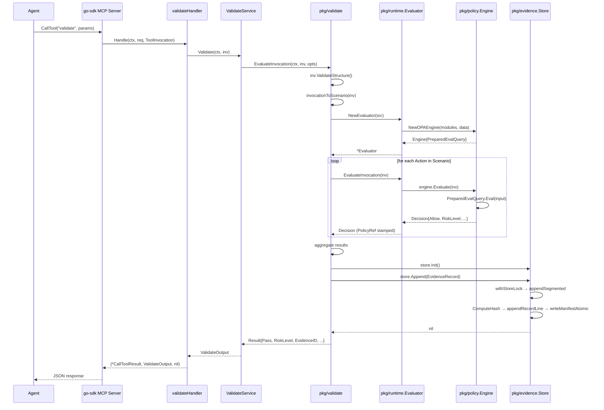

# MCP Tool Design: validate

**Document status:** Implementation-ready
**Date:** 2026-02-25
**Module:** `samebits.com/evidra`
**Go version:** 1.22+

---

## 1. Purpose

The `validate` MCP tool is Evidra's pre-execution policy gate for AI agent workflows. It answers the question "may I do this?" before an agent issues a destructive or privileged operation, and it records tamper-evident proof that the question was asked and answered.

### Why it exists at the MCP layer

AI agents that call external tools (Terraform, kubectl, shell commands) operate through MCP-aware orchestrators. Those orchestrators can be configured to call `validate` before forwarding any tool invocation to its target. By sitting at the MCP boundary, Evidra intercepts the invocation metadata without the agent needing to understand policy internals. The agent supplies a structured description of what it is about to do (`actor`, `tool`, `operation`, `params`, `context`); Evidra returns a structured verdict.

This placement means:

1. Policy is enforced regardless of which agent framework is in use.
2. Every invocation produces a signed, hash-linked audit record before execution occurs.
3. The agent's orchestrator can block execution when `ok: false` in enforce mode without modifying any agent code.

### When agents call it

An agent (or the orchestrator on its behalf) calls `validate` immediately before executing any operation that:
- Modifies infrastructure state (Terraform apply, kubectl apply/delete)
- Accesses sensitive namespaces or resources
- Operates under breakglass or elevated-risk tags
- Requires a documented audit trail for compliance

The tool is also appropriate as a dry-run check: agents may call it with `risk_tags` to probe policy without intending to execute, surfacing hints for remediation.

---

## 2. Functional Specification

### 2.1 Inputs

The tool receives a `ToolInvocation` (decoded from the MCP `params` map by the `go-sdk` framework):

| Field | Type | Required | Description |
|---|---|---|---|
| `actor.type` | string | yes | `human`, `agent`, or `system` |
| `actor.id` | string | yes | Opaque actor identifier |
| `actor.origin` | string | yes | Invocation channel: `mcp`, `cli`, `api` |
| `tool` | string | yes | Tool namespace (e.g. `terraform`, `kubectl`) |
| `operation` | string | yes | Operation within the tool (e.g. `apply`, `delete`) |
| `params` | object | yes | Allowed keys: `target`, `payload`, `risk_tags`, `scenario_id` |
| `context` | object | no | Allowed keys: `source`, `intent`, `scenario_id` |
| `environment` | string | no | Environment label override (overridden by `Options.Environment`) |

Strict key allowlists are enforced by `ToolInvocation.ValidateStructure()`. Any unknown key in `params` or `context` causes an `invalid_input` error before policy evaluation begins.

### 2.2 Outputs

The tool returns a `ValidateOutput` struct serialised as the JSON structured output (second return value of the `Handle` method):

| Field | Type | Always present | Description |
|---|---|---|---|
| `ok` | bool | yes | Agent-actionable gate: `true` means proceed, `false` means blocked |
| `event_id` | string | when evidence written | Stable identifier for the recorded evidence event |
| `policy.allow` | bool | yes | Raw policy verdict; differs from `ok` in observe mode |
| `policy.risk_level` | string | yes | `low`, `medium`, `high` |
| `policy.reason` | string | yes | First reason string, or `"scenario_validated"` |
| `policy.policy_ref` | string | when non-empty | Bundle revision or file hash stamped by the evaluator |
| `rule_ids` | []string | omitempty | Sorted, deduped canonical rule IDs that fired (`deny` and `warn`) |
| `hints` | []string | omitempty | Policy-supplied remediation hints |
| `reasons` | []string | omitempty | All policy reasons, sorted and deduped |
| `resources` | []ResourceLink | omitempty | MCP resource links for the evidence event |
| `error` | *ErrorSummary | on error only | Structured error; `null` on success |

The `go-sdk` framework serialises `ValidateOutput` as the tool's structured result. The `*mcp.CallToolResult` first return value carries `Resources` content items (resource links) for MCP clients that consume them separately.

### 2.3 Side effects

Every successful call to `validate` appends one `EvidenceRecord` to the append-only JSONL evidence store at `opts.EvidencePath`. Each record is hash-linked to the previous record using SHA-256. The record is **always written regardless of the policy verdict** — both allow and deny decisions are recorded.

Side effects are skipped only when `Options.SkipEvidence == true`, which is not exposed through the MCP layer.

### 2.4 Determinism and idempotency

`validate` is **not idempotent**. Identical inputs submitted twice produce two distinct evidence records with different `event_id` values, different `timestamp` values, and different hash chain positions. The tool is annotated with `IdempotentHint: true` and `ReadOnlyHint: true` in the MCP schema as a hint to client caching behaviour, but callers must not rely on these hints for deduplication.

Policy evaluation over the same input **is** deterministic: given the same bundle revision, environment, and invocation, `data.evidra.policy.decision` returns the same verdict. The non-determinism is confined to `event_id` generation (`evt-{UnixNano}`) and `timestamp`.

### 2.5 Enforce vs observe mode

Mode is set at server startup in `Options.Mode` and is not overridable per-call.

| | Enforce (default) | Observe |
|---|---|---|
| `policy.allow` | reflects OPA verdict | reflects OPA verdict |
| `ok` | equals `policy.allow` | always `true` |
| Evidence written | yes | yes |
| Agent blocked | when `ok == false` | never |

In observe mode the policy is fully evaluated, all rule hits and hints are computed, and a complete evidence record is written. The only difference is that `ok` is forced to `true` so the orchestrator does not block execution. This allows a new policy bundle to be staged and observed against real traffic before switching to enforce.

---

## 3. MCP Contract

### 3.1 JSON Request Schema

The `go-sdk` `mcp.AddTool` call registers the following `InputSchema`. The framework JSON-decodes the MCP params map directly into `invocation.ToolInvocation`.

```json
{
  "type": "object",
  "required": ["actor", "tool", "operation", "params", "context"],
  "properties": {
    "actor": {
      "type": "object",
      "required": ["type", "id", "origin"],
      "properties": {
        "type":   { "type": "string", "description": "Actor category: human|agent|system" },
        "id":     { "type": "string", "description": "Opaque actor identifier" },
        "origin": { "type": "string", "description": "Invocation source: mcp|cli|api" }
      }
    },
    "tool":      { "type": "string", "description": "Tool namespace, e.g. terraform" },
    "operation": { "type": "string", "description": "Operation name, e.g. apply" },
    "params": {
      "type": "object",
      "description": "Operation parameters. Allowed keys: target, payload, risk_tags, scenario_id",
      "properties": {
        "target":      { "type": "object" },
        "payload":     { "type": "object" },
        "risk_tags":   { "type": "array", "items": { "type": "string" } },
        "scenario_id": { "type": "string" }
      },
      "additionalProperties": false
    },
    "context": {
      "type": "object",
      "description": "Allowed keys: source, intent, scenario_id",
      "properties": {
        "source":      { "type": "string" },
        "intent":      { "type": "string" },
        "scenario_id": { "type": "string" }
      },
      "additionalProperties": false
    }
  }
}
```

Note: `additionalProperties: false` is enforced by `ValidateStructure()` at runtime, not by JSON Schema validation in the framework.

### 3.2 JSON Response Schema

The structured output field of `CallToolResult`:

```json
{
  "type": "object",
  "required": ["ok", "policy"],
  "properties": {
    "ok":       { "type": "boolean" },
    "event_id": { "type": "string" },
    "policy": {
      "type": "object",
      "required": ["allow", "risk_level", "reason"],
      "properties": {
        "allow":      { "type": "boolean" },
        "risk_level": { "type": "string", "enum": ["low", "medium", "high"] },
        "reason":     { "type": "string" },
        "policy_ref": { "type": "string" }
      }
    },
    "rule_ids":  { "type": "array", "items": { "type": "string" } },
    "hints":     { "type": "array", "items": { "type": "string" } },
    "reasons":   { "type": "array", "items": { "type": "string" } },
    "resources": {
      "type": "array",
      "items": {
        "type": "object",
        "properties": {
          "URI":      { "type": "string" },
          "Name":     { "type": "string" },
          "MIMEType": { "type": "string" }
        }
      }
    },
    "error": {
      "type": ["object", "null"],
      "properties": {
        "code":       { "type": "string" },
        "message":    { "type": "string" },
        "risk_level": { "type": "string" },
        "reason":     { "type": "string" }
      }
    }
  }
}
```

### 3.3 Error Codes

Defined in `pkg/mcpserver/server.go`:

| Code | Constant | Triggering condition | Evidence recorded |
|---|---|---|---|
| `invalid_input` | `ErrCodeInvalidInput` | `ValidateStructure()` fails; missing required field | No |
| `policy_failure` | `ErrCodePolicyFailure` | OPA engine error; bundle load failure; invalid decision shape | No |
| `evidence_write_failed` | `ErrCodeEvidenceWrite` | Evidence store locked, disk full, or path unresolvable | No (write failed) |
| `evidence_chain_invalid` | `ErrCodeChainInvalid` | `get_event` only: chain hash validation failed during lookup | N/A |
| `not_found` | `ErrCodeNotFound` | `get_event` only: event_id not present in store | N/A |
| `internal_error` | `ErrCodeInternalError` | Any unclassified error | No |

When an error occurs, the response shape is:

```json
{
  "ok": false,
  "policy": {
    "allow": false,
    "risk_level": "high",
    "reason": "<error_code>",
    "policy_ref": "<configured_policy_ref_or_empty>"
  },
  "error": {
    "code": "<error_code>",
    "message": "<safe_message>"
  }
}
```

Internal Go error messages are never forwarded to callers except for `invalid_input`, where `err.Error()` is safe because it contains only field-name validation strings.

### 3.4 Concrete JSON Examples

#### Passing case — allow, low risk

Request:
```json
{
  "actor": { "type": "agent", "id": "claude-agent-01", "origin": "mcp" },
  "tool": "terraform",
  "operation": "plan",
  "params": {
    "target": { "workspace": "prod" },
    "payload": { "resource_count": 3, "destroy_count": 0 },
    "risk_tags": []
  },
  "context": { "intent": "pre-flight plan check" }
}
```

Response:
```json
{
  "ok": true,
  "event_id": "evt-1740480000123456789",
  "policy": {
    "allow": true,
    "risk_level": "low",
    "reason": "scenario_validated",
    "policy_ref": "ops-v0.1-rev-20260225"
  },
  "rule_ids": [],
  "hints": [],
  "reasons": [],
  "resources": [
    { "URI": "evidra://event/evt-1740480000123456789", "Name": "Evidence record", "MIMEType": "application/json" },
    { "URI": "evidra://evidence/manifest", "Name": "Evidence manifest", "MIMEType": "application/json" },
    { "URI": "evidra://evidence/segments", "Name": "Evidence segments", "MIMEType": "application/json" }
  ],
  "error": null
}
```

#### Failing case — deny, high risk, mass delete

Request:
```json
{
  "actor": { "type": "agent", "id": "claude-agent-01", "origin": "mcp" },
  "tool": "terraform",
  "operation": "apply",
  "params": {
    "target": { "workspace": "prod" },
    "payload": { "resource_count": 50, "destroy_count": 48 },
    "risk_tags": ["mass-change"]
  },
  "context": {}
}
```

Response:
```json
{
  "ok": false,
  "event_id": "evt-1740480001987654321",
  "policy": {
    "allow": false,
    "risk_level": "high",
    "reason": "ops.mass_delete: destroy_count exceeds threshold",
    "policy_ref": "ops-v0.1-rev-20260225"
  },
  "rule_ids": ["ops.mass_delete"],
  "hints": ["Request human approval before proceeding with mass destroy operations."],
  "reasons": ["ops.mass_delete: destroy_count exceeds threshold"],
  "resources": [
    { "URI": "evidra://event/evt-1740480001987654321", "Name": "Evidence record", "MIMEType": "application/json" }
  ],
  "error": null
}
```

Note: `ok: false` but `error: null`. A policy denial is not an error; it is the normal policy gate path. The `error` field is non-null only for infrastructure failures.

#### Invalid input error case

Request:
```json
{
  "actor": { "type": "agent", "id": "claude-agent-01", "origin": "mcp" },
  "tool": "terraform",
  "operation": "apply",
  "params": { "unknown_key": "value" },
  "context": {}
}
```

Response:
```json
{
  "ok": false,
  "policy": {
    "allow": false,
    "risk_level": "high",
    "reason": "invalid_input",
    "policy_ref": ""
  },
  "error": {
    "code": "invalid_input",
    "message": "invalid_input: unknown params key: \"unknown_key\""
  }
}
```

---

## 4. Internal Architecture

### 4.1 Packages involved

```
cmd/evidra-mcp
  └── pkg/mcpserver      ValidateService, validateHandler, error mapping
        └── pkg/validate  EvaluateInvocation, EvaluateScenario, Options, Result
              ├── pkg/invocation    ToolInvocation schema + ValidateStructure
              ├── pkg/scenario      Scenario schema (invocationToScenario mapping)
              ├── pkg/runtime       Evaluator, PolicySource interface
              │     ├── pkg/policy  OPA Engine, Decision struct
              │     └── pkg/bundlesource / pkg/policysource  (PolicySource impls)
              ├── pkg/config        path resolution (bundle, evidence)
              └── pkg/evidence      Store, EvidenceRecord, hash chain
```

### 4.2 Call flow

```
MCP client
  → go-sdk transport (stdio or HTTP/SSE)
  → mcp.Server dispatches to validateHandler.Handle
  → ValidateService.Validate(ctx, ToolInvocation)
      1. validate.EvaluateInvocation(ctx, inv, opts)
          a. inv.ValidateStructure()                 [pkg/invocation]
          b. invocationToScenario(inv)               [pkg/validate]
          c. EvaluateScenario(ctx, sc, opts)
              i.  resolveBundlePath → bundlesource.NewBundleSource  [pkg/bundlesource]
                  or config.ResolvePolicyData → policysource.NewLocalFileSource [pkg/policysource]
              ii. runtime.NewEvaluator(src)
                  - src.LoadPolicy() → map[name][]byte
                  - src.LoadData()   → []byte
                  - policy.NewOPAEngine(modules, data) → PreparedEvalQuery
                  - src.PolicyRef()
              iii. evaluateScenarioWithRuntime(ctx, evaluator, sc, env)
                  - for each action: evaluator.EvaluateInvocation(inv)
                    - engine.Evaluate(inv) → rego.PreparedEvalQuery.Eval()
                    - stamps PolicyRef/BundleRevision/ProfileName onto Decision
                  - aggregate: pass/fail, risk_level, reasons, rule_ids, hints
              iv. sortedDedupeStrings on reasons, rule_ids, hints
              v.  config.ResolveEvidencePath → evidence.NewStoreWithPath
              vi. store.Init()
              vii. build EvidenceRecord{EventID: "evt-{UnixNano}", ...}
              viii. store.Append(rec) → withStoreLock → appendSegmented
                    - ComputeHash(rec) → SHA-256 of canonical fields
                    - appendRecordLine(segPath, rec)
                    - writeManifestAtomic(root, manifest)
              ix. return Result{Pass, RiskLevel, EvidenceID, Reasons, RuleIDs, Hints}
      2. map Result → ValidateOutput
          - ok = res.Pass (or true if ModeObserve)
          - policy.PolicyRef stamped from s.policyRef (server-level override)
          - resourceLinks(res.EvidenceID)
  → (*mcp.CallToolResult, ValidateOutput, nil)
  → go-sdk serialises ValidateOutput as structured tool result JSON
```

### 4.3 Sequence diagram



### 4.4 How OPA is invoked

`policy.NewOPAEngine` calls `rego.New(...).PrepareForEval(context.Background())` at evaluator construction time. This compiles all modules and stores the result in a `rego.PreparedEvalQuery`. Per-invocation calls use `PreparedEvalQuery.Eval(ctx, rego.EvalInput(input))` which skips recompilation.

**Critical:** `NewEvaluator` is called once per `EvaluateScenario` invocation, not once at server startup. This means OPA compilation happens on every MCP call. See Section 9 (Performance Considerations) for the implication.

The OPA input document shape is:
```json
{
  "actor": { "type": "...", "id": "...", "origin": "..." },
  "tool": "...",
  "operation": "...",
  "params": { "action": { "kind": "...", "target": {}, "intent": "...", "payload": {}, "risk_tags": [] } },
  "context": { "timestamp": "...", "source": "..." },
  "environment": "...",
  "actions": [{ "kind": "...", "target": {}, ... }]
}
```

The query is `data.evidra.policy.decision`. The decision must return `{ allow, risk_level, reason, reasons, hits, hints }`. Any missing or invalid field causes an error before `Decision` is populated.

### 4.5 Evidence write path

```
store.Append(rec)
  └── s.mu.Lock()                          (Store.mu — in-process mutex)
  └── appendAtPath(path, rec)
        └── withStoreLock(path, fn)        (evlock file lock — cross-process)
              └── appendAtPathUnlocked(path, rec)
                    └── detectStoreMode(path) → "segmented"
                    └── appendSegmented(root, rec)
                          1. loadOrInitManifest(root, maxBytes, createIfMissing=true)
                          2. rec.PreviousHash = manifest.LastHash
                          3. ComputeHash(rec) → SHA-256(canonical fields JSON)
                          4. rec.Hash = hash
                          5. appendRecordLine(segPath, rec)   (JSONL append)
                          6. update manifest counters
                          7. if segPath.Size > segmentMaxBytes: rotate segment
                          8. writeManifestAtomic(root, manifest)
```

Hash input is `canonicalEvidenceRecord` (excludes `Hash` field from the SHA-256 input to avoid circularity). The `PreviousHash` field links each record to its predecessor, forming the chain.

---

## 5. Data Structures (Go)

### 5.1 Existing structs (exact field names)

**`invocation.ToolInvocation`** (`pkg/invocation/invocation.go`):
```go
type ToolInvocation struct {
    Actor       Actor                  `json:"actor"`
    Tool        string                 `json:"tool"`
    Operation   string                 `json:"operation"`
    Params      map[string]interface{} `json:"params"`
    Context     map[string]interface{} `json:"context"`
    Environment string                 `json:"environment,omitempty"`
}

type Actor struct {
    Type   string `json:"type"`
    ID     string `json:"id"`
    Origin string `json:"origin"`
}
```

Param key constants: `KeyTarget = "target"`, `KeyPayload = "payload"`, `KeyRiskTags = "risk_tags"`, `KeyScenarioID = "scenario_id"`, `KeySource = "source"`, `KeyIntent = "intent"`.

Allowed `Params` keys: `{target, payload, risk_tags, scenario_id}`.
Allowed `Context` keys: `{source, intent, scenario_id}`.

**`validate.Options`** (`pkg/validate/validate.go`):
```go
type Options struct {
    PolicyPath   string
    DataPath     string
    BundlePath   string
    Environment  string
    EvidenceDir  string
    SkipEvidence bool
}
```

**`validate.Result`** (`pkg/validate/validate.go`):
```go
type Result struct {
    Pass       bool
    RiskLevel  string
    EvidenceID string
    Reasons    []string
    RuleIDs    []string
    Hints      []string
}
```

**`mcpserver.ValidateOutput`** (`pkg/mcpserver/server.go`):
```go
type ValidateOutput struct {
    OK        bool                    `json:"ok"`
    EventID   string                  `json:"event_id,omitempty"`
    Policy    PolicySummary           `json:"policy"`
    RuleIDs   []string                `json:"rule_ids,omitempty"`
    Hints     []string                `json:"hints,omitempty"`
    Reasons   []string                `json:"reasons,omitempty"`
    Resources []evidence.ResourceLink `json:"resources,omitempty"`
    Error     *ErrorSummary           `json:"error,omitempty"`
}
```

**`mcpserver.PolicySummary`** (`pkg/mcpserver/server.go`):
```go
type PolicySummary struct {
    Allow     bool   `json:"allow"`
    RiskLevel string `json:"risk_level"`
    Reason    string `json:"reason"`
    PolicyRef string `json:"policy_ref,omitempty"`
}
```

**`mcpserver.ErrorSummary`** (`pkg/mcpserver/server.go`):
```go
type ErrorSummary struct {
    Code      string `json:"code"`
    Message   string `json:"message"`
    RiskLevel string `json:"risk_level,omitempty"`
    Reason    string `json:"reason,omitempty"`
}
```

**`evidence.EvidenceRecord`** / `evidence.Record` (`pkg/evidence/types.go`):
```go
type EvidenceRecord struct {
    EventID          string                 `json:"event_id"`
    Timestamp        time.Time              `json:"timestamp"`
    PolicyRef        string                 `json:"policy_ref"`
    BundleRevision   string                 `json:"bundle_revision,omitempty"`
    ProfileName      string                 `json:"profile_name,omitempty"`
    EnvironmentLabel string                 `json:"environment_label,omitempty"`
    InputHash        string                 `json:"input_hash,omitempty"`
    Actor            invocation.Actor       `json:"actor"`
    Tool             string                 `json:"tool"`
    Operation        string                 `json:"operation"`
    Params           map[string]interface{} `json:"params"`
    PolicyDecision   PolicyDecision         `json:"policy_decision"`
    ExecutionResult  ExecutionResult        `json:"execution_result"`
    PreviousHash     string                 `json:"previous_hash"`
    Hash             string                 `json:"hash"`
}

type PolicyDecision struct {
    Allow     bool     `json:"allow"`
    RiskLevel string   `json:"risk_level"`
    Reason    string   `json:"reason"`
    Reasons   []string `json:"reasons,omitempty"`
    Hints     []string `json:"hints,omitempty"`
    RuleIDs   []string `json:"rule_ids,omitempty"`
    Advisory  bool     `json:"advisory"`
}

type ExecutionResult struct {
    Status          string `json:"status"`
    ExitCode        *int   `json:"exit_code"`
    Stdout          string `json:"stdout,omitempty"`
    Stderr          string `json:"stderr,omitempty"`
    StdoutTruncated bool   `json:"stdout_truncated,omitempty"`
    StderrTruncated bool   `json:"stderr_truncated,omitempty"`
}
```

`Record` is a type alias for `EvidenceRecord` (`type Record = EvidenceRecord`).

**`evidence.Store`** (`pkg/evidence/store.go`):
```go
type Store struct {
    path string
    mu   sync.Mutex
}
```

**`policy.Decision`** (`pkg/policy/policy.go`):
```go
type Decision struct {
    Allow          bool     `json:"allow"`
    RiskLevel      string   `json:"risk_level"`
    Reason         string   `json:"reason"`
    PolicyRef      string   `json:"policy_ref,omitempty"`
    BundleRevision string   `json:"bundle_revision,omitempty"`
    ProfileName    string   `json:"profile_name,omitempty"`
    Reasons        []string `json:"reasons,omitempty"`
    Hints          []string `json:"hints,omitempty"`
    Hits           []string `json:"hits,omitempty"`
}
```

**`runtime.PolicySource`** interface (`pkg/runtime/runtime.go`):
```go
type PolicySource interface {
    LoadPolicy() (map[string][]byte, error)
    LoadData() ([]byte, error)
    PolicyRef() (string, error)
    BundleRevision() string
    ProfileName() string
}
```

**`scenario.Scenario`** and related (`pkg/scenario/schema.go`):
```go
type Scenario struct {
    ScenarioID string    `json:"scenario_id"`
    Actor      Actor     `json:"actor"`
    Source     string    `json:"source"`
    Timestamp  time.Time `json:"timestamp"`
    Actions    []Action  `json:"actions"`
}

type Actor struct {
    Type   string `json:"type"`
    ID     string `json:"id,omitempty"`
    Origin string `json:"origin,omitempty"`
}

type Action struct {
    Kind     string                 `json:"kind"`
    Target   map[string]interface{} `json:"target"`
    Intent   string                 `json:"intent"`
    Payload  map[string]interface{} `json:"payload"`
    RiskTags []string               `json:"risk_tags"`
}
```

### 5.2 Changes needed

No structural changes to existing types are required for the current specification. The following additions would improve observability (see Section 8) but are not blocking for initial implementation:

- Add `RequestID string` to `ValidateOutput` (correlates slog/OTEL spans to the response)
- Add `DurationMs int64` to `ValidateOutput` for client-side latency tracking

These fields should be added with `json:",omitempty"` to maintain backward compatibility.

---

## 6. Concurrency and Safety Model

### 6.1 ValidateService thread safety

`ValidateService` contains no mutable state after construction. All fields (`policyPath`, `bundlePath`, `mode`, etc.) are read-only strings set once in `newValidateService`. The `go-sdk` server dispatches concurrent tool calls to the same `validateHandler` instance, which calls `s.service.Validate(ctx, inv)`. Since `ValidateService.Validate` does not mutate the struct, concurrent calls are safe without any additional synchronisation.

### 6.2 Evidence store contention under concurrent agent calls

Two distinct locking layers protect the evidence store:

**Layer 1 — In-process mutex (`Store.mu sync.Mutex`)**

`Store.Append` acquires `s.mu` before calling `appendAtPath`. This serialises concurrent goroutines within the same process. However, `EvaluateScenario` creates a **new `Store` instance per call** (`evidence.NewStoreWithPath(evidenceDir)`). Each instance has its own independent `Store.mu`, so the in-process mutex provides no cross-call serialisation. Protection at this layer is therefore only effective if a single `Store` instance is shared across calls.

**Implication:** The in-process mutex on `Store` is currently ineffective for the MCP server use case because `EvaluateScenario` creates a new store per call. Concurrent MCP calls from multiple agents will create separate `Store` instances and proceed past `Store.mu` independently.

**Layer 2 — File lock (`evlock`, `pkg/evlock`)**

`withStoreLock` acquires a filesystem-level advisory lock (`.evidra.lock`) in the evidence directory before any read or write operation. Default timeout is 2000ms (`EVIDRA_EVIDENCE_LOCK_TIMEOUT_MS`). This serialises all writers across processes and goroutines that reach this layer.

Under concurrent MCP calls, the effective contention point is the `evlock` file lock. With N concurrent agents calling `validate` simultaneously, N-1 calls will block at `evlock.Acquire` for up to 2000ms. If the lock is not released within the timeout, the call fails with `evidence_store_busy` (`ErrorCodeStoreBusy`).

**Recommended fix:** Lift the `evidence.Store` instance to `ValidateService` scope (create once, share across calls). This restores the in-process mutex as a fast path, reducing file lock contention. This requires `store.Init()` to be called once at server startup rather than per call.

```go
// Proposed: store is created once in newValidateService and reused
type ValidateService struct {
    // ... existing fields ...
    store *evidence.Store  // created once, shared across calls
}
```

### 6.3 Race conditions

The following race conditions exist in the current implementation:

1. **`event_id` collision:** `EventID` is `fmt.Sprintf("evt-%d", time.Now().UTC().UnixNano())`. Sub-nanosecond resolution is not guaranteed on all platforms. Under Go's goroutine scheduler on a multi-core machine, two concurrent calls may generate the same nanosecond timestamp, producing the same `event_id`. The file lock serialises actual writes, so the JSONL file will not be corrupted, but two records may share an `event_id`. Fix: use `sync/atomic` counter or UUID generation.

2. **New `Store` per call:** As described above, `Store.mu` provides no protection across concurrent calls. This is not a correctness bug (the file lock catches it) but is a performance issue.

3. **`repoPolicyFallbackOnce` in `config.ResolvePolicyData`:** This `sync.Once` prints a warning to stderr. It is safe for concurrent use.

Running `go test -race ./...` will surface item 1 if two goroutines in a test call `EvaluateScenario` concurrently with the same nanosecond timestamp.

---

## 7. Security Model

### 7.1 Input validation (`ToolInvocation.ValidateStructure`)

`ValidateStructure` enforces:
- Required fields: `actor.type`, `actor.id`, `actor.origin`, `tool`, `operation`, `params` (non-nil)
- Type constraints: `params["target"]` and `params["payload"]` must be `map[string]interface{}` or absent
- `params["risk_tags"]` must be `[]string` or `[]interface{}` of strings
- Strict allowlists: any key in `params` not in `{target, payload, risk_tags, scenario_id}` returns an error; same for `context` vs `{source, intent, scenario_id}`

There is no length limit enforced on string fields, map keys, or array lengths. A malicious agent could supply a `payload` object with thousands of deeply nested keys. This is a DoS vector (see 7.4).

### 7.2 Injection risks

**OPA injection:** OPA evaluation receives the `ToolInvocation` fields as native Go maps via `rego.EvalInput`. The OPA engine does not parse these as Rego or JSON paths; they are opaque data. OPA injection through input data is not possible.

**Evidence store injection:** Records are serialised via `json.Marshal` and appended as JSONL lines. JSON marshalling escapes all special characters. An attacker cannot inject extra JSONL records by crafting `actor.id` or `payload` values with embedded newlines because `json.Marshal` produces a single-line compact object (newlines within string values are escaped as `\n`).

**Filesystem path injection:** The evidence path is resolved from trusted server configuration (`Options.EvidencePath`, env vars, or default home path). Agent input does not influence the evidence path. The `scenario_id` from agent input is stored as a JSON value, not used as a filesystem path.

**PolicyRef exposure:** `ValidateOutput.Policy.PolicyRef` is stamped from the server-configured `s.policyRef` string, not from agent input. It is safe to expose.

### 7.3 Data exposure

Error messages surfaced to agents are intentionally minimal:
- `policy_failure`: message is always `"policy evaluation failed"` regardless of the underlying OPA error
- `evidence_write_failed`: message is always `"evidence write failed"`
- `internal_error`: message is always `"internal error"`
- `invalid_input`: message is `err.Error()` from `ValidateStructure`, which contains only field names (e.g. `"unknown params key: \"foo\""`)

Policy decision details (`rule_ids`, `hints`, `reasons`) are returned in the success path. These may reveal internal policy logic. This is intentional: agents need hints to self-correct.

`EventID` values (`evt-{UnixNano}`) reveal server-side timestamps to callers, allowing approximate inference of call volume from event ID gaps. If this is a concern, EventIDs should be replaced with UUIDs.

### 7.4 DoS vectors

| Vector | Current mitigation | Gap |
|---|---|---|
| Huge `payload` object | None | None; unbounded JSON size. Add `maxInputBytes` check before `ValidateStructure` |
| Deep nested `payload` | None | OPA input document depth is unbounded |
| Many concurrent calls | File lock with 2s timeout returns `evidence_store_busy` | In-process: no concurrency limit per caller |
| Very long `scenario_id` string | Stored in JSONL; no length limit | Segment file growth |
| OPA timeout | `context.Background()` passed to `PreparedEvalQuery.Eval` | No per-call OPA timeout; a runaway Rego rule can block indefinitely |

The OPA timeout gap is the most critical. `evaluateScenarioWithRuntime` and `engine.Evaluate` both call `e.query.Eval(context.Background(), ...)` instead of propagating the MCP request `ctx`. Passing `ctx` to `Eval` would allow the MCP server's request deadline to cancel OPA evaluation.

### 7.5 Auth requirements for HTTP transport

The `go-sdk` HTTP transport (Streamable HTTP / SSE) does not enforce authentication by default. The `NewServer` function does not attach any auth middleware. For production HTTP deployments:

1. Wrap the HTTP handler with an authentication middleware (bearer token, mTLS, or API key) before handing off to the go-sdk handler.
2. The `Options` struct has no auth fields; auth must be applied at the transport layer outside `NewServer`.
3. Evidence records do not record transport-layer authentication details; if auth identity differs from `actor.id`, the evidence record will not reflect transport auth.

Stdio transport (default) is process-level isolated and requires no additional auth.

---

## 8. Observability

### 8.1 slog fields per request

The current codebase has no slog instrumentation in the `validate` path. The following fields should be logged at the start and end of each `ValidateService.Validate` call:

```go
// On entry to ValidateService.Validate:
slog.InfoContext(ctx, "validate.start",
    "actor_type",   inv.Actor.Type,
    "actor_id",     inv.Actor.ID,
    "actor_origin", inv.Actor.Origin,
    "tool",         inv.Tool,
    "operation",    inv.Operation,
    "mode",         string(s.mode),
)

// On successful return:
slog.InfoContext(ctx, "validate.complete",
    "event_id",   output.EventID,
    "ok",         output.OK,
    "allow",      output.Policy.Allow,
    "risk_level", output.Policy.RiskLevel,
    "rule_count", len(output.RuleIDs),
    "duration_ms", durationMs,
)

// On error return:
slog.WarnContext(ctx, "validate.error",
    "error_code", output.Error.Code,
    "error_msg",  output.Error.Message,
    "duration_ms", durationMs,
)
```

Never log `params["payload"]` or `context["intent"]` at INFO level; they may contain sensitive operation data. Log them at DEBUG only, behind a debug flag.

### 8.2 Prometheus metrics

The following metrics should be registered in a `metrics` package or within `pkg/mcpserver`:

```
# Counter: total validate tool invocations by outcome
evidra_validate_total{result="allow|deny|error", risk_level="low|medium|high", mode="enforce|observe"} counter

# Histogram: end-to-end latency of ValidateService.Validate
evidra_validate_duration_seconds{result="allow|deny|error"} histogram
  buckets: [0.005, 0.01, 0.025, 0.05, 0.1, 0.25, 0.5, 1.0, 2.5, 5.0]

# Histogram: OPA evaluation time only (evaluateScenarioWithRuntime)
evidra_opa_eval_duration_seconds histogram
  buckets: [0.001, 0.005, 0.01, 0.025, 0.05, 0.1, 0.25]

# Counter: OPA compilation (NewEvaluator) calls
evidra_opa_compile_total{result="ok|error"} counter

# Histogram: evidence write latency (store.Append including lock wait)
evidra_evidence_write_duration_seconds histogram
  buckets: [0.001, 0.005, 0.01, 0.025, 0.05, 0.1, 0.5]

# Counter: evidence write errors by code
evidra_evidence_write_errors_total{code="evidence_store_busy|evidence_write_failed|internal_error"} counter
```

### 8.3 OpenTelemetry span attributes

Each `ValidateService.Validate` call should create a span named `evidra.validate`:

```
evidra.actor.type     = inv.Actor.Type
evidra.actor.origin   = inv.Actor.Origin
evidra.tool           = inv.Tool
evidra.operation      = inv.Operation
evidra.mode           = string(s.mode)
evidra.event_id       = res.EvidenceID           (set after evidence write)
evidra.policy.allow   = res.Pass
evidra.risk_level     = res.RiskLevel
evidra.rule_count     = len(res.RuleIDs)
evidra.error.code     = output.Error.Code        (only on error)
```

Child spans:
- `evidra.opa.compile` (spanning `runtime.NewEvaluator`)
- `evidra.opa.eval` (spanning `evaluateScenarioWithRuntime`)
- `evidra.evidence.write` (spanning `store.Append`)

### 8.4 Event ID correlation

The `event_id` field in `ValidateOutput` is the primary correlation key. Agents can pass it to `get_event` to retrieve the full evidence record. Log lines and OTEL spans should carry `event_id` as a structured attribute so that:

1. A specific validate call can be located by searching logs for `event_id=evt-XXXXXXXXX`
2. The evidence record can be retrieved directly for audit
3. MCP resource links (`evidra://event/{event_id}`) are resolvable through the `get_event` tool or `readResourceEvent` resource handler

---

## 9. Performance Considerations

### 9.1 OPA compilation cost

`runtime.NewEvaluator` calls `rego.New(...).PrepareForEval(context.Background())` on every call to `EvaluateScenario`. This compiles all Rego modules, parses data JSON, and prepares the OPA IR. For the `ops-v0.1` bundle with approximately 10 Rego files and a moderate `data.json`, this takes approximately **20–80ms** on a typical development machine (varies with bundle size and CPU).

This is the single largest latency contributor per call, dwarfing both OPA evaluation time (sub-millisecond for most rules) and evidence write time (1–5ms).

**Recommended fix:** Cache the `*runtime.Evaluator` in `ValidateService`. The evaluator is stateless after construction; it can be shared across concurrent calls safely because `PreparedEvalQuery.Eval` is documented as concurrency-safe in the OPA SDK. Cache invalidation: rebuild the evaluator when the bundle path changes (detected by comparing `BundleRevision()`).

```go
type ValidateService struct {
    // ... existing fields ...
    evalMu    sync.RWMutex
    evaluator *runtime.Evaluator
    evalRef   string  // last known bundle revision
}

func (s *ValidateService) getEvaluator() (*runtime.Evaluator, error) {
    s.evalMu.RLock()
    if s.evaluator != nil {
        e := s.evaluator
        s.evalMu.RUnlock()
        return e, nil
    }
    s.evalMu.RUnlock()

    s.evalMu.Lock()
    defer s.evalMu.Unlock()
    // double-check
    if s.evaluator != nil {
        return s.evaluator, nil
    }
    // build evaluator from source
    // ...
    s.evaluator = eval
    return eval, nil
}
```

### 9.2 Evidence store lock contention

`withStoreLock` uses a filesystem advisory lock with a 2000ms timeout. Under sequential calls this adds approximately 0.1–2ms per call. Under concurrent calls, later callers wait up to 2000ms for earlier callers to complete the write and release the lock. With P99 evidence write time of ~5ms and default timeout of 2000ms, the store can sustain approximately 400 writes/second before callers start timing out.

For higher throughput, the timeout can be raised with `EVIDRA_EVIDENCE_LOCK_TIMEOUT_MS`. A batch-write or async-write path would require significant changes to the evidence store and is out of scope for v0.1.

### 9.3 Expected latency targets

With the evaluator cache fix applied:

| Operation | p50 | p99 | Notes |
|---|---|---|---|
| `ValidateStructure` | < 0.1ms | < 0.1ms | In-memory |
| `invocationToScenario` | < 0.1ms | < 0.1ms | In-memory |
| OPA eval (cached evaluator) | 0.5ms | 5ms | Single action, ops-v0.1 |
| Evidence write (uncontended) | 1ms | 5ms | Includes file lock |
| Evidence write (contended, 4 concurrent) | 5ms | 20ms | Lock wait |
| End-to-end (cached, uncontended) | 2ms | 10ms | |

Without the evaluator cache:

| Operation | p50 | p99 |
|---|---|---|
| OPA compile (`NewEvaluator`) | 30ms | 100ms |
| End-to-end | 35ms | 110ms |

Target: p99 < 100ms for the MCP tool response (cached evaluator, uncontended evidence store).

---

## 10. Failure Modes

| Failure | How surfaced to agent | Evidence recorded | Partial response |
|---|---|---|---|
| **Invalid input** (`ValidateStructure` fails) | `ok: false`, `error.code: "invalid_input"`, `error.message: err.Error()` | No | No |
| **Bundle load failure** (missing `.manifest`, bad revision) | `ok: false`, `error.code: "policy_failure"`, `error.message: "policy evaluation failed"` | No | No |
| **OPA compile error** (`PrepareForEval` fails) | `ok: false`, `error.code: "policy_failure"`, `error.message: "policy evaluation failed"` | No | No |
| **OPA evaluation error** (`Eval` returns error) | `ok: false`, `error.code: "policy_failure"`, `error.message: "policy evaluation failed"` | No | No |
| **OPA decision invalid** (missing `allow`, invalid `risk_level`) | `ok: false`, `error.code: "policy_failure"`, `error.message: "policy evaluation failed"` | No | No |
| **Evidence path unresolvable** (`config.ResolveEvidencePath` fails) | `ok: false`, `error.code: "evidence_write_failed"`, `error.message: "evidence write failed"` | No | No |
| **Evidence store busy** (lock timeout) | `ok: false`, `error.code: "evidence_write_failed"`, `error.message: "evidence write failed"` | No | No |
| **Evidence store disk full** (`appendRecordLine` fails) | `ok: false`, `error.code: "evidence_write_failed"`, `error.message: "evidence write failed"` | No (write failed) | No |
| **OPA panic** (Rego module panics) | Go recovers at stdlib level; propagates as error → `ok: false`, `error.code: "internal_error"` | No | No |
| **Policy deny** (normal operation, `allow: false`) | `ok: false` (enforce mode), `ok: true` (observe mode), `error: null`, full policy detail populated | Yes | N/A (full response) |
| **`action.Kind` invalid format** (no `.` separator) | Accumulated into reasons: `action[N] invalid kind: ...`; `Pass: false`, `RiskLevel: "high"` | Yes (with deny decision) | Full response with error reasons |

Key invariant: **`error` is non-null only for infrastructure failures, never for policy denials.** A policy denial is `ok: false` with `error: null`. This distinction is essential for agents to differentiate "I was blocked by policy" from "the validator is broken."

When any infrastructure failure occurs, the `ValidateOutput.Policy` is still populated with a synthetic block:
```go
Policy: PolicySummary{
    Allow:     false,
    RiskLevel: "high",
    Reason:    code,           // e.g. "policy_failure"
    PolicyRef: s.policyRef,
}
```
This ensures agents treating `policy.allow` as the gate will still be blocked even when the error path fires.

---

## 11. Backward Compatibility

### 11.1 Field addition rules

`ValidateOutput` uses `json:",omitempty"` on all optional fields. New optional fields may be added to `ValidateOutput`, `PolicySummary`, and `ErrorSummary` without breaking existing consumers, provided they are tagged `omitempty`. Agents must tolerate unknown JSON fields in the response (standard JSON decoding behaviour).

New required fields must not be added to the input schema without a versioned tool name (e.g. `validate_v2`).

### 11.2 Error code stability

The error code constants in `pkg/mcpserver/server.go` are part of the public contract with agent callers:

```go
ErrCodeInvalidInput  = "invalid_input"
ErrCodePolicyFailure = "policy_failure"
ErrCodeEvidenceWrite = "evidence_write_failed"
ErrCodeChainInvalid  = "evidence_chain_invalid"
ErrCodeNotFound      = "not_found"
ErrCodeInternalError = "internal_error"
```

These strings must not change. Agents are expected to branch on `error.code` values. Adding new codes is safe; renaming existing codes is a breaking change.

### 11.3 Observe mode flag stability

The `ModeObserve` / `ModeEnforce` distinction is a server-startup concern (`Options.Mode`). The `ok` field in `ValidateOutput` always reflects whether the agent should proceed. In observe mode `ok` is always `true`; agents that treat `ok` as the gate are unaffected by mode changes at the server level. Agents must not inspect `policy.allow` directly to decide whether to block — they must use `ok`.

### 11.4 `policy_ref` stability

`policy_ref` is stamped from the server-configured `s.policyRef` string, which typically equals the bundle revision (`BundleRevision()`). It may change across server restarts when the bundle is upgraded. Agents must treat `policy_ref` as informational only, not as a stable identifier for caching purposes.

---

## 12. Testing Strategy

### 12.1 Unit tests for `validate.go`

File: `pkg/validate/validate_test.go`

| Test | Input | Expected output | Method |
|---|---|---|---|
| `TestEvaluateInvocation_InvalidInput_MissingActorType` | `ToolInvocation{Actor.Type: ""}` | `ErrInvalidInput` wrapping `actor.type is required` | `EvaluateInvocation` |
| `TestEvaluateInvocation_InvalidInput_UnknownParamKey` | `params["unknown_key"]` | `ErrInvalidInput` wrapping `unknown params key` | `EvaluateInvocation` |
| `TestEvaluateScenario_PolicyFailure_NoBundlePath` | no bundle, no policy files | `ErrPolicyFailure` | `EvaluateScenario` |
| `TestEvaluateScenario_EvidenceWrite_PathUnresolvable` | `opts.EvidenceDir = "/no/such/path"` with create disabled | `ErrEvidenceWrite` | `EvaluateScenario` |
| `TestEvaluateScenario_SkipEvidence_EvidenceIDEmpty` | `opts.SkipEvidence = true` | `Result.EvidenceID == ""` | `EvaluateScenario` |
| `TestInvocationToScenario_ScenarioIDFromParams` | `params["scenario_id"] = "my-id"` | `Scenario.ScenarioID == "my-id"` | `invocationToScenario` |
| `TestInvocationToScenario_ScenarioIDFromContext` | `context["scenario_id"] = "ctx-id"`, no params key | `Scenario.ScenarioID == "ctx-id"` | `invocationToScenario` |
| `TestInvocationToScenario_ScenarioIDGenerated` | no scenario_id anywhere | `Scenario.ScenarioID` matches `tool.op.NNN` pattern | `invocationToScenario` |
| `TestSortedDedupeStrings_Order` | `["c", "a", "b", "a"]` | `["a", "b", "c"]` | `sortedDedupeStrings` |
| `TestSplitKind_Valid` | `"terraform.apply"` | `("terraform", "apply", true)` | `splitKind` |
| `TestSplitKind_Invalid_NoSeparator` | `"terraformapply"` | `("", "", false)` | `splitKind` |

### 12.2 Unit tests for `mcpserver/server.go`

File: `pkg/mcpserver/server_test.go`

| Test | Setup | Assertion |
|---|---|---|
| `TestValidateService_Validate_Allow` | Fake `validate.EvaluateInvocation` returns `Result{Pass: true, RiskLevel: "low"}` | `output.OK == true`, `output.Error == nil` |
| `TestValidateService_Validate_Deny_EnforceMode` | Returns `Result{Pass: false}`, `mode = ModeEnforce` | `output.OK == false`, `output.Policy.Allow == false` |
| `TestValidateService_Validate_Deny_ObserveMode` | Returns `Result{Pass: false}`, `mode = ModeObserve` | `output.OK == true`, `output.Policy.Allow == false` |
| `TestValidateService_Validate_ErrInvalidInput` | Fake returns `ErrInvalidInput` | `output.Error.Code == "invalid_input"` |
| `TestValidateService_Validate_ErrPolicyFailure` | Fake returns `ErrPolicyFailure` | `output.Error.Code == "policy_failure"`, `output.Error.Message == "policy evaluation failed"` |
| `TestValidateErrCode_Mapping` | All sentinel errors | Correct code and safe message for each |
| `TestFirstReason_Empty` | `reasons = nil` | `"scenario_validated"` |
| `TestFirstReason_NonEmpty` | `reasons = ["r1", "r2"]` | `"r1"` |

### 12.3 Golden output tests

File: `pkg/validate/testdata/golden/`

For each golden case, store:
- `input.json` — `ToolInvocation` as JSON
- `expected_output.json` — `ValidateOutput` as JSON (with `event_id` and `resources` zeroed out before comparison)

Golden test runner:
1. Load `input.json`, decode into `ToolInvocation`
2. Call `ValidateService.Validate` with `opts.SkipEvidence = true`
3. Zero out `output.EventID` and `output.Resources` (non-deterministic)
4. Compare JSON with `expected_output.json`
5. On `UPDATE_GOLDEN=1`, write actual output to expected file

Required golden cases:
- `allow_low_risk` — terraform plan with 0 destroys
- `deny_mass_delete` — terraform apply with high destroy count
- `deny_protected_namespace` — kubectl apply to `kube-system`
- `allow_breakglass_medium_risk` — approved change with breakglass tag
- `invalid_unknown_param_key` — unknown key in params

### 12.4 Integration tests with real OPA bundle

File: `pkg/validate/integration_test.go`

Tag with `//go:build integration` to exclude from unit test runs.

```go
func TestIntegration_Validate_WithRealBundle(t *testing.T) {
    bundlePath := os.Getenv("EVIDRA_TEST_BUNDLE_PATH")
    if bundlePath == "" {
        t.Skip("EVIDRA_TEST_BUNDLE_PATH not set")
    }
    // ...
}
```

Required cases:
- Round-trip through `validate` with the `ops-v0.1` bundle and verify `evidence.FindByEventID` can retrieve the written record
- Verify chain validation passes after write
- Verify bundle revision appears in `ValidateOutput.Policy.PolicyRef`

### 12.5 Concurrency tests (race detector)

File: `pkg/validate/concurrent_test.go`

Run with `go test -race ./pkg/validate ./pkg/evidence`:

```go
func TestConcurrentEvaluate_NoRaceOnEvidenceStore(t *testing.T) {
    dir := t.TempDir()
    const N = 20
    var wg sync.WaitGroup
    errs := make([]error, N)
    for i := range N {
        wg.Add(1)
        go func(i int) {
            defer wg.Done()
            _, errs[i] = validate.EvaluateScenario(context.Background(), makeScenario(i), validate.Options{
                BundlePath:  testBundlePath,
                EvidenceDir: dir,
            })
        }(i)
    }
    wg.Wait()
    // At most one error per "store busy" is acceptable; no data races
    for _, err := range errs {
        if err != nil && !errors.Is(err, validate.ErrEvidenceWrite) {
            t.Errorf("unexpected error: %v", err)
        }
    }
    // Verify chain is valid after concurrent writes
    if err := evidence.ValidateChainAtPath(dir); err != nil {
        t.Errorf("chain invalid after concurrent writes: %v", err)
    }
}
```

### 12.6 Fuzz tests for input validation

File: `pkg/invocation/fuzz_test.go`

```go
func FuzzValidateStructure(f *testing.F) {
    // Seed corpus: valid invocation JSON, then mutate
    f.Add([]byte(`{"actor":{"type":"agent","id":"x","origin":"mcp"},"tool":"t","operation":"o","params":{},"context":{}}`))
    f.Fuzz(func(t *testing.T, data []byte) {
        var inv invocation.ToolInvocation
        if err := json.Unmarshal(data, &inv); err != nil {
            return
        }
        // Must not panic
        _ = inv.ValidateStructure()
    })
}
```

Fuzz target: `ValidateStructure` must not panic on any input. The function currently performs type assertions on `Params` values; a fuzzer may surface unhandled type combinations.

---

## 13. Implementation Plan

The following tasks are ordered by dependency. Each references the specific file and function to modify.

### Task 1: Add slog instrumentation to `ValidateService.Validate`

**File:** `pkg/mcpserver/server.go`
**Function:** `ValidateService.Validate`

Add entry/exit log lines as described in Section 8.1. Use `slog.InfoContext(ctx, ...)`. Import `log/slog`. Add `duration_ms` computed via `time.Since(start).Milliseconds()`.

No new dependencies. No struct changes.

### Task 2: Pass `ctx` through to OPA `PreparedEvalQuery.Eval`

**Files:** `pkg/policy/policy.go`, `pkg/runtime/runtime.go`, `pkg/validate/validate.go`

Change `Engine.Evaluate(inv)` to `Engine.Evaluate(ctx, inv)` — add `ctx context.Context` as first parameter. Inside `Evaluate`, pass `ctx` to `e.query.Eval(ctx, rego.EvalInput(input))`. Propagate the ctx change through `Evaluator.EvaluateInvocation(ctx, inv)` and `evaluateScenarioWithRuntime(ctx, ...)`.

This allows MCP server request cancellation and deadline to propagate into OPA. Addresses the OPA timeout gap in Section 7.4.

Also change `policy.NewOPAEngine` to pass `ctx` to `r.PrepareForEval(ctx)` if available, or continue using `context.Background()` (acceptable for compile-time).

**Signature changes:**
```go
// pkg/policy/policy.go
func (e *Engine) Evaluate(ctx context.Context, inv invocation.ToolInvocation) (Decision, error)

// pkg/runtime/runtime.go
func (e *Evaluator) EvaluateInvocation(ctx context.Context, inv invocation.ToolInvocation) (policy.Decision, error)
```

### Task 3: Fix `event_id` uniqueness — replace UnixNano with UUID or atomic counter

**File:** `pkg/validate/validate.go`
**Location:** `EvaluateScenario`, line `evidenceID = fmt.Sprintf("evt-%d", time.Now().UTC().UnixNano())`

Replace with either:
- `fmt.Sprintf("evt-%s", uuid.New().String())` — requires `github.com/google/uuid` (new dep; document in `ai/AI_DECISIONS.md`)
- Atomic counter: `fmt.Sprintf("evt-%d-%d", time.Now().UTC().Unix(), atomic.AddUint64(&evtCounter, 1))` — no new dep

If introducing `github.com/google/uuid`, add an entry to `ai/AI_DECISIONS.md` per AI governance requirements.

### Task 4: Cache the OPA `*runtime.Evaluator` in `ValidateService`

**File:** `pkg/mcpserver/server.go`
**Structs:** `ValidateService`

Add fields to `ValidateService`:
```go
evalMu    sync.RWMutex
evaluator *runtime.Evaluator
evalRef   string
```

Add method `getOrBuildEvaluator(ctx context.Context) (*runtime.Evaluator, error)` that:
1. RLock-reads `s.evaluator`; if non-nil, returns it
2. Falls through to build: acquires write lock, builds `src` from `s.bundlePath`/`s.policyPath`/`s.dataPath`, calls `runtime.NewEvaluator(src)`, stores in `s.evaluator` and `s.evalRef`

Modify `ValidateService.Validate` to use `getOrBuildEvaluator` instead of delegating fully to `validate.EvaluateScenario`. This requires refactoring `validate.EvaluateScenario` to accept an optional pre-built evaluator, or moving evaluator construction logic out of `EvaluateScenario`.

**Preferred approach:** Add `validate.Options.Evaluator *runtime.Evaluator` — when non-nil, skip source loading and use the provided evaluator directly. This is the least-invasive change.

### Task 5: Lift `evidence.Store` to `ValidateService` scope

**File:** `pkg/mcpserver/server.go`, `pkg/validate/validate.go`

Add `store *evidence.Store` to `ValidateService`. Initialize it in `newValidateService` with `evidence.NewStoreWithPath` and call `store.Init()`. Pass the pre-initialized store to `EvaluateScenario` via `Options.Store *evidence.Store` (new field). When `Options.Store` is non-nil, `EvaluateScenario` uses it instead of creating a new one.

This restores the in-process `Store.mu` as a fast serialisation path and reduces file lock frequency.

### Task 6: Add Prometheus metrics

**New file:** `pkg/mcpserver/metrics.go`

Register the metrics described in Section 8.2 using `github.com/prometheus/client_golang/prometheus`. Wrap `ValidateService.Validate` with a `recordMetrics` helper that observes duration and increments counters. Expose a `/metrics` HTTP endpoint only when HTTP transport is configured. Document the `prometheus/client_golang` dependency in `ai/AI_DECISIONS.md`.

### Task 7: Write unit tests for `validate.go` (Section 12.1)

**File:** `pkg/validate/validate_test.go`

Implement the test table in Section 12.1. Use a temporary directory for evidence (`t.TempDir()`). Use the real `ops-v0.1` bundle via `EVIDRA_TEST_BUNDLE_PATH` env var; skip if not set.

### Task 8: Write unit tests for `mcpserver/server.go` (Section 12.2)

**File:** `pkg/mcpserver/server_test.go`

Use a stub that bypasses `validate.EvaluateInvocation` by injecting an `Options.Evaluator` (from Task 4) or by testing the error mapping functions independently.

### Task 9: Write golden output tests (Section 12.3)

**Files:** `pkg/validate/golden_test.go`, `pkg/validate/testdata/golden/*.json`

Implement the golden test runner and create the 5 required golden cases.

### Task 10: Write concurrency tests (Section 12.5)

**File:** `pkg/validate/concurrent_test.go`

Implement `TestConcurrentEvaluate_NoRaceOnEvidenceStore` as described. Run as part of `go test -race`.

### Task 11: Write fuzz test (Section 12.6)

**File:** `pkg/invocation/fuzz_test.go`

Implement `FuzzValidateStructure`. Add seed corpus entry for the valid minimal invocation.

### Task 12: Add `maxInputBytes` guard

**File:** `pkg/mcpserver/server.go`
**Function:** `validateHandler.Handle`

Before calling `h.service.Validate`, check the serialized size of the input by re-marshaling to JSON and comparing against a configurable `MaxInputBytes` (default 1MB). Return `invalid_input` if exceeded. This addresses the DoS vector in Section 7.4.

Alternatively, add a `MaxInputBytes int` field to `Options` and enforce it at the start of `EvaluateInvocation`.

---

*End of document.*
