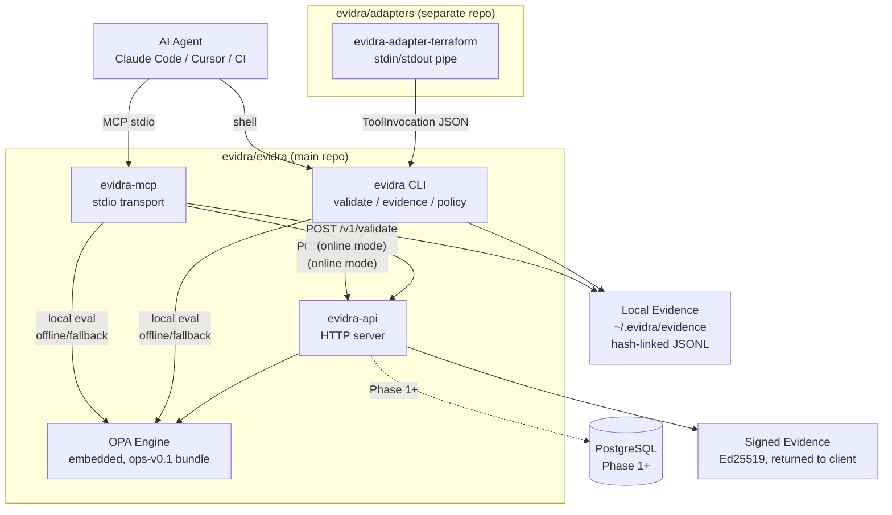

> Part of the Evidra OSS toolset by SameBits.

# Architecture

Evidra is a policy evaluation and evidence signing system for AI agent infrastructure operations. Before an AI agent executes `kubectl apply` or `terraform apply`, it calls Evidra. Evidra evaluates OPA policy, returns allow/deny with risk level and remediation hints, and produces a cryptographically verifiable evidence record. The agent stores the evidence and proceeds (or aborts).

Three binaries share one evaluation core. Two operating modes — online (API-first) and offline (local OPA) — ensure consistent policy decisions whether connected or air-gapped.



---

## Repository Architecture

| Repository | Contents |
|---|---|
| `evidra/evidra` | API server, MCP server, CLI, OPA engine, evidence, policy bundle |
| `evidra/adapters` | Adapter interface + `evidra-adapter-terraform` binary |

Zero Go import coupling between repos. Communication between adapters and Evidra is HTTP JSON (`POST /v1/validate`) or stdin/stdout pipes.

---

## Component Map

### API Server (`cmd/evidra-api`)

Stateless HTTP server. Evaluates policy via embedded OPA, signs evidence with Ed25519, returns the signed record to the caller. Never stores evidence server-side.

| Phase | Gate | Capabilities | Status |
|---|---|---|---|
| **Phase 0** | `DATABASE_URL` absent | Stateless. `POST /v1/validate`, `GET /v1/evidence/pubkey`, `GET /healthz`. Static API key from env var. No Postgres. | **✅ Complete. Deployed.** |
| **Phase 1** | `DATABASE_URL` present | + `POST /v1/keys`, `GET /readyz`. Dynamic key issuance, usage tracking. | **✅ Complete.** |
| Phase 2 | `EVIDRA_SKILLS_ENABLED=true` | + `/v1/skills/*`, `/v1/executions/*`. Named operations with input validation. | Not started. |

Key packages: `internal/api` (handlers, router, middleware), `internal/auth` (static key P0 / DB-backed P1), `internal/engine` (runtime adapter), `internal/evidence` (Ed25519 signer, signing payload builder), `internal/store` (Postgres key store), `internal/db` (pgxpool + migration runner).

### MCP Server (`cmd/evidra-mcp`)

Stdio transport for AI agents (Claude Code, Cursor, etc.). Exposes two MCP tools: `validate` (policy evaluation + evidence) and `get_event` (evidence lookup). Three MCP resources for evidence inspection.

- **Online mode** (`EVIDRA_URL` set): delegates evaluation to the API server.
- **Offline mode** (default): embedded OPA, local JSONL evidence.
- **Fallback**: if online API is unreachable and `EVIDRA_FALLBACK=offline`, falls back to local evaluation.
- **Modes**: `enforce` (default, deny blocks) vs `observe` (policy recorded but never blocks).

Key package: `pkg/mcpserver`.

### CLI (`cmd/evidra`)

Offline-first command-line tool.

- `evidra validate <file>` — evaluates scenario files (Terraform plan JSON, Kubernetes manifests, native format). Online mode when `EVIDRA_URL` is set.
- `evidra evidence verify|export|violations|cursor` — inspects and exports local evidence chain.
- `evidra policy sim` — policy simulation against arbitrary input.

Key packages: `pkg/validate`, `pkg/scenario`, `pkg/evidence`.

### Shared Core (`pkg/`)

| Package | Role |
|---|---|
| `pkg/validate` | Central evaluation: loads scenario, runs policy, records evidence |
| `pkg/invocation` | Canonical `ToolInvocation` and `Actor` types, structure validation |
| `pkg/runtime` | `Evaluator` wraps OPA engine, `PolicySource` interface |
| `pkg/policy` | OPA engine wrapper; evaluates `data.evidra.policy.decision` |
| `pkg/evidence` | Append-only JSONL store with hash-linked chain, segmented storage |
| `pkg/scenario` | Scenario schema, auto-detect loader (Terraform/K8s/native) |
| `pkg/client` | HTTP client for API (online mode), sentinel errors, `IsReachabilityError()` |
| `pkg/mode` | Mode resolution (online/offline), no I/O |
| `pkg/config` | Flag/env resolution, `NormalizeEnvironment()` |
| `pkg/bundlesource` | Loads OPA bundle directories with `.manifest` validation |
| `pkg/policysource` | Loads individual `.rego` + `data.json` files (loose mode) |

### Input Adapters (`evidra/adapters` repo)

Separate Go module. Adapters are pure functions — no network calls, no state. They transform raw tool artifacts into structured `ToolInvocation` parameters.

- `evidra-adapter-terraform` — reads `terraform show -json` output, produces `create_count`, `destroy_count`, `resource_types`, `resource_changes`.
- Interface: `Name() string`, `Convert(ctx, raw, config) → Result`.
- Cross-compiled via goreleaser; distributed as standalone stdin/stdout binaries.

---

## Hybrid Mode

Both CLI and MCP resolve their operating mode at startup. The decision is instant (no I/O) — reachability is tested at call time, not on startup.

```
EVIDRA_URL set?
├── NO → Offline (local OPA, local evidence)
└── YES
    ├── --offline flag? → Offline
    └── EVIDRA_API_KEY set?
        ├── NO → error: "EVIDRA_API_KEY required"
        └── YES → Online (try API, fallback per EVIDRA_FALLBACK)
```

**Runtime behavior (each `Validate` call):**

```
POST /v1/validate →
├── 200         → return Result{Source: "api"}
├── 401/403/422 → error immediately (no fallback)
├── 429         → error immediately (no fallback)
├── 5xx / timeout / connect error →
│   ├── EVIDRA_FALLBACK=offline → evaluate locally, Source: "local-fallback"
│   └── EVIDRA_FALLBACK=closed  → error (exit code 3)
```

No separate "Fallback mode" state. Online mode with a failed API call degrades based on fallback policy.

**Environment variables:**

| Variable | Default | Purpose |
|---|---|---|
| `EVIDRA_URL` | (unset) | API endpoint. Enables online mode |
| `EVIDRA_API_KEY` | (unset) | Bearer token. Required when `EVIDRA_URL` is set |
| `EVIDRA_FALLBACK` | `closed` | `closed` = error on API failure. `offline` = local eval |
| `EVIDRA_ENVIRONMENT` | (unset) | Environment label. Normalized: `prod`/`prd` → `production`, `stg`/`stage` → `staging` |
| `EVIDRA_BUNDLE_PATH` | (embedded) | OPA bundle path for offline/fallback |
| `EVIDRA_EVIDENCE_DIR` | `~/.evidra/evidence` | Local evidence path (offline/fallback only) |

**CLI exit codes:** 0 = allowed, 1 = internal error, 2 = policy denied, 3 = API unreachable, 4 = usage error.

---

## Policy Engine

All three binaries embed the `ops-v0.1` OPA policy bundle (curated ops rules) via `go:embed`. The bundle is the single source of truth for policy.

**Evaluation flow:**
```
ToolInvocation → pkg/runtime.Evaluator → OPA engine → Decision{allow, risk_level, reasons, hints, rule_ids}
```

**Policy sources** (in precedence order):
1. `--bundle <path>` or `EVIDRA_BUNDLE_PATH` — custom OPA bundle directory
2. Embedded `ops-v0.1` bundle (zero-config default)
3. `--policy <path> --data <path>` — loose mode (individual `.rego` + `data.json`)

**Bundle structure:**
```
policy/bundles/ops-v0.1/
├── .manifest                    — revision, roots, profile metadata
├── evidra/policy/
│   ├── policy.rego              — decision entrypoint (data.evidra.policy.decision)
│   ├── decision.rego            — deny/warn aggregator
│   ├── defaults.rego            — helpers: resolve_param, has_tag, action_namespace
│   └── rules/                   — one .rego file per rule
├── evidra/data/params/data.json — tunable parameters with by_env overrides
└── evidra/data/rule_hints/      — remediation hints keyed by rule ID
```

Environment-specific parameter overrides use the `by_env` model in `data.json`: environment-specific value → default value fallback chain.

---

## Evidence and Signing

### Offline Evidence (CLI / MCP)

Append-only JSONL stored at `~/.evidra/evidence/` (configurable). Hash-linked chain: each record's `hash` covers all fields except itself, and includes `previous_hash` linking to the prior record. Tampering breaks the chain, detectable via `evidra evidence verify`.

The store is segmented (manifest + segment files, max 5MB per segment). Every `validate` call produces a record regardless of allow/deny. Evidence cannot be silently bypassed — if the store write fails, the validation pipeline returns an error.

### Online Evidence (API)

The API server signs every evidence record with Ed25519. Evidence is returned in the response body and **never stored server-side** — the client owns storage.

**Signing payload:** Deterministic text format, NOT `json.Marshal`. Version prefix `evidra.v1\n`, then `key=value\n` fields in fixed declaration order. List fields use length-prefixed encoding: `reasons=3:foo,11:hello,world,0:`.

**Key management:**
- `EVIDRA_SIGNING_KEY` (base64) or `EVIDRA_SIGNING_KEY_PATH` (PEM file) — required in production.
- `EVIDRA_ENV=development` → ephemeral in-memory key (lost on restart).
- Production without key → `log.Fatal`. Server never writes key material to disk.

**Verification:** `GET /v1/evidence/pubkey` returns the Ed25519 public key (PEM). Anyone with the public key can verify evidence offline — no server contact needed.

---

## API Surface

| Phase | Method | Path | Auth | Description |
|---|---|---|---|---|
| P0 | `POST` | `/v1/validate` | Bearer | Policy evaluation → signed evidence record |
| P0 | `GET` | `/v1/evidence/pubkey` | — | Ed25519 public key (PEM) |
| P0 | `GET` | `/healthz` | — | Liveness probe (always 200) |
| P1 | `POST` | `/v1/keys` | — (rate-limited) | Issue API key + create tenant |
| P1 | `GET` | `/readyz` | — | Readiness (DB connected) |
| P1 | `POST` | `/v1/evidence/verify` | Bearer | Server-side signature verification [opt-in] |
| P2 | `POST` | `/v1/skills` | Bearer | Register named skill |
| P2 | `POST` | `/v1/skills/{id}:execute` | Bearer | Execute skill with input validation |
| P2 | `POST` | `/v1/skills/{id}:simulate` | Bearer | Dry-run skill execution |
| P2 | `GET` | `/v1/executions/{id}` | Bearer | Get execution record |

**Key rule: Deny = HTTP 200.** Policy denial is a successful evaluation, not an error. Check `response.decision.allow`, not the HTTP status code. This prevents retry storms in HTTP clients that auto-retry on 4xx/5xx.

For full API details, see `__internal/docs/implemented/architecture_evidra-api-mvp.md`.

---

## Security Model

- **API keys:** 256 bits entropy from `crypto/rand`, stored as SHA-256 hash. Plaintext returned once at creation, never persisted. Phase 0: static key with `subtle.ConstantTimeCompare`. On auth failure: 50-100ms random jitter before 401 (timing attack mitigation).
- **Signing key:** Ed25519 via `crypto/ed25519` (stdlib). Loaded from env var, never written to disk. Dev mode: ephemeral in-memory key.
- **Evidence:** Client-side storage. Server signs but does not store. Offline store uses hash-linked chain for tamper detection.
- **Input validation:** Reject `\n` and `\r` in signing-payload fields (`actor.type`, `actor.id`, `tool`, `operation`, `environment`). Max request body: 1MB.
- **Logging:** Never log API key plaintext or signing key material. OK to log: key prefix (first 12 chars), tenant_id, event_id, decision.allow, tool, operation.

For the full security model, see `docs/SECURITY_MODEL.md`.
