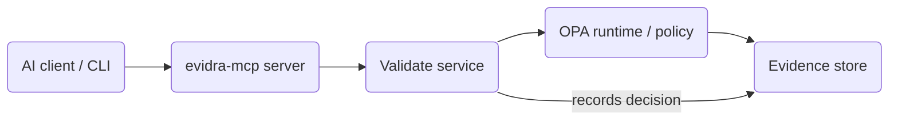

# Architecture

## Module Responsibilities
- `cmd/evidra-mcp`: exposes the MCP `validate` tool plus `get_event` resource and wires requests to the shared evaluation core.
- `cmd/evidra`: content-free CLI surface for offline validation, policy sim, and evidence inspection that reuses `pkg/validate`.
- `pkg/validate`: shared scenario loader + runtime runner that evaluates `policy/profiles/ops-v0.1` and writes evidence records.
- `pkg/scenario`: scenario schema + loader (Terraform plan, K8s manifest, or explicit action list) used by all entry points.
- `pkg/policy` + `pkg/runtime`: wrap the OPA engine and policy loader for the single decision contract.
- `pkg/evidence`: append-only store, manifest/segment helpers, and resource link generation for the MCP evidence API.
